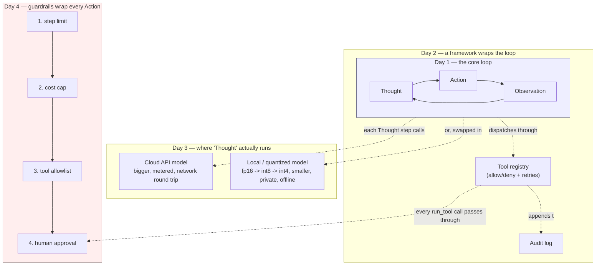

# Agentic AI: ReAct Loops, Local LLMs, and Safety

A language model that only ever produces one reply to one prompt cannot act
in the world — it cannot check a price, call an API, or verify its own
arithmetic. Turning it into an **agent** means wrapping it in a loop that
lets it reason, act, observe the result, and reason again, and then wrapping
*that* loop in enough structure that it doesn't spend money it shouldn't,
run forever, or take an action nobody approved. This unit builds that stack
from the bottom up, one layer per day, entirely from first principles —
no framework is treated as a black box.

| Day | Topic | Link |
| --- | --- | --- |
| 1 | Agents vs. chatbots; hand-rolling the ReAct (Thought/Action/Observation) loop | [daily/Day1_agents-vs-chatbots-react-loop.md](daily/Day1_agents-vs-chatbots-react-loop.md) |
| 2 | The agent-framework landscape, and building a minimal framework from scratch | [daily/Day2_framework-landscape-mini-framework.md](daily/Day2_framework-landscape-mini-framework.md) |
| 3 | Running agents on local LLMs; quantization and its precision/memory tradeoff | [daily/Day3_local-llms-quantization.md](daily/Day3_local-llms-quantization.md) |
| 4 | Agent safety mechanisms — allowlisting, step limits, approval gates, cost caps, and why check *order* matters | [daily/Day4_agent-safety-mechanisms.md](daily/Day4_agent-safety-mechanisms.md) |

Korean translations: [README.ko.md](README.ko.md) and a `.ko.md` sibling next
to every file above.

Concepts notebook (runnable, heavily commented): [concepts/7th_week_Concepts.ipynb](concepts/7th_week_Concepts.ipynb)
(Korean: [concepts/7th_week_Concepts.ko.ipynb](concepts/7th_week_Concepts.ko.ipynb))

## How the four days fit together

Each day adds one layer around the same core loop from Day 1. Nothing from
an earlier day gets replaced — Day 2's framework still runs Day 1's
Thought/Action/Observation cycle underneath; Day 3 just changes *where* the
reasoning step is computed; Day 4 wraps the same tool-dispatch call in
checks that can refuse to run it.

The ordering inside Day 4's box is not arbitrary — it is itself the subject
of that day's note: cheap, deterministic checks run before anything that can
block on a human, and counters are only ever committed *after* every check
has passed, or a denied call quietly poisons the budget for calls that come
after it.

## What's actually verified vs. illustrative

Every runnable example in the daily notes and the concepts notebook that
uses plain Python, numpy, or pandas was executed for real and its printed
output checked against what the text claims. Examples that call a real
local-model API (`transformers`, `bitsandbytes` for GPU quantization) are
written against the current, correct API shape but were not executed in
this environment — those cells are labeled accordingly rather than presented
as tested output.

## License

Original educational material. Code samples marked as illustrative are
schematic — verify against current library documentation before relying on
an exact API signature in production.
