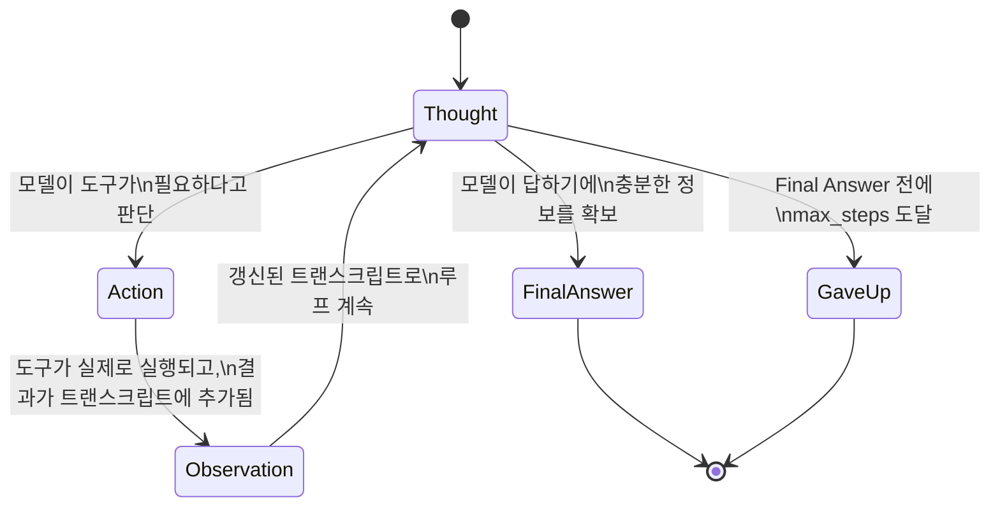

# Day 1 — 에이전트 vs. 챗봇, 그리고 ReAct 루프

## 문제: 챗봇은 행동할 수 없다

챗봇은 하나의 메시지를 하나의 답변으로 매핑하는 함수다. "2,830의 15%가
뭐야?"라고 물으면, 실제로 산술을 계산해서가 아니라 전에 본 적 있는 토큰
시퀀스를 패턴 매칭해서 답을 만들어낸다. 훈련 데이터에 흔히 등장하는
숫자와 비슷한 경우라면 이 추측이 맞을 때가 많다. 하지만 임의의 숫자에
대해서는, 답변의 유창하고 자신감 있는 어조가 암시하는 것보다 훨씬 자주
틀린다. 모델이 훈련 데이터로부터 알 수 없는 모든 것에서 같은 실패가
나타난다 — 오늘의 환율, 특정 파일의 내용, 주문이 실제로 발송됐는지 여부.
챗봇은 이를 알아낼 방법이 전혀 없다 — 텍스트를 완성하는 것만 할 수 있다.

**에이전트**는 모델을 더 똑똑하게 만들어서가 아니라, 답하기 전에 실제로
*무언가를 하고* 실제 결과를 읽어올 수 있는 루프 안에 모델을 집어넣음으로써
이 문제를 해결한다. 모델은 그대로이고, 그 주위를 감싸는 제어 흐름이
달라지는 것이다.

## 실제로 무언가를 에이전트로 만드는 것

공식적으로: 에이전트는 (1) 환경의 현재 상태를 관찰하고, (2) 다음에 무엇을
할지 추론하고, (3) 행동을 취하는 과정을 목표에 도달하거나 정지 조건에
걸릴 때까지 반복한다. 이 루프가 모든 것의 차이를 만든다. 모델을 한 번만
호출하는 시스템은, 설령 그 한 번의 호출이 도구를 부르더라도, 플러그인이
달린 챗봇이 못 할 일을 하는 게 아직 아니다. 어떤 시스템을 에이전트로
만드는 것은 *한 단계의 출력이 다음 단계를 결정하는 입력이 되고*, 단계의
수가 미리 정해져 있지 않다는 점이다.

## ReAct: 루프에 파싱 가능한 추론 형식을 부여하기

"ReAct: Synergizing Reasoning and Acting in Language Models"(Yao 외,
2022)는 이 루프를 위한 구체적인 텍스트 형식을 제안했다: `Thought`(다음에
무엇을 할지에 대한 자유 텍스트 추론), `Action`(구조화된 도구 호출),
`Observation`(도구의 실제 출력을 트랜스크립트에 다시 넣는 것)을 번갈아
가며 — 모델이 `Final Answer`를 낼 때까지 반복한다.

```
Thought: I need the current value of 18 * 47 before I can answer.
Action: calc(18 * 47)
Observation: 846
Thought: I now have enough to answer.
Final Answer: 846
```

이 방식이 뻔해 보이는 두 대안보다 나은 이유:

- **순수 chain-of-thought**(도구 호출이 전혀 없는 추론)는 실제 세계를
  전혀 건드리지 않기 때문에, 추론 오류나 오래된 사실이 이를 걸러줄
  아무 장치 없이 최종 답까지 그대로 전파된다.
- **순수 행동**(추론 과정이 보이지 않는 도구 호출)은 불투명하다 — 잘못된
  도구나 잘못된 인자를 고를 때, 왜 그랬는지 설명하는 흔적이 전혀 없어서
  디버깅도, 더 잘하도록 프롬프트를 고치는 일도 훨씬 어려워진다.

두 가지를 번갈아 하는 것은 모든 행동을 *접지(grounded)*시킨다는 뜻이다:
모델은 행동하기 전에 이유를 먼저 밝혀야 하고, 그다음 바로 읽는 것은 그
추론이 실제로 맞아떨어졌는지 여부다.

## 상태 기계로 본 메커니즘



다이어그램만으로는 잘 드러나지 않는 두 상태가 중요하다: `Observation`은
절대 모델이 쓰는 것이 아니다 — 실제 함수 호출 이후 하네스(harness)가
끼워 넣는 것이다. 그리고 `GaveUp`이 존재하는 이유는, `Thought ->
FinalAnswer` 전이가 반드시 일어난다는 보장이 어디에도 없기 때문이다.

## stop 시퀀스가 핵심적인 이유

실제 모델의 `generate()`를 `Thought`/`Action` 단계에 호출할 때는 반드시
`Observation:`이라는 리터럴 문자열(`stop` 시퀀스)에서 생성을 끊어야 한다 —
모델이 그 지점을 지나 계속 생성하도록 두면 안 된다. 그렇게 하지 않으면,
모델은 — 정보가 부족하다는 것을 아는 게 아니라 그럴듯한 텍스트 연속을
만들도록 훈련된 존재이므로 — 관찰 결과가 "이래야 할 것 같다"는 자기
추측을 그대로 써버리고 계속 진행하며, 실제로는 실행된 적 없는 도구
결과를 날조하게 된다. 이 stop 시퀀스 하나의 디테일이 그럴듯해 보이기만
하는 트랜스크립트와 실제로 접지된 트랜스크립트를 가르는 지점이다:
모든 `Observation:` 줄을 쓰는 책임은 모델이 아니라 하네스에 있다.

## 루프를 직접 구현하기

프레임워크가 필요 없다 — 모델을 호출하고, 마지막 줄을 파싱하고, 요청된
도구가 있으면 실행하고, 실제 관찰 결과를 진행 중인 트랜스크립트에
덧붙이는 `while`/`for` 루프면 충분하다:

```python
def run_agent(model, tools, question, max_steps=6):
    transcript = FEW_SHOT_EXAMPLES + f"\nQuestion: {question}\n"
    for step in range(max_steps):
        # stop=["Observation:"] 가 위에서 말한 그 디테일이다: 모델이
        # 자기만의 가짜 observation을 쓰게 놔두지 않는다.
        chunk = model.generate(transcript, stop=["Observation:"])
        transcript += chunk
        if "Final Answer:" in chunk:
            return chunk.split("Final Answer:")[-1].strip()
        action_line = next(l for l in chunk.splitlines() if l.startswith("Action:"))
        tool_name, arg = parse_action(action_line)   # -> (str, str)
        result = tools[tool_name](arg)                # 현실이 개입하는 유일한 지점
        transcript += f"Observation: {result}\n"
    return "Gave up after max_steps without a final answer."
```

## 실전 예제: 두 개의 도구를 쓰는 에이전트를 처음부터 끝까지 실행

제어 흐름을 설명만 하지 않고 실제로 확인하기 위해, **결정적인 규칙
기반 가짜 LLM**(실제 모델 호출이 아니라, 트랜스크립트에 이미 몇 개의
observation이 있는지를 보고 미리 정해진 다음 단계를 반환하는 함수)이
두 개의 **실제** 도구 — 딕셔너리 기반 가격 조회와 계산기 — 를 다루는
완전한 ReAct 루프를 아래에 준비했다. 가짜 LLM 부분은 그 이름 그대로
가짜지만, 그 *주변*의 모든 것 — 파싱, 디스패치, 트랜스크립트 관리, 도구
실행 — 은 실제 모델 연동에 필요한 것과 정확히 같고, 실제로 테스트되는
부분도 바로 이것이다.

```python
import re

PRICE_LIST = {"apples": 2.40, "rice": 1.80, "milk": 1.10}  # $ per kg

def lookup_price(item):
    """딕셔너리 기반 조회 도구."""
    item = item.strip().strip('"').lower()
    if item not in PRICE_LIST:
        return f"error: no price for '{item}'"
    return PRICE_LIST[item]                        # -> float, 예: 2.4

def calc(expr):
    """계산기 도구, 산술 문자만 허용."""
    if not re.fullmatch(r"[0-9+\-*/(). ]+", expr):
        return "error: invalid characters in expression"
    return eval(expr, {"__builtins__": {}}, {})     # -> float

TOOLS = {"lookup_price": lookup_price, "calc": calc}

def fake_llm_step(transcript, observations_seen):
    # model.generate()를 대신하는 결정적 함수: 실제 토큰 확률이 아니라
    # 지금까지 observation이 몇 개인지만 본다. 가짜인 부분은 이것뿐이고,
    # 그 아래 루프 메커니즘은 실제다.
    if observations_seen == 0:
        return 'Thought: I need the price per kg of apples first.\nAction: lookup_price("apples")\n'
    if observations_seen == 1:
        return 'Thought: Now I need the price per kg of rice.\nAction: lookup_price("rice")\n'
    if observations_seen == 2:
        return 'Thought: I can now compute the total for 3.5kg apples and 2kg rice.\nAction: calc(3.5 * 2.4 + 2 * 1.8)\n'
    if observations_seen == 3:
        return 'Thought: Splitting that total evenly between 2 people.\nAction: calc(12.0 / 2)\n'
    return 'Thought: I have both numbers I need.\nFinal Answer: Total bill is $12.00; each of the 2 people pays $6.00.\n'

def parse_action(action_line):
    # "Action: calc(3.5 * 2.4 + 2 * 1.8)" -> ("calc", "3.5 * 2.4 + 2 * 1.8")
    name = action_line.split("Action:")[1].split("(")[0].strip()
    arg = action_line.split("(", 1)[1].rsplit(")", 1)[0]
    return name, arg                                # -> (str, str)

def run_agent(question, max_steps=6):
    transcript = f"Question: {question}\n"
    observations_seen = 0
    for step in range(1, max_steps + 1):
        chunk = fake_llm_step(transcript, observations_seen)
        transcript += chunk
        if "Final Answer:" in chunk:
            return chunk.split("Final Answer:")[-1].strip()
        action_line = next(l for l in chunk.splitlines() if l.startswith("Action:"))
        tool_name, arg = parse_action(action_line)
        result = TOOLS[tool_name](arg)              # 실제 도구 호출, 실제 숫자가 돌아옴
        transcript += f"Observation: {result}\n"
        observations_seen += 1
    return "Gave up after max_steps without a final answer."
```

이를 처음부터 끝까지 실행하면(`python3 day1_react.py`) 정확히 다음
트랜스크립트가 나온다:

```
Thought: I need the price per kg of apples first.
Action: lookup_price("apples")
Observation: 2.4
Thought: Now I need the price per kg of rice.
Action: lookup_price("rice")
Observation: 1.8
Thought: I can now compute the total cost for 3.5kg apples and 2kg rice.
Action: calc(3.5 * 2.4 + 2 * 1.8)
Observation: 12.0
Thought: Splitting that total evenly between 2 people.
Action: calc(12.0 / 2)
Observation: 6.0
Thought: I have both numbers I need.
Final Answer: Total bill is $12.00; each of the 2 people pays $6.00.
```

이 최종 답변은 독립적으로 검증했다: `3.5 * 2.40 + 2 * 1.80 = 12.0`이고
`12.0 / 2 = 6.0`이다 — 에이전트의 계산기 도구는 두 번 다 정확한 숫자를
냈고, 가짜 LLM이 추측한 게 아니라 실제로 `calc`를 호출해서 얻은 값이다.

## 함정: 스텝 제한이 없으면 정지 조건도 없다

`max_steps`는 장식용 파라미터가 아니다. 이것이 가상의 실패가 아니라
실제 실패 모드임을 확인하기 위해, 가짜 LLM을 항상 같은
`lookup_price("apples")` 행동만 재발행하는(절대 `Final Answer:`를 내지
않는) 버전으로 바꾸고 `max_steps=4`로 동일한 루프를 실행하면 다음과
같은 결과가 나온다:

```
Gave up after max_steps=4 without a final answer.
```

이 상한이 없다면 동일한 루프가 영원히 실행된다 — 모든 직접 구현한
에이전트는 모델이 스스로 멈추기를 선택하는 것에 의존하지 않는 확실한
정지 조건이 필요하다. 혼란에 빠졌거나 루프를 도는 모델에게는 스스로
포기하라는 내부 신호가 없기 때문이다.

## 그 밖의 함정

- **작은 모델에서의 파싱 취약성.** 작은 로컬 모델은 `Action: tool(arg)`
  형태의 깔끔하고 파싱 가능한 줄을 스스로 잘 내지 못한다 — 산문으로
  흘러가기 쉽다("이제 사과 가격을 확인해봐야 할 것 같은데..."). 정확히
  `Thought/Action/Observation` 형식으로 된 몇 개의 few-shot 예시가
  "가끔 파싱됨"과 "안정적으로 파싱됨"의 차이를 만드는 경우가 많다 —
  모델은 형식을 발명하는 게 아니라 방금 본 형식을 모방하는 것이기
  때문이다.
- **행동 이름 드리프트.** 모델이 한 번도 등록된 적 없는 도구 이름을
  환각으로 만들어낼 수 있다(실제 도구는 `lookup_price`인데
  `Action: fetch_price("apples")`라고 쓰는 식). 디스패치 단계는
  조용히 아무 일도 안 하고 넘어가는 게 아니라 크게 실패해야 한다
  (`KeyError`, 명시적인 "알 수 없는 도구" observation) — 그렇지 않으면
  루프가 절대 성공할 수 없는 단계에서 계속 헛돌게 된다.
- **환각된 observation** — 위에서 다뤘고, 놓치면 접지(grounding)라는
  개념 전체를 조용히 무력화시키기 때문에 가장 중요한 디테일이다.

## 챗봇 모드 vs. 에이전트 모드, 같은 모델

작은 로컬 모델 하나를 놓고 평범한 챗봇 모드로 "2,830의 14.7%는 뭐야?"라고
물어보라. 빠르고 유창하게 답할 때가 많다 — 그리고 틀린다. 익숙하지 않은
숫자에 대한 산술은 단순 패턴 매칭만으로 신뢰성 있게 계산할 수 있는
종류의 일이 아니기 때문이다. *같은* 모델을 `calc` 도구가 준비된 위의
ReAct 루프에 태우면, 트랜스크립트는 그 모델이 도구가 필요하다는 것을
인식하고, 호출하고, 정확한 observation을 읽어들이고, 올바른 숫자를
보고하는 과정을 보여준다. 모델의 가중치는 아무것도 바뀌지 않았다 —
그 주위를 감싼 루프만 바뀌었을 뿐이다. (이 비교는 메커니즘을 설명하기
위한 예시이며, 특정 모델에서 캡처한 트랜스크립트가 아니다 — 실제로
실행한 트랜스크립트인 위의 실전 예제가 실제 숫자로 같은 논점을 이미
보여준다.)

## 정리

에이전트란 챗봇에 루프와 도구를 더한 것이다 — ReAct는 그 루프에 추론하고
행동할 파싱 가능한 형식을 부여할 뿐이고, `stop=["Observation:"]`
시퀀스와 `max_steps` 가드가 그 루프를 정직하고 유계(bounded)로 유지하는
장치다.
