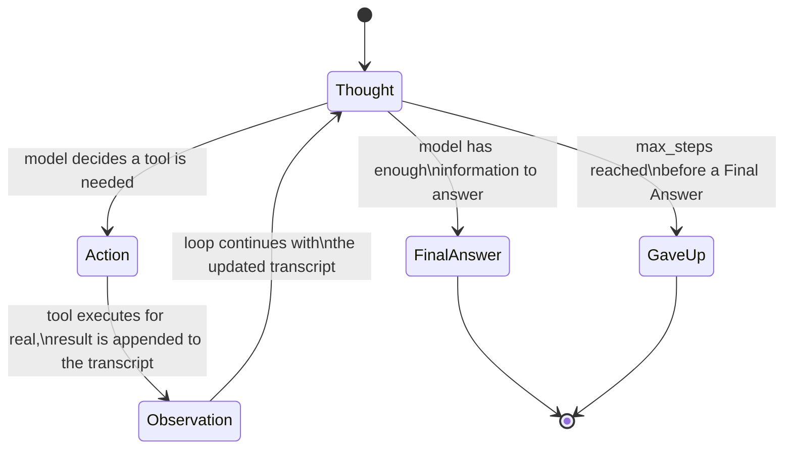

# Day 1 — Agents vs. Chatbots, and the ReAct Loop

## The problem: a chatbot cannot act

A chatbot is a function from one message to one reply. Ask it "what's 15%
of 2,830?" and it produces an answer by pattern-matching over token
sequences it has seen before — not by running arithmetic. For numbers that
happen to resemble common examples in its training data, that guess is
often right. For arbitrary numbers, it is wrong more often than the fluent,
confident tone of the answer would suggest. The same failure shows up for
anything the model cannot know from its training data: today's exchange
rate, the contents of a specific file, whether an order actually shipped.
A chatbot has no mechanism for finding out — it can only complete text.

An **agent** fixes this not by making the model smarter, but by putting it
in a loop that lets it *do something* and read back a real result before
answering. The model is unchanged; the control flow around it is not.

## What actually makes something an agent

Formally: an agent repeatedly (1) observes the current state of its
environment, (2) reasons about what to do next, and (3) takes an action —
cycling through that loop until it reaches a goal or hits a stop condition.
The loop is the whole distinction. A system that calls a model once, even
if that one call happens to invoke a tool, is not yet doing anything a
chatbot with a plugin couldn't do. What makes it an agent is that the
*output of one step becomes the input to deciding the next step*, and the
number of steps isn't fixed in advance.

## ReAct: giving the loop a parseable reasoning format

"ReAct: Synergizing Reasoning and Acting in Language Models" (Yao et al.,
2022) proposed a specific text format for that loop: interleave a
`Thought` (free-text reasoning about what to do next), an `Action` (a
structured tool call), and an `Observation` (the tool's real output fed
back into the transcript) — repeated until the model emits a `Final
Answer`.

```
Thought: I need the current value of 18 * 47 before I can answer.
Action: calc(18 * 47)
Observation: 846
Thought: I now have enough to answer.
Final Answer: 846
```

Why this beats the two obvious alternatives:

- **Pure chain-of-thought** (reasoning with no tool calls) never touches
  the real world, so a reasoning error or an outdated fact propagates all
  the way to the final answer with nothing to catch it.
- **Pure acting** (tool calls with no visible reasoning) is opaque — when
  it picks the wrong tool or the wrong argument, there is no trace
  explaining why, which makes both debugging and prompting it to do better
  much harder.

Interleaving the two means every action is *grounded*: the model has to
commit to a reason before acting, and the very next thing it reads is
whether that reasoning held up in reality.

## The mechanism as a state machine



Two states matter more than the diagram alone shows: `Observation` is never
written by the model — it is spliced in by the harness after a real
function call — and `GaveUp` exists precisely because nothing here
guarantees the `Thought -> FinalAnswer` transition ever fires.

## Why the stop sequence is load-bearing

When you call a real model's `generate()` for the `Thought`/`Action` step,
you must cut generation at the literal string `Observation:` (a `stop`
sequence), *not* let the model keep generating past it. If you don't, the
model — which is trained to produce plausible continuations of text, not to
know when it lacks information — will simply write its own guess for what
the observation "should" be and keep going, fabricating a tool result that
was never executed. That single stop-sequence detail is what turns a
plausible-looking trace into a grounded one: the harness, not the model,
is responsible for writing every `Observation:` line.

## Hand-rolling the loop

No framework needed — a `while`/`for` loop that calls the model, parses its
last line, dispatches a tool if one was requested, and appends the real
observation to the running transcript:

```python
def run_agent(model, tools, question, max_steps=6):
    transcript = FEW_SHOT_EXAMPLES + f"\nQuestion: {question}\n"
    for step in range(max_steps):
        # stop=["Observation:"] is the detail from above: never let the
        # model write its own fake observation.
        chunk = model.generate(transcript, stop=["Observation:"])
        transcript += chunk
        if "Final Answer:" in chunk:
            return chunk.split("Final Answer:")[-1].strip()
        action_line = next(l for l in chunk.splitlines() if l.startswith("Action:"))
        tool_name, arg = parse_action(action_line)   # -> (str, str)
        result = tools[tool_name](arg)                # the ONLY place reality enters
        transcript += f"Observation: {result}\n"
    return "Gave up after max_steps without a final answer."
```

## Worked example: a two-tool agent, run end to end

To check the control flow for real rather than just describing it, here is
a complete ReAct loop driven by a **deterministic rule-based fake LLM** (no
real model call — it inspects how many observations are already in the
transcript and returns the scripted next step) exercising two **real**
tools: a dict-based price lookup and a calculator. The point of the fake
LLM is that everything *around* it — parsing, dispatch, transcript
management, tool execution — is exactly what a real model integration
needs, and it is what actually gets tested here.

```python
import re

PRICE_LIST = {"apples": 2.40, "rice": 1.80, "milk": 1.10}  # $ per kg

def lookup_price(item):
    """Dict-based lookup tool."""
    item = item.strip().strip('"').lower()
    if item not in PRICE_LIST:
        return f"error: no price for '{item}'"
    return PRICE_LIST[item]                        # -> float, e.g. 2.4

def calc(expr):
    """Calculator tool, restricted to arithmetic characters only."""
    if not re.fullmatch(r"[0-9+\-*/(). ]+", expr):
        return "error: invalid characters in expression"
    return eval(expr, {"__builtins__": {}}, {})     # -> float

TOOLS = {"lookup_price": lookup_price, "calc": calc}

def fake_llm_step(transcript, observations_seen):
    # Deterministic stand-in for model.generate(): looks only at how many
    # Observations exist so far, not at real token probabilities. This is
    # what's fake -- the loop mechanics below it are real.
    if observations_seen == 0:
        return 'Thought: I need the price per kg of apples first.\nAction: lookup_price("apples")\n'
    if observations_seen == 1:
        return 'Thought: Now I need the price per kg of rice.\nAction: lookup_price("rice")\n'
    if observations_seen == 2:
        return 'Thought: I can now compute the total for 3.5kg apples and 2kg rice.\nAction: calc(3.5 * 2.4 + 2 * 1.8)\n'
    if observations_seen == 3:
        return 'Thought: Splitting that total evenly between 2 people.\nAction: calc(12.0 / 2)\n'
    return 'Thought: I have both numbers I need.\nFinal Answer: Total bill is $12.00; each of the 2 people pays $6.00.\n'

def parse_action(action_line):
    # "Action: calc(3.5 * 2.4 + 2 * 1.8)" -> ("calc", "3.5 * 2.4 + 2 * 1.8")
    name = action_line.split("Action:")[1].split("(")[0].strip()
    arg = action_line.split("(", 1)[1].rsplit(")", 1)[0]
    return name, arg                                # -> (str, str)

def run_agent(question, max_steps=6):
    transcript = f"Question: {question}\n"
    observations_seen = 0
    for step in range(1, max_steps + 1):
        chunk = fake_llm_step(transcript, observations_seen)
        transcript += chunk
        if "Final Answer:" in chunk:
            return chunk.split("Final Answer:")[-1].strip()
        action_line = next(l for l in chunk.splitlines() if l.startswith("Action:"))
        tool_name, arg = parse_action(action_line)
        result = TOOLS[tool_name](arg)              # real tool call, real number back
        transcript += f"Observation: {result}\n"
        observations_seen += 1
    return "Gave up after max_steps without a final answer."
```

Running this end to end (`python3 day1_react.py`) produces exactly this
transcript:

```
Thought: I need the price per kg of apples first.
Action: lookup_price("apples")
Observation: 2.4
Thought: Now I need the price per kg of rice.
Action: lookup_price("rice")
Observation: 1.8
Thought: I can now compute the total cost for 3.5kg apples and 2kg rice.
Action: calc(3.5 * 2.4 + 2 * 1.8)
Observation: 12.0
Thought: Splitting that total evenly between 2 people.
Action: calc(12.0 / 2)
Observation: 6.0
Thought: I have both numbers I need.
Final Answer: Total bill is $12.00; each of the 2 people pays $6.00.
```

That final answer was checked independently: `3.5 * 2.40 + 2 * 1.80 = 12.0`
and `12.0 / 2 = 6.0` — the agent's arithmetic tool produced the right
number both times, and did so by actually calling `calc`, not by the fake
LLM guessing it.

## Pitfall: no step limit means no stop condition

`max_steps` is not a cosmetic parameter. To confirm this is a real failure
mode and not a hypothetical one, replacing the fake LLM with one that
always re-issues the same `lookup_price("apples")` action (never emitting
`Final Answer:`) and running the identical loop with `max_steps=4` produces:

```
Gave up after max_steps=4 without a final answer.
```

Without that cap, the identical loop runs forever — every hand-rolled agent
needs a hard stop condition that does not depend on the model choosing to
stop, because a confused or looping model has no internal signal telling it
to give up.

## Other pitfalls

- **Parsing brittleness on small models.** A small local model rarely
  emits a clean, parseable `Action: tool(arg)` line on its own — it drifts
  into prose ("I should probably look up the price of apples now..."). A
  handful of few-shot examples in the exact `Thought/Action/Observation`
  format is usually the difference between "sometimes parses" and
  "reliably parses" — the model is imitating a format it just saw, not
  inventing one.
- **Action name drift.** A model can hallucinate a tool name that was
  never registered (`Action: fetch_price("apples")` when the real tool is
  `lookup_price`). The dispatch step must fail loudly (`KeyError`, an
  explicit "unknown tool" observation) rather than silently no-op, or the
  loop will spin on a step that can never succeed.
- **Hallucinated observations**, covered above — the single most important
  detail, because it silently defeats the entire point of grounding if
  missed.

## Chatbot mode vs. agent mode, same model

Take one small local model and ask it, in plain chatbot mode, "What's
14.7% of 2,830?" It will often answer fast and fluently — and wrong,
because arithmetic on unfamiliar numbers is not something a language model
computes reliably from pattern-matching alone. Run the *same* model through
the ReAct loop above with a `calc` tool available, and the trace shows it
recognizing it needs the tool, calling it, reading back an exact
observation, and reporting the correct number. Nothing about the model's
weights changed — only the loop wrapped around it did. (This comparison is
illustrative of the mechanism, not a captured transcript from a specific
model — the worked example above, which *is* an executed transcript, makes
the same point with real numbers.)

## Takeaway

An agent is a chatbot plus a loop plus tools — ReAct just gives that loop a
parseable format to reason and act in, and a `stop=["Observation:"]`
sequence plus a `max_steps` guard are what keep that loop honest and
bounded.
