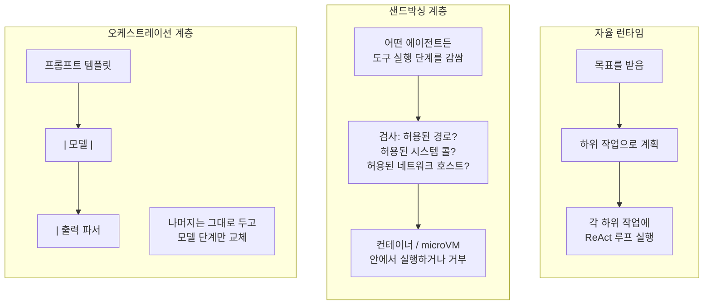

# Day 2 — 에이전트 프레임워크 생태계, 그리고 그 일부를 직접 만들어보기

## 무엇이든 고르기 전에 먼저 구분해야 하는 이유

"에이전트 프레임워크"라는 말은 실제로는 서로 완전히 다른 최소 세 종류의
소프트웨어를 가리키는 데 쓰이고, 이를 섞어서 생각하면 작업에 맞지 않는
도구를 고르게 되거나 — 더 나쁘게는 — 라이브러리가 한 번도 약속한 적
없는 안전 속성을 준다고 착각하게 된다. 무엇을 손대기 전에, 각각이
실제로 무엇을 하는지 먼저 구분해볼 가치가 있다.

1. **자율 에이전트 플랫폼/런타임**(AutoGPT류 프로젝트나 CrewAI 같은
   멀티 에이전트 오케스트레이션 라이브러리가 여기 속하고, LangGraph의
   그래프 기반 에이전트 런타임도 마찬가지) — 목표를 받아 하위 작업으로
   쪼개고, Day 1의 루프를 어느 정도 독립적으로 실행한다: 계획, 메모리,
   도구 디스패치를 대신 관리해준다. 강력하지만, 의사결정의 상당 부분을
   플랫폼의 플래너에게 맡기게 되고, 그 실패 모드는 이제 추상화 뒤에
   부분적으로 가려져 있다.
2. **샌드박싱/보안 래퍼 계층**(컨테이너 기반 격리, Firecracker 같은
   microVM, gVisor의 시스템 콜 가로채기, 호스팅형 코드 샌드박스) —
   어떤 종류의 에이전트든 그 *주위를* 감싸서 실제로 무엇을 건드릴 수
   있는지 제한한다: 파일시스템 경로, 네트워크 호출, 서브프로세스 실행.
   과제를 계획하거나 추론하는 일은 전혀 하지 않는다 — 에이전트가 무엇을
   시도하려 하든 상관없이 단단한 경계를 강제할 뿐이다. 이는 "자율성"과는
   완전히 다른 축이다 — 아주 멍청한 에이전트라도 셸 명령을 실행할 수
   있다면 이런 장치가 필요하다.
3. **프레임워크에 독립적인 오케스트레이션/조합 계층**(LangChain의
   `Runnable`/LCEL 인터페이스가 가장 눈에 띄는 예) — 여러 개의 서로
   다른 모델/도구 라이브러리 *위에* 올라가서, 애플리케이션이 단계를
   선언적으로 조합하고 밑단의 엔진을 바꿔 끼울 수 있게 해준다(이번
   분기는 A사 런타임, 다음 분기는 다른 것) — 호출하는 코드를 다시 쓸
   필요 없이.

이 셋 중 어느 것도 루프 자체에 대한 이해를 대체하지 않는다 — 모두 Day 1에서
직접 손으로 짠 것의 일부를 자동화할 뿐이다: `for` 루프, 도구 디스패치,
트랜스크립트 관리. 어떤 프레임워크가 정확히 어떤 부분을 자동화하는지
아는 것이, 그것이 오작동할 때 남의 플래너 안에서 나온 스택 트레이스를
미스터리로 취급하지 않고 디버깅할 수 있게 해준다.



## 최소한의 프레임워크, 감춰진 것을 보기 위해 만들다

더 큰 프레임워크들도 모두, 그 플래너와 메모리 저장소 밑에서는 세 가지를
제공한다: 어떤 도구가 있고 허용되는지에 대한 레지스트리, 불안정한 도구
호출을 재시도하는 방법, 모든 시도의 기록. 이 일부를 직접 손으로 짜보면
추상화가 눈에 보이게 된다 — 그리고 설명으로만 그치지 않고, 아래 버전은
실제로 실행해서 확인했다.

```python
import time

class MiniAgentFramework:
    """더 큰 에이전트 프레임워크가 모두 최소한으로 제공하는 세 가지:
    (1) 허용/거부 플래그가 있는 도구 레지스트리, (2) 불안정한 도구를 위한
    재시도 래퍼, (3) 허용 여부와 무관하게 모든 시도를 기록하는 감사 로그."""

    def __init__(self):
        self.tools = {}
        self.audit_log = []

    def register_tool(self, name, fn, allowed=True, max_retries=0):
        self.tools[name] = {"fn": fn, "allowed": allowed, "max_retries": max_retries}

    def run_tool(self, name, arg):
        entry = {"tool": name, "arg": arg, "ts": round(time.time(), 3)}
        spec = self.tools.get(name)

        if spec is None or not spec["allowed"]:
            entry["status"] = "denied"
            self.audit_log.append(entry)
            raise PermissionError(f"tool '{name}' is not registered or not allowed")

        attempts = 0
        last_err = None
        while attempts <= spec["max_retries"]:
            attempts += 1
            try:
                result = spec["fn"](arg)               # -> 도구가 반환하는 값
                entry["status"] = "ok"
                entry["attempts"] = attempts
                entry["result"] = result
                self.audit_log.append(entry)
                return result
            except Exception as e:                     # 불안정한 호출 실패; 예산이 남으면 재시도
                last_err = e
        entry["status"] = "failed_after_retries"
        entry["attempts"] = attempts
        entry["error"] = str(last_err)
        self.audit_log.append(entry)
        raise RuntimeError(f"tool '{name}' failed after {attempts} attempts: {last_err}")
```

`register_tool`, `run_tool`, `audit_log`는 더 큰 프레임워크들이 내부에
모두 갖고 있는 것과 같은 세 조각이다 — 그 위에 플래너, 더 풍부한 메모리
저장소, 스트리밍을 얹을 뿐이다.

### 실제로 실행해보기: 불안정한 도구, 거부된 도구, 감사 로그

```python
# 처음 2번은 실패하고 3번째에 성공하는 도구 -- 설명이 아니라 실제로
# 재시도 경로를 실행해서 확인한다.
_call_count = {"n": 0}
def flaky_search(query):
    _call_count["n"] += 1
    if _call_count["n"] < 3:
        raise ConnectionError(f"simulated timeout on attempt {_call_count['n']}")
    return f"3 results for '{query}'"

def add(arg):
    a, b = [float(x) for x in arg.split(",")]
    return a + b                                        # -> float

fw = MiniAgentFramework()
fw.register_tool("add", add, allowed=True)
fw.register_tool("search", flaky_search, allowed=True, max_retries=3)
fw.register_tool("delete_db", lambda arg: "dropped", allowed=False)

print(fw.run_tool("add", "2,3"))
print(fw.run_tool("search", "agent frameworks"))
try:
    fw.run_tool("delete_db", "prod")
except PermissionError as e:
    print("blocked:", e)
```

실제로 이 스크립트를 실행한 출력:

```
add(2,3) -> 5.0
search (flaky, should retry then succeed) -> 3 results for 'agent frameworks'
blocked as expected: tool 'delete_db' is not registered or not allowed

audit log:
{'tool': 'add', 'arg': '2,3', 'ts': 1788863772.63, 'status': 'ok', 'attempts': 1, 'result': 5.0}
{'tool': 'search', 'arg': 'agent frameworks', 'ts': 1788863772.63, 'status': 'ok', 'attempts': 3, 'result': "3 results for 'agent frameworks'"}
{'tool': 'delete_db', 'arg': 'prod', 'ts': 1788863772.63, 'status': 'denied'}
```

`search` 행의 `attempts: 3`은 재시도 루프가 성공하기 전 두 번 실제로
발동했다는 뜻이다 — 설명이 아니라 `_call_count` 클로저로 확인된 사실이다.

## LCEL 스타일 파이프 체인

LangChain의 `Runnable` 인터페이스(LCEL)로 대표되는 몇몇 생태계
프레임워크는 `|` 연산자로 `prompt | model | parser`를 조합할 수 있게
해준다. 특별한 문법처럼 보이지만, 사실은 Python의 `__or__`를 통해
오른쪽에서 왼쪽으로 호출되는 평범한 연산자 오버로딩 기반의 함수 합성일
뿐이다. 로컬 모델을 감싸는 개략적인 버전을 아래에서, 설명만 하지 않고
끝까지 실제로 실행해 확인했다:

```python
class RunnableStep:
    def __or__(self, other):
        return PipedStep(self, other)

class PipedStep(RunnableStep):
    def __init__(self, first, second):
        self.first, self.second = first, second

    def invoke(self, x):
        return self.second.invoke(self.first.invoke(x))

class PromptStep(RunnableStep):
    """예시용 -- 실제 연동이라면 LangChain의 `LLM` 클래스 같은 실제
    베이스 클래스를 상속하고 `_call`을 구현해야 할 것이다."""
    def __init__(self, template):
        self.template = template

    def invoke(self, variables):
        return self.template.format(**variables)         # -> str

class LocalModelStep(RunnableStep):
    def __init__(self, generate_fn):
        self.generate_fn = generate_fn

    def invoke(self, prompt_text):
        return self.generate_fn(prompt_text)               # -> str

class StripParserStep(RunnableStep):
    def invoke(self, raw_text):
        return raw_text.strip()                             # -> str, 앞뒤 공백 제거

def fake_local_generate(prompt_text):
    # 실제 로컬 모델 호출을 대신하는 함수; 체인 출력을 검증할 수 있도록
    # 결정적으로 작성했다.
    return f"  [summary of: {prompt_text[:24]}...]  "

chain = PromptStep("Summarize: {text}") | LocalModelStep(fake_local_generate) | StripParserStep()
result = chain.invoke({"text": "Agents combine reasoning traces with real tool calls."})
print(repr(result))
```

실제 출력: `'[summary of: Summarize: Agents combin...]'` — `fake_local_generate`가
붙였던 앞뒤 공백이 사라졌다. 이는 코드가 컴파일됐다는 사실뿐 아니라
`StripParserStep`이 체인의 마지막에서 실제로 실행됐음을 확인해준다.

## 함정

- **재시도 폭주는 신뢰성뿐 아니라 비용과도 얽힌다.** 단독으로 보면
  무해해 보이는 `max_retries`는, 도구에 호출당 비용이 조금이라도 있다면
  발동할 때마다 지연 시간과 지출을 동시에 곱한다. 이는 Day 4의 비용
  상한이 정확히 신경 써야 하는 부분이다: 재시도된 시도를 카운트하지
  않는 스텝 예산이나 비용 예산은 실제 지출을 과소평가한다.
- **추상화는 프롬프트가 실제로 어디서 깨졌는지를 감춘다.** 파이프
  체인의 출력이 틀렸을 때, 버그는 거의 항상 한 링크 안에 있다(대개는
  파서가 잘못된 형식의 모델 출력을 조용히 삼켜버리는 경우) — 하지만
  그 링크에서 몇 겹 떨어진 프레임워크의 예외는 어느 링크인지 거의 알려
  주지 않는다. 파이프 체인을 다시 `PromptStep`/`LocalModelStep`/
  `StripParserStep`으로 풀어서 각각을 따로 호출해볼 수 있는 능력이야말로
  이를 디버깅 가능하게 만든다.
- **프레임워크의 기본 설정이 곧 안전 설정인 것은 아니다.** 위의
  `MiniAgentFramework`에서 `allowed=True`로 등록된 도구가 파괴적이지
  않으리라는 보장은 아무것도 없다 — 어떤 도구가 존재하는지에 대한
  허용 목록은 필요하지만, Day 4가 다루는 것(스텝 제한, 비용 상한, 사람
  승인)과는 별개의 추가적인 결정이다. 프레임워크가 기본적으로 안전한
  설정을 제공한다고 확인 없이 가정하는 것은 흔하면서도 값비싼 실수다.

## 정리

프레임워크는 Day 1의 루프, 도구 레지스트리, 감사 트레일을 재사용 가능한
조각으로 패키징한다 — 그 밑에 정확히 무엇이 있는지(레지스트리, 재시도
래퍼, 로그, 그리고 파이프 스타일 API의 경우 평범한 함수 합성) 아는 것이,
그 안에서 나온 스택 트레이스를 손댈 수 없는 것으로 여기지 않고, 자신
있게 디버깅하거나 확장하거나 아예 건너뛸 수 있게 해준다.
