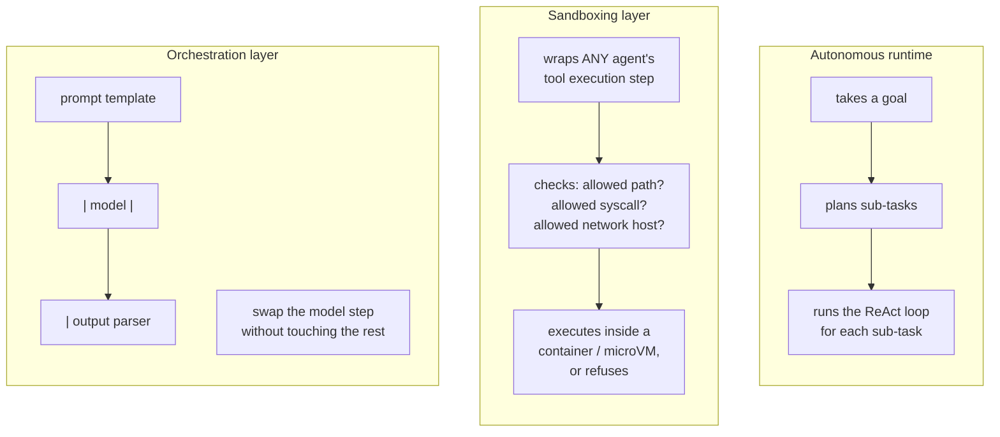

# Day 2 — The Agent Framework Landscape, and Building a Sliver of One

## Why this needs untangling before picking anything

"Agent framework" gets used for at least three genuinely different kinds
of software, and conflating them leads to picking the wrong tool for the
job — or worse, assuming a library gives you a safety property it never
claimed to. Before touching any of them, it's worth separating what each
one actually does.

1. **Autonomous agent platforms/runtimes** (the category AutoGPT-style
   projects and multi-agent orchestration libraries like CrewAI fall
   into, and what LangGraph's graph-based agent runtime provides) — take a
   goal, break it into sub-tasks, and execute the Day 1 loop somewhat
   independently: they manage planning, memory, and tool dispatch for you.
   Powerful, but you are trusting the platform's planner with a large share
   of the decision-making, and its failure modes are now partly hidden
   behind its abstractions.
2. **Sandboxing / security wrapper layers** (container-based isolation,
   microVMs like Firecracker, gVisor's syscall interception, hosted code
   sandboxes) — sit *around* an agent of any kind and constrain what it can
   actually touch: filesystem paths, network calls, subprocess execution.
   They don't plan or reason about the task at all; they enforce a hard
   boundary no matter what the agent decides to try. This is a different
   axis entirely from "autonomy" — a very dumb agent still needs one if it
   can run shell commands.
3. **Framework-agnostic orchestration / composition layers** (LangChain's
   `Runnable`/LCEL interface is the most visible example) — sit *above*
   several different underlying model or tool libraries so an application
   can compose steps declaratively and swap the engine underneath (one
   vendor's model today, a different one next quarter) without rewriting
   the calling code.

None of these three replace understanding the loop itself — every one of
them automates pieces of what was written by hand on Day 1: the `for` loop,
the tool dispatch, the transcript management. Knowing which piece a given
framework automates is what lets you debug it when it misbehaves, instead
of treating a stack trace from inside someone else's planner as a mystery.



## A minimal framework, built to see what's hidden

Every larger framework, underneath its planner and its memory store,
provides three things: a registry of what tools exist and whether they're
allowed, a way to retry a flaky tool call, and a log of every attempt.
Writing that sliver by hand makes the abstraction legible — and, unlike a
description, this version is executed for real below.

```python
import time

class MiniAgentFramework:
    """The three things every larger agent framework provides, minimal:
    (1) a tool registry with an allow/deny flag, (2) a retry wrapper for
    flaky tools, (3) an audit log recording every attempt, allowed or not."""

    def __init__(self):
        self.tools = {}
        self.audit_log = []

    def register_tool(self, name, fn, allowed=True, max_retries=0):
        self.tools[name] = {"fn": fn, "allowed": allowed, "max_retries": max_retries}

    def run_tool(self, name, arg):
        entry = {"tool": name, "arg": arg, "ts": round(time.time(), 3)}
        spec = self.tools.get(name)

        if spec is None or not spec["allowed"]:
            entry["status"] = "denied"
            self.audit_log.append(entry)
            raise PermissionError(f"tool '{name}' is not registered or not allowed")

        attempts = 0
        last_err = None
        while attempts <= spec["max_retries"]:
            attempts += 1
            try:
                result = spec["fn"](arg)               # -> whatever the tool returns
                entry["status"] = "ok"
                entry["attempts"] = attempts
                entry["result"] = result
                self.audit_log.append(entry)
                return result
            except Exception as e:                     # flaky call failed; retry if budget remains
                last_err = e
        entry["status"] = "failed_after_retries"
        entry["attempts"] = attempts
        entry["error"] = str(last_err)
        self.audit_log.append(entry)
        raise RuntimeError(f"tool '{name}' failed after {attempts} attempts: {last_err}")
```

`register_tool`, `run_tool`, and `audit_log` are the same three pieces
every larger framework has under the hood; they just add planners,
richer memory stores, and streaming on top.

### Running it for real: a flaky tool, a denied tool, an audit log

```python
# A tool that fails its first 2 calls, then succeeds -- exercises the
# retry path for real instead of describing it.
_call_count = {"n": 0}
def flaky_search(query):
    _call_count["n"] += 1
    if _call_count["n"] < 3:
        raise ConnectionError(f"simulated timeout on attempt {_call_count['n']}")
    return f"3 results for '{query}'"

def add(arg):
    a, b = [float(x) for x in arg.split(",")]
    return a + b                                        # -> float

fw = MiniAgentFramework()
fw.register_tool("add", add, allowed=True)
fw.register_tool("search", flaky_search, allowed=True, max_retries=3)
fw.register_tool("delete_db", lambda arg: "dropped", allowed=False)

print(fw.run_tool("add", "2,3"))
print(fw.run_tool("search", "agent frameworks"))
try:
    fw.run_tool("delete_db", "prod")
except PermissionError as e:
    print("blocked:", e)
```

Actual output from running this script:

```
add(2,3) -> 5.0
search (flaky, should retry then succeed) -> 3 results for 'agent frameworks'
blocked as expected: tool 'delete_db' is not registered or not allowed

audit log:
{'tool': 'add', 'arg': '2,3', 'ts': 1788863772.63, 'status': 'ok', 'attempts': 1, 'result': 5.0}
{'tool': 'search', 'arg': 'agent frameworks', 'ts': 1788863772.63, 'status': 'ok', 'attempts': 3, 'result': "3 results for 'agent frameworks'"}
{'tool': 'delete_db', 'arg': 'prod', 'ts': 1788863772.63, 'status': 'denied'}
```

`attempts: 3` on the `search` row is the retry loop actually firing twice
before succeeding — confirmed by the `_call_count` closure, not asserted
from the description.

## An LCEL-style pipe chain

Several ecosystem frameworks — LangChain's `Runnable` interface (LCEL)
being the best-known — let you compose `prompt | model | parser` with the
`|` operator. It looks like special syntax; it's ordinary operator
overloading around function composition, invoked right to left through
Python's `__or__`. Here's a schematic version wrapping a local model,
executed end to end below rather than only described:

```python
class RunnableStep:
    def __or__(self, other):
        return PipedStep(self, other)

class PipedStep(RunnableStep):
    def __init__(self, first, second):
        self.first, self.second = first, second

    def invoke(self, x):
        return self.second.invoke(self.first.invoke(x))

class PromptStep(RunnableStep):
    """Illustrative -- a real integration would subclass an actual base
    class such as LangChain's `LLM` class and implement `_call`."""
    def __init__(self, template):
        self.template = template

    def invoke(self, variables):
        return self.template.format(**variables)         # -> str

class LocalModelStep(RunnableStep):
    def __init__(self, generate_fn):
        self.generate_fn = generate_fn

    def invoke(self, prompt_text):
        return self.generate_fn(prompt_text)               # -> str

class StripParserStep(RunnableStep):
    def invoke(self, raw_text):
        return raw_text.strip()                             # -> str, whitespace trimmed

def fake_local_generate(prompt_text):
    # Stand-in for a real local model call; deterministic so the chain's
    # output is checkable.
    return f"  [summary of: {prompt_text[:24]}...]  "

chain = PromptStep("Summarize: {text}") | LocalModelStep(fake_local_generate) | StripParserStep()
result = chain.invoke({"text": "Agents combine reasoning traces with real tool calls."})
print(repr(result))
```

Actual output: `'[summary of: Summarize: Agents combin...]'` — the leading
and trailing whitespace from `fake_local_generate` is gone, confirming
`StripParserStep` really ran last in the chain, not just that the code
compiled.

## Pitfalls

- **Retry storms interact with cost, not just reliability.** A `max_retries`
  that looks harmless in isolation multiplies both latency and — if the
  tool has any per-call cost — spend, every time it fires. This is exactly
  the kind of thing Day 4's cost cap has to account for: a step budget or
  cost budget that doesn't count retried attempts undercounts real spend.
- **The abstraction hides where a prompt actually broke.** When a pipe
  chain's output is wrong, the bug is almost always inside one link
  (usually the parser silently swallowing a malformed model output) — but
  a framework's exception, several layers removed from that link, rarely
  says which one. Being able to unwrap the chain back into
  `PromptStep`/`LocalModelStep`/`StripParserStep` and invoke each in
  isolation is what makes that debuggable.
- **A framework's default configuration is not automatically a safety
  configuration.** Nothing in `MiniAgentFramework` above prevents a tool
  registered `allowed=True` from being destructive — allowlisting *which*
  tools exist is necessary but is a different, additional decision from
  what Day 4 covers (step limits, cost caps, human approval). Assuming a
  framework ships safe defaults without checking is a common, expensive
  mistake.

## Takeaway

Frameworks package the loop, the tool registry, and the audit trail from
Day 1 into reusable pieces — knowing exactly what's underneath (a registry,
a retry wrapper, a log, and for pipe-style APIs, plain function
composition) is what lets you debug them, extend them, or skip them
entirely with confidence, rather than treating a stack trace from inside
one as unapproachable.
