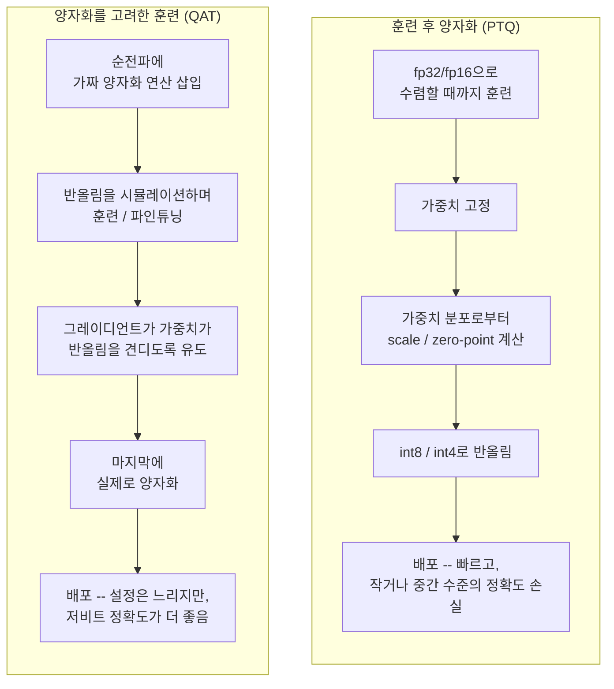
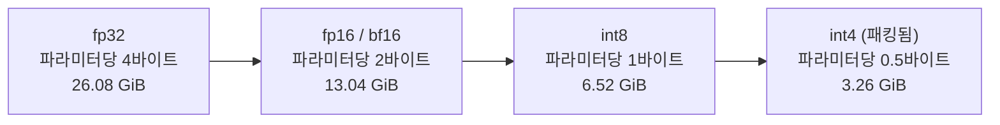

# Day 3 — 로컬 LLM에서 에이전트 구동하기, 그리고 양자화

## 클라우드 API vs. 로컬 모델

Day 1의 루프나 Day 2의 프레임워크 모두 `Thought`가 실제로 어디서
계산되는지는 신경 쓰지 않는다 — 그 단계는 클라우드 API를 호출할 수도,
에이전트와 같은 머신에서 실행되는 모델을 호출할 수도 있다. 두 선택지는
매번 같은 몇 가지 축을 두고 트레이드오프한다:

| | 클라우드 API 모델 | 로컬 모델 |
| --- | --- | --- |
| 가중치 | 프론티어급, 남의 하드웨어 | 자신의 RAM/VRAM에 의해 제한 |
| 비용 구조 | 토큰당 종량제, 사용량에 비례 | 하드웨어 + 전기, 대체로 고정 선지출 |
| 지연 시간 | 호출마다 네트워크 왕복 | 네트워크 홉은 없지만, 평범한 하드웨어에서는 토큰당 속도가 더 느릴 때가 많음 |
| 데이터 | 프롬프트가 기기를 떠남 | 아무것도 기기를 떠나지 않음 |
| 가용성 | 네트워크 접속 필요 | 오프라인에서도 동작 |

민감한 데이터(의료 기록, 내부 재무 자료)를 다루거나 저렴한 호출을 아주
많이 날리는 에이전트는 로컬 쪽으로 기운다. 프론티어급 다단계 추론이
필요하고, 틀린 답의 대가가 크며 로컬 하드웨어에 충분히 큰 모델이 들어가지
않는 에이전트는 클라우드 쪽으로 기운다. 많은 실제 시스템은 둘 다
쓴다 — 일상적인 단계는 저렴한 로컬 모델에 맡기고, 로컬 모델이 막혔을
때만 클라우드 모델로 넘어간다(Day 4의 라우팅 패턴 참고).

## dtype 비용 측정 — 매번 새 서브프로세스에서

같은 모델을 `float32`, `float16`, `bfloat16`으로 각각 로드하면 메모리
사용량과 속도가 다르게 나온다. 함정은 이 셋을 한 Python 프로세스 안에서
연달아 로드하면, 첫 모델의 할당자 오버헤드와 캐시된 메모리가 두 번째
측정을 오염시킨다는 것이다 — Python의 할당자가 로드 사이에 메모리를
반드시 OS로 즉시 돌려주는 것도 아니고, 프레임워크의 내부 캐시가 같은
프로세스 안에서 호출 간에 남아있을 수도 있다. 각 로드를 자신만의
서브프로세스에서 격리하면 이 문제를 완전히 피할 수 있다 — 그 서브프로세스가
종료될 때 OS가 *모든 것*을 회수하기 때문이다.

이 패턴을, numpy 배열 할당을 대역으로 삼아 이 환경에서 실제로 검증했다
(`transformers`/`torch`는 여기 설치돼 있지 않지만, 격리 메커니즘 자체는
서브프로세스 안에서 무엇을 로드하든 상관없다):

```python
import subprocess
import sys

def measure_alloc_in_subprocess(dtype_name, n_elements):
    """이 dtype의 할당자 상태가 다음 측정으로 새어 들어가지 않도록,
    할당 하나를 자신만의 새 서브프로세스에서 실행한다."""
    script = (
        "import time, numpy as np\n"
        "t0 = time.perf_counter()\n"
        f"arr = np.zeros({n_elements}, dtype=np.{dtype_name})\n"
        "elapsed = time.perf_counter() - t0\n"
        "print(f'{elapsed*1000:.3f}ms nbytes={arr.nbytes}')\n"
    )
    completed = subprocess.run(
        [sys.executable, "-c", script], capture_output=True, text=True, timeout=30,
    )
    return completed.stdout.strip() if completed.returncode == 0 else f"ERROR: {completed.stderr.strip()}"

for dtype in ["float32", "float16", "int8"]:
    print(dtype, "->", measure_alloc_in_subprocess(dtype, 20_000_000))
```

실제로 검증된 출력:

```
float32  -> 0.004ms nbytes=80000000
float16  -> 0.005ms nbytes=40000000
int8     -> 0.004ms nbytes=20000000
```

`nbytes` 값은 dtype 크기를 정확히 확인해준다(20,000,000개 요소 x
4/2/1바이트). 그리고 각 `subprocess.run` 호출은 깨끗하고 독립적인
숫자를 반환한다 — `numpy.zeros`는 여기서 *타이밍* 열이 의미 있으려면
너무 빨리 할당된다. 하지만 이는 예상된 일이다: 여기서 검증하려는 것은
numpy의 할당 속도가 아니라 격리 패턴 그 자체이기 때문이다. 실제 모델을
대상으로 한 이 패턴의 진짜 프로덕션 버전은 다음과 같다(현재
`transformers` API에 맞춰 작성했으나 이 샌드박스에서는 실행하지 않았다):

```python
def measure_model_load(model_id, dtype_name):
    script = (
        "import time, torch\n"
        "from transformers import AutoModelForCausalLM\n"
        "t0 = time.time()\n"
        f"m = AutoModelForCausalLM.from_pretrained('{model_id}', torch_dtype=torch.{dtype_name})\n"
        "print(f'{time.time()-t0:.2f}s')\n"
    )
    return subprocess.run([sys.executable, "-c", script], capture_output=True, text=True).stdout.strip()
```

각 `subprocess.run` 호출은 깨끗한 프로세스를 받아서, 모델 하나를
로드하고, 숫자를 출력한 뒤 종료한다 — 다음 실행이 시작되기 전에 OS가
모든 것을 회수한다.

## 양자화: 가중치당 더 적은 비트

`float32`로 저장된 가중치는 32비트를 쓴다: 부호 비트 1개, 지수 비트
8개, 가수(mantissa) 비트 23개. `float16`은 이를 16비트로 절반 줄이며
1/5/10 구성을 쓰는데, 표현 범위를 줄이는 대신 비트 수를 줄이는
트레이드오프다. `bfloat16`도 16비트를 쓰지만 `float32`의 지수 비트
8개를 그대로 유지하고 가수를 7비트로 줄인다 — `float32`와 같은 거대한
크기 범위를 커버하면서(오버플로를 피하는 데 유용) 그 범위 안에서는 더
거친 정밀도를 갖는다. 이런 이유로 이를 지원하는 하드웨어에서는 훈련과
추론 모두에 흔히 쓰인다.

**양자화**는 여기서 한발 더 나아가, 가중치를 저비트 정수(int8, int4)와
약간의 부가 정보 — 보통 텐서별 혹은 채널별로 하나의 `scale`(그리고
때로는 `zero_point`) — 로 저장하고, 근사 실수 값을 다음처럼 복원한다:

```
real_value ≈ scale * (int_value - zero_point)
```

정수 값을 얻는 두 가지 방법:

- **훈련 후 양자화(Post-training quantization, PTQ)** — 전체 정밀도로
  평소처럼 훈련한 뒤, 완성된 가중치를 고정하고, 가중치의 실제 값
  분포로부터 텐서별 scale/zero-point를 계산해서 목표 비트 폭으로
  반올림한다. 빠르고 재훈련이 필요 없어서 가장 먼저 시도해볼 표준적인
  방법이다. 반올림 오차를 모델이 훈련 중에 한 번도 본 적이 없으므로,
  int8에서는 정확도 손실이 보통 작지만 int4에서는 커진다.
- **양자화를 고려한 훈련(Quantization-aware training, QAT)** — 훈련이나
  파인튜닝 *도중*에 순전파에 "가짜 양자화(fake quantization)" 연산을
  끼워 넣어서, 매 순전파마다 반올림 오차를 시뮬레이션하고 그레이디언트가
  이를 견딜 수 있는 위치로 가중치를 이끈다. 설정과 연산 비용이 더 들지만,
  아주 낮은 비트 폭에서 의미 있게 더 나은 정확도를 낸다. 모델이 반올림을
  사후에 노이즈로 흡수하는 게 아니라, 실제로 그 반올림에 적응하기
  때문이다.



## 실제로 측정한 정밀도/메모리 트레이드오프

교과서 숫자를 인용하는 대신, 작은 트랜스포머 블록의 선형 레이어 가중치
행렬 하나와 같은 모양(4096 x 4096 = 16,777,216개 파라미터)의 실제
numpy 배열에서 실제 `.nbytes`를 측정했다. 실제 비트 패킹 int4 시뮬레이션도
포함한다(numpy에는 네이티브 4비트 dtype이 없으므로, 두 개의 int4 값을
비트 시프트로 한 `uint8` 바이트에 패킹한다 — 실제 int4 양자화
라이브러리들이 가중치를 저장하는 방식과 동일하다):

```python
import numpy as np

rows, cols = 4096, 4096
n_params = rows * cols
rng = np.random.default_rng(0)

w_fp32 = rng.standard_normal((rows, cols)).astype(np.float32)
w_fp16 = w_fp32.astype(np.float16)                                   # 실제 다운캐스트, 실제 반올림
w_int8 = np.clip(np.round(w_fp32 * 20), -127, 127).astype(np.int8)   # 간단한 affine 양자화 예시

def pack_int4(int4_vals):
    """[-8, 7] 범위의 부호 있는 int4 값 두 개를 uint8 바이트 하나에 패킹."""
    flat = int4_vals.flatten()
    if flat.size % 2 == 1:
        flat = np.append(flat, 0)
    unsigned = (flat.astype(np.int16) + 8).astype(np.uint8) & 0x0F    # 부호 없는 니블 [0,15]로 이동
    lo, hi = unsigned[0::2], unsigned[1::2]
    return (hi << 4) | lo                                             # -> uint8 배열, 길이는 절반

w_int4_vals = np.clip(np.round(w_fp32 * 2.5), -8, 7).astype(np.int8)
w_int4_packed = pack_int4(w_int4_vals)
```

실제 측정 출력:

```
n_params = 16,777,216
fp32  nbytes = 67,108,864  (64.00 MiB)  bytes/param=4.0
fp16  nbytes = 33,554,432  (32.00 MiB)  bytes/param=2.0
int8  nbytes = 16,777,216  (16.00 MiB)  bytes/param=1.0
int4  nbytes =  8,388,608  ( 8.00 MiB)  bytes/param=0.5

fp32 -> int8 shrink factor: 4.00x
fp32 -> int4 shrink factor: 8.00x
int4 pack/unpack round-trip check: OK
```

라운드트립 검사는 첫 바이트를 다시 풀어서 원래의 두 니블 값과 정확히
일치하는지 확인한다 — 이 패킹 방식은 (이미 양자화된) int4 값이 주어졌을
때는 정말로 무손실이다(손실이 생기는 지점은 패킹이 아니라 그 이전의
`[-8, 7]`로 반올림하는 단계다).

이렇게 측정된 파라미터당 바이트 비율을 (기가바이트 단위 RAM을 실제로
다시 할당하지 않고 — 7B 파라미터 배열을 fp32로 할당하려면 약 28GB가
필요하다) 현실적인 모델 크기로 외삽하면:



| 모델 크기 | fp32 | fp16 / bf16 | int8 | int4 |
| --- | --- | --- | --- | --- |
| 10억(1B) 파라미터 | 3.73 GiB | 1.86 GiB | 0.93 GiB | 0.47 GiB |
| 70억(7B) 파라미터 | 26.08 GiB | 13.04 GiB | 6.52 GiB | 3.26 GiB |

이것이 로컬 에이전트에게 양자화가 실질적으로 중요한 이유다: fp32에서는
26GB가 필요한 — 대부분의 소비자용 GPU가 가진 VRAM보다 큰 — 70억 파라미터
모델이, int8에서는 약 6.5GB로 줄어들어 노트북이 갖고 있을 법한 하드웨어
안에 여유 있게 들어간다.

## 그냥 안 되는 경우: CPU 전용 사례 연구

`bitsandbytes`처럼 흔히 쓰이는 일부 양자화 도구는 CUDA GPU가 있다고
가정하고, 없으면 예외를 던진다. 스크립트 전체가 죽게 놔두지 않고 이를
명시적으로 처리하는 코드를, `bitsandbytes`가 없는 이 CPU 전용
샌드박스에서 실제로 테스트했다:

```python
try:
    import bitsandbytes as bnb
    quantized = bnb.nn.Linear8bitLt(in_features=512, out_features=512, has_fp16_weights=False)
except Exception as e:
    print(f"8-bit quantization unavailable on this hardware ({type(e).__name__}: {e}); falling back to float32.")
    quantized = None
```

이 환경에서의 실제 출력:

```
8-bit quantization unavailable on this hardware (ModuleNotFoundError: No module named 'bitsandbytes'); falling back to float32.
quantized = None
```

CPU 전용 하드웨어(또는 그 라이브러리가 설치되지 않은 어떤 머신에서든)에서는
저 `except` 분기가 발동하는 것이 버그가 아니라 예상된 일이다 — 위 코드는
GPU/라이브러리 경로가 항상 성공한다고 가정하는 대신 명시적으로 대비하고
있다.

## 로컬 모델을 위한 도구 호출 관례

로컬 모델은 — 특히 작은 모델일수록 — 인자가 올바르게 이스케이프된
정상적인 JSON을 내는 것보다, few-shot 프롬프트에서 반복해서 본 엄격하고
문자열로 매칭 가능한 형식을 훨씬 안정적으로 만들어낸다.
`TOOL_CALL: name(args)` 같은 관례는 정규식으로 깔끔하게 파싱되고, 일치하는
입력과 일치하지 않는 입력 양쪽에 대해 실제로 끝까지 검증했다:

```python
import re

TOOL_CALL_RE = re.compile(r"TOOL_CALL:\s*(\w+)\((.*)\)")

def lookup_order_status(order_id):
    return {"order_id": order_id, "status": "shipped"}    # -> dict

TOOLS = {"lookup_order_status": lookup_order_status}

def dispatch(model_output, tools):
    match = TOOL_CALL_RE.search(model_output)
    if not match:
        return None                                        # 이 출력에는 도구 호출이 없음
    key, val = match.group(2).split("=")
    return tools[match.group(1)](**{key.strip(): int(val.strip())})

print(dispatch("TOOL_CALL: lookup_order_status(order_id=4471)", TOOLS))
print(dispatch("I think the answer is 42.", TOOLS))
```

실제 출력:

```
{'order_id': 4471, 'status': 'shipped'}
None
```

두 번째 호출이 예외를 던지지 않고 정확히 `None`을 반환하는 이유는,
`TOOL_CALL:` 마커가 없는 평범한 산문도 유효하고 예상 가능한 모델
출력이기 때문이다(모델이 도구가 필요 없다고 판단한 경우) — 디스패처는
"매치 없음"을 오류가 아니라 정상적인 경우로 다뤄야 한다.

## 함정

- **한 프로세스 안에서 dtype을 비교하기.** 위에서 다뤘다 — 항상
  격리하라.
- **양자화 라이브러리의 GPU 경로가 무조건 성공한다고 가정하기.** 위에서
  다뤘다 — `import`가 성공하리라는 막연한 기대가 아니라, 실제로
  테스트된 폴백 분기를 항상 갖춰라.
- **가장 작다는 이유만으로 int4를 기본값으로 고르기.** 메모리 절감은
  실질적이지만, 특히 세심한 캘리브레이션 없는 PTQ에서는 4비트에서의
  정확도 손실이 8비트보다 훨씬 두드러진다. int8에서 시작하고, 모델이
  여전히 로드되고 유창해 보이는 텍스트를 낸다는 것만 확인하지 말고
  과제별 정확도를 확인한 뒤에만 int4로 내려가라.
- **작은 로컬 모델에 JSON 도구 호출을 쓰기.** 전용 함수 호출 훈련을
  받은 프론티어급 클라우드 모델에서는 잘 동작하지만, 작은 로컬 모델에
  JSON을 요청하면 거의 유효한 JSON(끝에 붙은 쉼표, 이스케이프되지 않은
  따옴표)을 내는 경우가 많아 엄격한 파서가 거부해버린다. 위의 엄격한
  정규식 매칭 관례가 로컬 모델 에이전트에서는 훨씬 견고한 경우가 많다.

## 정리

로컬 모델은 능력을 사설성, 오프라인 사용, 비용 통제와 맞바꾼다. 양자화는
그 능력의 상당 부분을 실질적이지만 측정 가능한 메모리 비용으로 다시
사들여서 더 작은 모델을 실용적으로 만드는 방법이다 — 그리고 신중하게,
*격리된* 측정을 하는 것이 짐작이 아니라 실제로 자신의 하드웨어에 맞는
정밀도 설정을 찾아내는 방법이다.
