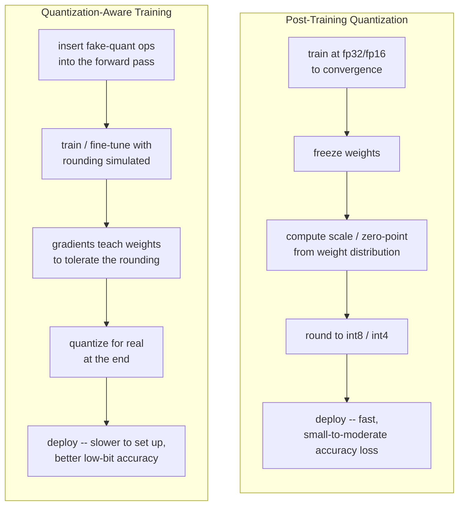
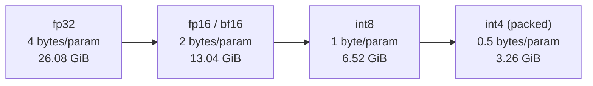

# Day 3 — Running Agents on Local LLMs, and Quantization

## Cloud API vs. local model

Nothing about the Day 1 loop or the Day 2 framework cares where `Thought`
actually gets computed — that step can call a cloud API or a model running
on the same machine as the agent. The two options trade off along the same
few axes every time:

| | Cloud API model | Local model |
| --- | --- | --- |
| Weights | Frontier-scale, someone else's hardware | Capped by your own RAM/VRAM |
| Cost shape | Per-token billing, scales with usage | Hardware + electricity, mostly fixed up front |
| Latency | A network round trip per call | No network hop, but often slower per token on modest hardware |
| Data | Your prompts leave the machine | Nothing leaves the machine |
| Availability | Requires network access | Works offline |

Agents handling sensitive data (medical notes, internal financial records)
or firing an extremely high volume of cheap calls lean local. Agents that
need frontier-level multi-step reasoning, where a wrong answer is expensive
and local hardware can't fit a big enough model, lean cloud. Many real
systems use both — a cheap local model for routine steps, escalating to a
cloud model only when the local one is stuck (see Day 4's routing pattern).

## Measuring dtype cost — in a fresh subprocess each time

Loading the same model in `float32`, `float16`, and `bfloat16` produces
different memory footprints and speeds. The trap: loading all three
back-to-back inside one Python process means the first model's allocator
overhead and cached memory pollute the second measurement — Python's
allocator does not necessarily hand memory straight back to the OS between
loads, and a framework's internal caches can persist across calls in the
same process. Isolating each load in its own subprocess sidesteps this
entirely, since the OS reclaims *everything* when that subprocess exits.

The pattern, verified for real in this environment using numpy array
allocation as a stand-in (`transformers`/`torch` are not installed here,
but the isolation mechanism does not depend on what gets loaded inside the
subprocess):

```python
import subprocess
import sys

def measure_alloc_in_subprocess(dtype_name, n_elements):
    """Runs one allocation in its own fresh subprocess so this dtype's
    allocator state can't bleed into the next measurement."""
    script = (
        "import time, numpy as np\n"
        "t0 = time.perf_counter()\n"
        f"arr = np.zeros({n_elements}, dtype=np.{dtype_name})\n"
        "elapsed = time.perf_counter() - t0\n"
        "print(f'{elapsed*1000:.3f}ms nbytes={arr.nbytes}')\n"
    )
    completed = subprocess.run(
        [sys.executable, "-c", script], capture_output=True, text=True, timeout=30,
    )
    return completed.stdout.strip() if completed.returncode == 0 else f"ERROR: {completed.stderr.strip()}"

for dtype in ["float32", "float16", "int8"]:
    print(dtype, "->", measure_alloc_in_subprocess(dtype, 20_000_000))
```

Actual verified output:

```
float32  -> 0.004ms nbytes=80000000
float16  -> 0.005ms nbytes=40000000
int8     -> 0.004ms nbytes=20000000
```

The `nbytes` values confirm the dtype sizes exactly (20,000,000 elements ×
4/2/1 bytes), and each `subprocess.run` call returns a clean, independent
number — `numpy.zeros` allocates too fast for the *timing* column to be
meaningful here, but that's expected: the point being verified is the
isolation pattern, not numpy's allocation speed. The real, production shape
of this same pattern against an actual model looks like this (written
against the current `transformers` API, not executed in this sandbox):

```python
def measure_model_load(model_id, dtype_name):
    script = (
        "import time, torch\n"
        "from transformers import AutoModelForCausalLM\n"
        "t0 = time.time()\n"
        f"m = AutoModelForCausalLM.from_pretrained('{model_id}', torch_dtype=torch.{dtype_name})\n"
        "print(f'{time.time()-t0:.2f}s')\n"
    )
    return subprocess.run([sys.executable, "-c", script], capture_output=True, text=True).stdout.strip()
```

Each `subprocess.run` call gets a clean process, loads one model, reports
its number, and exits — the OS reclaims everything before the next run
starts.

## Quantization: fewer bits per weight

A weight stored as `float32` uses 32 bits: 1 sign bit, 8 exponent bits, 23
mantissa bits. `float16` halves that to 1/5/10, trading dynamic range for
fewer bits. `bfloat16` also uses 16 bits but keeps `float32`'s 8 exponent
bits and shrinks the mantissa to 7 — it covers the same huge range of
magnitudes as `float32` (useful for avoiding overflow) at coarser
precision within that range, which is why it's common for training and
inference alike on hardware that supports it.

**Quantization** goes further: it stores weights as low-bit integers
(int8, int4) plus a small amount of side information — typically one
`scale` (and sometimes a `zero_point`) per tensor or per channel — and
reconstructs an approximate real value as:

```
real_value ≈ scale * (int_value - zero_point)
```

Two ways to get the int values:

- **Post-training quantization (PTQ)** — train normally at full precision,
  freeze the finished weights, then compute a scale/zero-point per tensor
  from the weights' actual value distribution and round to the target
  bit-width. Fast, no retraining needed, and the standard first thing to
  try; the rounding error was never seen by the model during training, so
  accuracy loss is usually small at int8 but grows at int4.
- **Quantization-aware training (QAT)** — insert "fake quantization" ops
  into the forward pass *during* training or fine-tuning, so the rounding
  error is simulated on every forward pass and gradients teach the weights
  to land in places that tolerate it. More setup and compute cost, but
  meaningfully better accuracy at very low bit-widths, because the model
  actually adapts to the rounding rather than absorbing it as noise after
  the fact.



## The precision/memory tradeoff, measured for real

Rather than quoting textbook numbers, this measures actual `.nbytes` on a
real numpy array shaped like one linear-layer weight matrix from a small
transformer block (4096 x 4096 = 16,777,216 parameters), including a real
bit-packed int4 simulation (numpy has no native 4-bit dtype, so two int4
values are packed into each `uint8` byte via bit shifts — genuinely how
int4 quantization libraries store weights):

```python
import numpy as np

rows, cols = 4096, 4096
n_params = rows * cols
rng = np.random.default_rng(0)

w_fp32 = rng.standard_normal((rows, cols)).astype(np.float32)
w_fp16 = w_fp32.astype(np.float16)                                   # real downcast, real rounding
w_int8 = np.clip(np.round(w_fp32 * 20), -127, 127).astype(np.int8)   # toy affine quant

def pack_int4(int4_vals):
    """Two signed int4 values in [-8, 7] packed into one uint8 byte."""
    flat = int4_vals.flatten()
    if flat.size % 2 == 1:
        flat = np.append(flat, 0)
    unsigned = (flat.astype(np.int16) + 8).astype(np.uint8) & 0x0F    # shift to unsigned nibble [0,15]
    lo, hi = unsigned[0::2], unsigned[1::2]
    return (hi << 4) | lo                                             # -> uint8 array, half the length

w_int4_vals = np.clip(np.round(w_fp32 * 2.5), -8, 7).astype(np.int8)
w_int4_packed = pack_int4(w_int4_vals)
```

Actual measured output:

```
n_params = 16,777,216
fp32  nbytes = 67,108,864  (64.00 MiB)  bytes/param=4.0
fp16  nbytes = 33,554,432  (32.00 MiB)  bytes/param=2.0
int8  nbytes = 16,777,216  (16.00 MiB)  bytes/param=1.0
int4  nbytes =  8,388,608  ( 8.00 MiB)  bytes/param=0.5

fp32 -> int8 shrink factor: 4.00x
fp32 -> int4 shrink factor: 8.00x
int4 pack/unpack round-trip check: OK
```

The round-trip check unpacks the first byte back into its two nibble
values and confirms they match the original `w_int4_vals` exactly — the
packing scheme really is lossless *given* the already-quantized int4
values (the lossy step is the earlier rounding to `[-8, 7]`, not the
packing).

Extrapolating those measured bytes-per-parameter ratios (not re-allocating
gigabytes of RAM — a 7B-parameter array at fp32 would need ~28 GB just to
allocate) to realistic model sizes:



| Model size | fp32 | fp16 / bf16 | int8 | int4 |
| --- | --- | --- | --- | --- |
| 1B params | 3.73 GiB | 1.86 GiB | 0.93 GiB | 0.47 GiB |
| 7B params | 26.08 GiB | 13.04 GiB | 6.52 GiB | 3.26 GiB |

This is the actual, practical reason quantization matters for local
agents: a 7B model that needs 26 GB at fp32 — more VRAM than most consumer
GPUs have — fits in roughly 6.5 GB at int8, comfortably inside hardware a
laptop can plausibly have.

## When it just doesn't work: a CPU-only case study

Some quantization tooling (`bitsandbytes` is the common example) assumes a
CUDA GPU is present and raises when it isn't. Handling that explicitly
rather than letting the whole script die was tested for real in this
CPU-only, `bitsandbytes`-free sandbox:

```python
try:
    import bitsandbytes as bnb
    quantized = bnb.nn.Linear8bitLt(in_features=512, out_features=512, has_fp16_weights=False)
except Exception as e:
    print(f"8-bit quantization unavailable on this hardware ({type(e).__name__}: {e}); falling back to float32.")
    quantized = None
```

Actual output in this environment:

```
8-bit quantization unavailable on this hardware (ModuleNotFoundError: No module named 'bitsandbytes'); falling back to float32.
quantized = None
```

On CPU-only hardware (or any machine without the library installed), that
`except` branch firing is expected, not a bug — the code above plans for
it explicitly instead of assuming the GPU/library branch always succeeds.

## A tool-calling convention for local models

Local models — especially small ones — are far more reliable at producing
a rigid, string-matchable format they've seen repeated in a few-shot
prompt than at emitting well-formed JSON with correctly escaped
arguments. A convention like `TOOL_CALL: name(args)` parses cleanly with a
regex and was verified end to end against both a matching and a
non-matching input:

```python
import re

TOOL_CALL_RE = re.compile(r"TOOL_CALL:\s*(\w+)\((.*)\)")

def lookup_order_status(order_id):
    return {"order_id": order_id, "status": "shipped"}    # -> dict

TOOLS = {"lookup_order_status": lookup_order_status}

def dispatch(model_output, tools):
    match = TOOL_CALL_RE.search(model_output)
    if not match:
        return None                                        # no tool call in this output
    key, val = match.group(2).split("=")
    return tools[match.group(1)](**{key.strip(): int(val.strip())})

print(dispatch("TOOL_CALL: lookup_order_status(order_id=4471)", TOOLS))
print(dispatch("I think the answer is 42.", TOOLS))
```

Actual output:

```
{'order_id': 4471, 'status': 'shipped'}
None
```

The second call correctly returns `None` instead of raising, because plain
prose with no `TOOL_CALL:` marker is a valid, expected model output too
(the model deciding no tool is needed) — the dispatcher has to treat "no
match" as a normal case, not an error.

## Pitfalls

- **Comparing dtypes inside one process.** Covered above — always isolate.
- **Assuming a quantization library's GPU path is unconditional.** Covered
  above — always have a tested fallback branch, not just a hope that
  `import` succeeds.
- **Picking int4 by default because it's smallest.** The memory savings
  are real, but accuracy loss at 4 bits is far more pronounced than at 8,
  especially for PTQ without careful calibration. Start at int8; drop to
  int4 only after checking task-specific accuracy, not just checking that
  the model still loads and produces fluent-looking text.
- **JSON tool-calling on a small local model.** Works fine on frontier
  cloud models with dedicated function-calling training; a small local
  model asked for JSON will often produce almost-valid JSON (a trailing
  comma, an unescaped quote) that a strict parser rejects. The rigid
  regex-matchable convention above tends to be far more robust for
  local-model agents specifically.

## Takeaway

Local models trade capability for privacy, offline use, and cost control;
quantization is how you buy back enough of that capability to make a
smaller model practical, at a real but measurable memory cost — and
careful, *isolated* measurement is how you find the precision setting that
actually fits your hardware instead of guessing.
