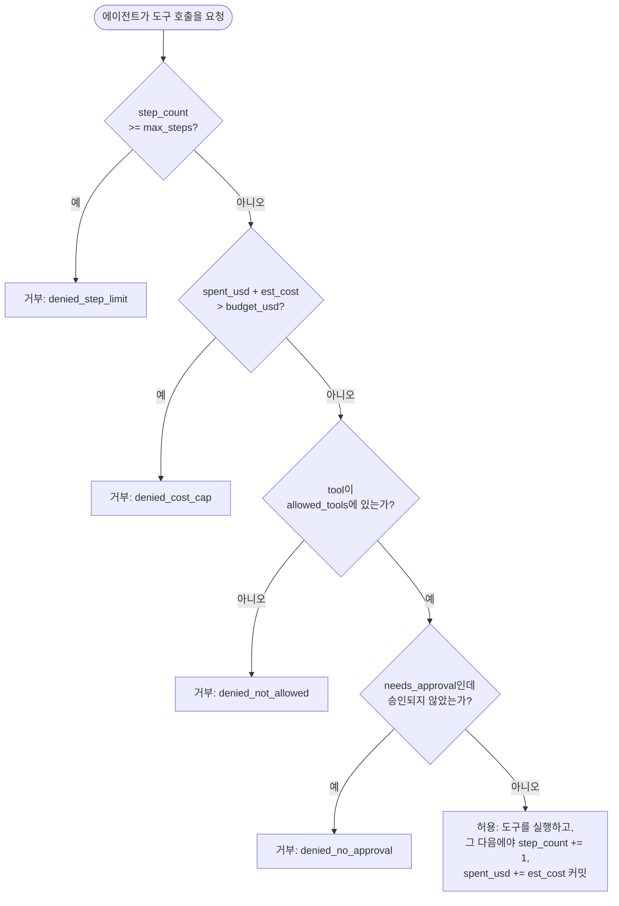

# Day 4 — 에이전트 안전장치

## 평범한 챗봇에는 필요 없고 에이전트에는 필요한 이유

챗봇의 출력은 사람이 읽는 텍스트다. 에이전트의 출력은 실제 도구
호출이다: 실제로 발송되는 이메일, 실제로 삭제되는 파일, 실제로
등록되는 환불. Day 1의 루프와 Day 2의 레지스트리는 에이전트에게 이런
행동을 반복적으로, 자율적으로 취할 *수단*을 준다. 둘 중 어느 것도
*어떤* 행동을, *몇 번*, *누군가의 승인 없이* 하는지를 제한하지 않는다.
이는 별개의, 의도적으로 설계해야 할 계층이며, 여기서 다룬다.

## 네 가지 메커니즘

1. **도구 허용 목록(allowlist), default-deny.** 에이전트는 명시적으로
   허용 표시된 도구만 호출할 수 있다 — 목록에 없으면 거부된다. "막히지
   않는 한 허용"이 아니다. default-deny가 중요한 구체적인 이유는,
   블록리스트는 위험한 모든 것을 미리 예상해야 하는 반면, default-deny
   아래서 새로 등록된 도구는 누군가 의도적으로 검토하고 허용할 때까지
   사용 불가 상태로 시작하기 때문이다. 블록리스트의 실패 모드는 조용하다
   (새 도구가 위험한데 아직 아무도 목록에 추가하지 않음). default-deny의
   실패 모드는 시끄럽다(정당한 새 도구가 누군가 켜줄 때까지 동작하지
   않음) — 시끄러운 실패는 고쳐지지만, 조용한 실패는 무언가 잘못될
   때까지 눈에 띄지 않는다.
2. **스텝 제한.** 루프 반복 횟수에 대한 하드 캡으로, 혼란에 빠진
   에이전트가 영원히 도는 것을 막는다 — Day 1과 같은 가드이지만, 호출하는
   코드가 매번 넘겨줘야 하는 것이 아니라 항상 켜져 있는 정식 규칙으로
   승격된 것이다. 이는 그 자체로 비용 통제이기도 하다: 각 스텝은 보통
   적어도 한 번의 모델 호출이므로, 스텝 캡은 달러 단위 예산이 추가되기도
   전에 이미 암묵적인 지출 상한 역할을 한다.
3. **사람 승인 게이트(human-in-the-loop).** 되돌리기 어려운 고위험
   행동(송금, 데이터 삭제, 에이전트가 깔끔하게 되돌릴 수 없는 것)은
   사람이 명시적으로 승인할 때까지 루프를 멈춘다. 이는 정말로 고위험인
   행동에만 예약해두어야 한다 — *모든 것*을 승인 뒤에 두면 승인자가
   요청을 제대로 읽지 않고 도장만 찍게 되고, 이는 사람을 루프에 넣는
   목적 전체를 무너뜨린다.
4. **비용 상한.** 추정 지출 달러의 누적 합계로, 예산을 넘으면 다른 모든
   조건이 통과하더라도 이후 호출은 거부된다. 아래에서 깊이 다룰 미묘한
   지점은 정확히 *언제* 그 누적 합계가 증가하느냐다.

## 검사 순서는 장식이 아니다



이 순서는 두 가지 독립적인 근거로 의도된 것이다:

- **검사 자체의 비용.** 스텝 제한과 비용 상한은 `O(1)` 카운터 비교다 —
  사실상 공짜다. 허용 목록 검사는 집합(set) 조회로, 여전히 빠르지만
  약간 더 많은 작업이다. 사람 승인은 실제 사람에게서 몇 초에서 몇 분간
  블록될 수 있는 유일한 검사이므로 마지막에 실행된다: 더 저렴하고 즉각
  적인 모든 검사가 먼저 거부할 기회를 갖는다는 뜻이고, 결국 사람은
  이미 모든 자동 검사를 통과한 요청에 대해서만 방해받게 된다.
- **카운터가 언제 커밋되는가.** 위 다이어그램에서 `step_count`와
  `spent_usd`는 오직 최종 `Allow` 분기에서만 — 즉 *모든* 검사가 통과된
  이후에만 — 변경된다. 이 디테일 하나는 각 검사가 하나의 커밋 지점을
  가진 단일 함수가 아니라 독립적인 미들웨어 함수들로 구현될 때 놓치기
  쉽고, 잘못 처리하면 실제로 확인 가능한 결과가 생긴다. 바로 다음에서
  보여준다.

## 올바른 순서, 실제로 실행

```python
class GuardedAgentRunner:
    def __init__(self, allowed_tools, max_steps, budget_usd, approve_fn):
        self.allowed_tools = set(allowed_tools)
        self.max_steps = max_steps
        self.budget_usd = budget_usd
        self.spent_usd = 0.0
        self.step_count = 0
        self.approve_fn = approve_fn
        self.log = []

    def call_tool(self, name, args, est_cost, needs_approval=False):
        record = {"tool": name, "args": args, "cost": est_cost, "status": None}

        if self.step_count >= self.max_steps:                     # 1) 가장 저렴함: 카운터 검사
            record["status"] = "denied_step_limit"
        elif self.spent_usd + est_cost > self.budget_usd:          # 2) 이것도 카운터 검사
            record["status"] = "denied_cost_cap"
        elif name not in self.allowed_tools:                       # 3) 집합 조회
            record["status"] = "denied_not_allowed"
        elif needs_approval and not self.approve_fn(name, args):   # 4) 가장 느림: 사람
            record["status"] = "denied_no_approval"
        else:
            record["status"] = "allowed"
            self.step_count += 1            # 모든 검사가 통과했을 때만 커밋
            self.spent_usd += est_cost      # 모든 검사가 통과했을 때만 커밋

        self.log.append(record)
        return record["status"] == "allowed"
```

한 번도 허용 목록에 오른 적 없는 도구(`wire_transfer`, 각 $0.30씩 3회
시도)를 반복해서 찔러보는 혼란에 빠진 에이전트, 그다음 정당한
`search` 호출 하나를, $1.00 예산에 대해 이걸로 실행하면:

```
{'tool': 'wire_transfer', 'cost': 0.3, 'status': 'denied_not_allowed', 'spent_after': 0.0}
{'tool': 'wire_transfer', 'cost': 0.3, 'status': 'denied_not_allowed', 'spent_after': 0.0}
{'tool': 'wire_transfer', 'cost': 0.3, 'status': 'denied_not_allowed', 'spent_after': 0.0}
{'tool': 'search',        'cost': 0.02, 'status': 'allowed',           'spent_after': 0.02}
final spent_usd = 0.02 (budget 1.00)
```

거부된 세 번의 `wire_transfer` 시도는 `spent_usd`를 전혀 움직이지
않았다 — 실제로 실행된 적이 없으므로, 의도한 대로다.

## 버그: 허용 여부를 확인하기 전에 비용부터 청구하기

이 버그의 흔한 실제 형태는 이렇다: 각 가드가 최종에 하나의 커밋 지점을
가진 단일 함수가 아니라, 다음 검사로 넘기기 전에 자기만의 공유 상태
조각을 갱신하는 독립적인 미들웨어로 작성된 경우다. 여기서는 비용 추적
미들웨어가 먼저 실행되어 "시도된 지출"을 무조건 기록하는데, 이는
허용목록 검사가 그 호출을 거부할 기회를 갖기 *전*이다:

```python
class BuggyGuardedRunner:
    # ... 위와 동일한 __init__ ...
    def call_tool(self, name, args, est_cost, needs_approval=False):
        record = {"tool": name, "cost": est_cost, "status": None}

        # 버그: 호출이 허용될지도 모르는데 여기서 이미 비용이 청구된다
        # -- 이 미들웨어의 역할은 "비용 추적"뿐이므로, 기다리지 않고
        # 무조건 그 일을 해버린다.
        if self.spent_usd + est_cost > self.budget_usd:
            record["status"] = "denied_cost_cap"
            self.log.append(record); return False
        self.spent_usd += est_cost   # <-- 나중 검사가 거부하더라도 이미 청구됨

        if name not in self.allowed_tools:
            record["status"] = "denied_not_allowed"
            self.log.append(record); return False
        # ... 스텝 제한과 승인 검사가 뒤따른다, 올바른 버전과 동일 ...
        record["status"] = "allowed"
        self.step_count += 1
        self.log.append(record)
        return True
```

위와 *동일한* 시퀀스의 시도에 대해 실행하면:

```
{'tool': 'wire_transfer', 'cost': 0.3, 'status': 'denied_not_allowed', 'spent_after': 0.30}
{'tool': 'wire_transfer', 'cost': 0.3, 'status': 'denied_not_allowed', 'spent_after': 0.60}
{'tool': 'wire_transfer', 'cost': 0.3, 'status': 'denied_not_allowed', 'spent_after': 0.90}
{'tool': 'search',        'cost': 0.02, 'status': 'allowed',           'spent_after': 0.92}
final spent_usd = 0.92 (budget 1.00)
```

거부된 세 번의 호출과 허용된 한 번의 호출은 동일한데, `spent_usd`는
**0.02**가 아니라 **0.92**로 끝난다 — 버그 있는 러너가 한 번도 실제로
승인된 적 없는 세 번의 호출에 대해 "지출"했기 때문이다. 이는 단순한
회계상의 신기한 현상이 아니다. 완전히 정당한 `send_email` 호출을 $0.15
견적으로 하나 더 보내보면 이 괴리가 구체적으로 드러난다:

```
correct runner allows it: True  (spent_usd=0.17)
buggy runner allows it:   False (spent_usd=0.92, would exceed $1.00 budget)
```

버그 있는 러너는 정당한 행동을 잘못 거부한다 — `denied_cost_cap`으로
기록되는데, 이는 실질적으로 오도하는 정보다. 실제 원인은 같은 세션
안에서 앞서 있었던, 전혀 다른 도구 호출의 무관한 세 번의 시도였기
때문이다. 나중에 이 로그를 읽는 사람은 `denied_cost_cap`만 보고는 예산이
사실 한 번도 위험한 적 없었다는 것을 알 방법이 없다. 이것이 "검사 순서가
중요하다"의 구체적인 버전이다: 순서는 성능뿐 아니라 무엇이 거부 사유로
기록되는지, 그리고 무관한 나쁜 호출 하나와 부딪힌 뒤에도 정당한 요청이
살아남는지 여부까지 바꾼다.

## 로그를 감사 트레일로 바꾸기

```python
import pandas as pd

audit_df = pd.DataFrame(runner.log)
suspicious = (
    audit_df.groupby(["tool", "args"])
    .size()
    .reset_index(name="attempts")
    .query("attempts >= 5")
)
```

동일한 `wire_transfer` 거부 시도 5회와 무관한 `search` 호출 1회를
대상으로 검증한 결과:

```
            tool             args  attempts
1  wire_transfer  {'amount': 500}         5
```

`(tool, args)`로 그룹화해서 비정상적으로 많이 시도된 조합 — 특히 반복적으로
거부된 조합 — 을 표시하는 것은, 별도의 이상 탐지 모델 없이도 막히거나
오작동하는 에이전트를 잡아내는 단순하고 효과적인 휴리스틱이다. 이는 또한
위에서 본 비용 추적 버그가 정확히 오염시킬 만한 종류의 것이기도 하다:
감사 로그의 `spent_after` 열이 오염돼 있다면, "이 에이전트가 실제로
우리에게 얼마를 쓰게 했는가"를 로그로부터 재구성하려는 조사자도 잘못된
숫자를 얻게 된다.

## 막혔을 때 더 큰 모델로 넘어가기

이 네 가지 안전장치와 함께 알아둘 만한 패턴: 일상적인 단계는 저렴한
로컬 모델(Day 3)로 처리하고, 로컬 모델이 스텝 예산을 다 쓰고도 성공하지
못했을 때만 마지막으로 한 번, 최선을 다해 더 큰 클라우드 모델로 넘어간다.

```python
def route_request(local_agent_run, cloud_agent_run, question):
    local_result = local_agent_run(question)   # 저렴하니 먼저 시도
    if local_result is None:                   # 로컬 모델이 포기 / max_steps 도달
        return cloud_agent_run(question)        # 막혔을 때만 상향 이동
    return local_result
```

대부분의 요청은 비싼 모델이 전혀 필요 없으므로, 이 방식은 평균 요청당
비용과 지연 시간을 의미 있게 줄이면서도, 어려운 케이스에는 그냥 실패
처리하는 대신 더 강력한 모델의 능력을 시도해볼 기회를 준다. 이 상향
호출도 여전히 같은 네 가지 안전장치를 통과해야 한다 — "이건 비싼
폴백 경로니까"는 허용 목록이나 비용 상한을 건너뛸 이유가 아니다. 오히려
그 반대로, 그 상향 호출은 구조적으로 더 비싼 호출이므로 비용 상한을
*더 엄격하게* 확인할 이유가 된다.

## 함정

- **모든 검사가 통과하기 전에 비용이나 스텝 수를 청구하는 것** — 위에서
  실제로 실행해서 보여준 숫자로 확인한 버그다.
- **모든 행동을 사람 승인 뒤에 두는 것** — 승인자가 요청을 꼼꼼히
  읽지 않고 넘어가도록 훈련시킨다. 진짜로 되돌릴 수 없거나 고가치인
  행동에만 예약해두어라.
- **허용 목록 대신 블록리스트를 쓰는 것** — 위험한 모든 도구 호출을
  미리 예상하는 것은 지는 게임이다. 아무것도 허용하지 않는 상태에서
  시작해 의도적으로 도구를 하나씩 켜는 것은 그렇지 않다.
- **거부만 기록하는 감사 로그.** 막힌 것만 기록하면 정상적인 사용
  패턴을 놓치게 되는데, 이는 애초에 (동일한 거부된 도구를 5번 반복
  시도하는 것 같은) *비*정상적인 사용을 알아채는 데 필요한 기준선이다.

## 정리

저렴하고 결정적인 검사가 먼저 실행되고 느린 사람 검사가 마지막에
실행된다 — 하지만 이 순서는 단순히 속도만의 문제가 아니다. 카운터는
모든 검사가 통과한 이후에만 커밋되어야 한다. 그렇지 않으면 거부된 호출
하나가 그 뒤에 오는 정당한 호출들의 예산을 조용히 갉아먹는다. 허용된
것과 거부된 것 모두 전부 기록해서, 오용이 순간에 (혹은 순서가 잘못됐다면
잘못 예방된 채로) 그치지 않고 사후에도 눈에 보이게 하라.
