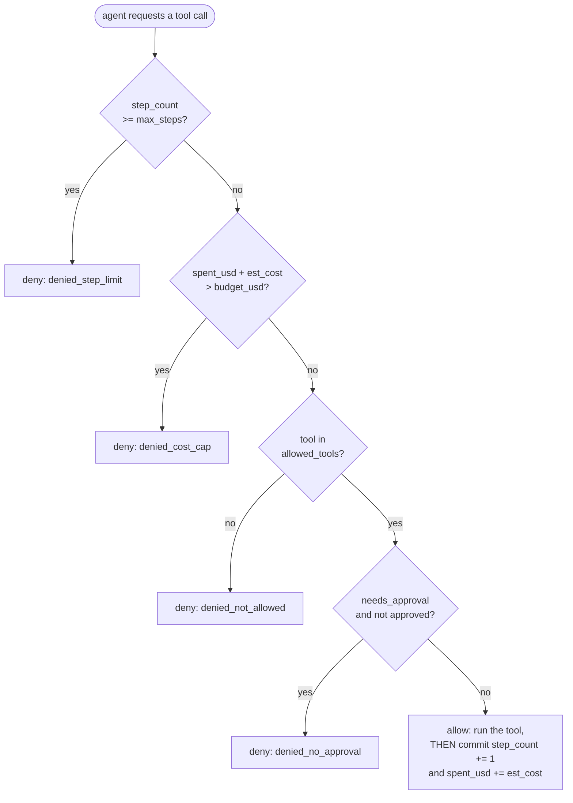

# Day 4 — Agent Safety Mechanisms

## Why a plain chatbot doesn't need this and an agent does

A chatbot's output is text a person reads. An agent's output is a real
tool call: an email that actually sends, a file that actually gets
deleted, a refund that actually posts. The Day 1 loop and Day 2's registry
give an agent the *means* to take those actions repeatedly and
autonomously; nothing about either one limits *which* actions it takes,
*how many* times, or *whether a person signed off*. That's a separate,
deliberate layer, covered here.

## The four mechanisms

1. **Tool allowlisting, default-deny.** An agent may call only tools
   explicitly marked allowed; anything not on the list is refused — never
   "allow unless blocked." Default-deny matters specifically because a
   blocklist has to anticipate every dangerous thing in advance, while a
   newly registered tool under default-deny starts unusable until someone
   deliberately reviews and allows it. The failure mode of a blocklist is
   silent (a new tool is dangerous and nobody added it to the list yet);
   the failure mode of default-deny is loud (a legitimate new tool doesn't
   work until someone flips it on) — loud failures get fixed, silent ones
   don't get noticed until something goes wrong.
2. **Step limit.** A hard cap on loop iterations, so a confused agent
   cannot spin forever — the same guard from Day 1, promoted to a formal,
   always-on rule rather than something the calling code has to remember
   to pass in. It's also a cost control on its own: each step is typically
   at least one model call, so a step cap is implicitly a spend cap even
   before a dollar-denominated budget is added.
3. **Human-in-the-loop approval gate.** High-stakes, hard-to-undo actions
   (sending money, deleting data, anything an agent cannot cleanly walk
   back) pause the loop until a person explicitly approves. This has to be
   reserved for genuinely high-stakes actions — gating *everything* behind
   approval trains the approver to rubber-stamp requests without reading
   them, which defeats the entire point of having a human in the loop.
4. **Cost cap.** A running total of estimated dollars spent; once it
   crosses a budget, further calls are refused regardless of what else
   checks out. The subtlety, covered in depth below, is exactly *when*
   that running total gets incremented.

## The check order is not cosmetic



The order is deliberate on two independent grounds:

- **Cost of the check itself.** Step-limit and cost-cap are `O(1)` counter
  comparisons — essentially free. The allowlist check is a set lookup,
  still fast but marginally more work. Human approval is the only check
  that can block for seconds or minutes on an actual person, so it runs
  last: every cheaper, instant check gets a chance to reject first,
  meaning a person only ever gets interrupted for a request that has
  already cleared every automatic check.
- **When counters get committed.** In the diagram above, `step_count` and
  `spent_usd` are only mutated in the final `Allow` branch — after *every*
  check has passed. That single detail is easy to get wrong when the
  checks are implemented as independent middleware functions instead of
  one function with a single commit point, and getting it wrong has a real
  , checkable consequence, demonstrated next.

## Correct order, run for real

```python
class GuardedAgentRunner:
    def __init__(self, allowed_tools, max_steps, budget_usd, approve_fn):
        self.allowed_tools = set(allowed_tools)
        self.max_steps = max_steps
        self.budget_usd = budget_usd
        self.spent_usd = 0.0
        self.step_count = 0
        self.approve_fn = approve_fn
        self.log = []

    def call_tool(self, name, args, est_cost, needs_approval=False):
        record = {"tool": name, "args": args, "cost": est_cost, "status": None}

        if self.step_count >= self.max_steps:                     # 1) cheapest: counter check
            record["status"] = "denied_step_limit"
        elif self.spent_usd + est_cost > self.budget_usd:          # 2) also a counter check
            record["status"] = "denied_cost_cap"
        elif name not in self.allowed_tools:                       # 3) a set lookup
            record["status"] = "denied_not_allowed"
        elif needs_approval and not self.approve_fn(name, args):   # 4) slowest: a person
            record["status"] = "denied_no_approval"
        else:
            record["status"] = "allowed"
            self.step_count += 1            # only committed once every check passed
            self.spent_usd += est_cost      # only committed once every check passed

        self.log.append(record)
        return record["status"] == "allowed"
```

Running this against a confused agent repeatedly probing a tool that was
never on the allowlist (`wire_transfer`, three attempts at $0.30 each),
then one legitimate `search` call, against a $1.00 budget produces:

```
{'tool': 'wire_transfer', 'cost': 0.3, 'status': 'denied_not_allowed', 'spent_after': 0.0}
{'tool': 'wire_transfer', 'cost': 0.3, 'status': 'denied_not_allowed', 'spent_after': 0.0}
{'tool': 'wire_transfer', 'cost': 0.3, 'status': 'denied_not_allowed', 'spent_after': 0.0}
{'tool': 'search',        'cost': 0.02, 'status': 'allowed',           'spent_after': 0.02}
final spent_usd = 0.02 (budget 1.00)
```

None of the three denied `wire_transfer` attempts moved `spent_usd` at
all — exactly as intended, since they never actually executed.

## The bug: charging cost before checking permission

A common real-world shape for this bug: each guard is written as an
independent middleware that updates its *own* piece of shared state before
deferring to the next check, instead of one function with a single commit
point at the end. Here, the cost-tracking middleware runs first and
records "attempted spend" unconditionally, *before* the allowlist check
gets a chance to reject the call:

```python
class BuggyGuardedRunner:
    # ... same __init__ as above ...
    def call_tool(self, name, args, est_cost, needs_approval=False):
        record = {"tool": name, "cost": est_cost, "status": None}

        # BUG: cost is charged here, before we know the call will even
        # be allowed -- this middleware's only job is "track cost," so
        # it does that unconditionally instead of waiting.
        if self.spent_usd + est_cost > self.budget_usd:
            record["status"] = "denied_cost_cap"
            self.log.append(record); return False
        self.spent_usd += est_cost   # <-- charged even if a later check denies the call

        if name not in self.allowed_tools:
            record["status"] = "denied_not_allowed"
            self.log.append(record); return False
        # ... step-limit and approval checks follow, same as the correct version ...
        record["status"] = "allowed"
        self.step_count += 1
        self.log.append(record)
        return True
```

Run against the *identical* sequence of attempts as above:

```
{'tool': 'wire_transfer', 'cost': 0.3, 'status': 'denied_not_allowed', 'spent_after': 0.30}
{'tool': 'wire_transfer', 'cost': 0.3, 'status': 'denied_not_allowed', 'spent_after': 0.60}
{'tool': 'wire_transfer', 'cost': 0.3, 'status': 'denied_not_allowed', 'spent_after': 0.90}
{'tool': 'search',        'cost': 0.02, 'status': 'allowed',           'spent_after': 0.92}
final spent_usd = 0.92 (budget 1.00)
```

Same three denied calls, same one allowed call — but `spent_usd` ends at
**0.92** instead of **0.02**, because the buggy runner "spent" budget on
three calls that were never actually authorized to run. That's not just an
accounting curiosity. Sending one more, entirely legitimate `send_email`
call estimated at $0.15 makes the divergence concrete:

```
correct runner allows it: True  (spent_usd=0.17)
buggy runner allows it:   False (spent_usd=0.92, would exceed $1.00 budget)
```

The buggy runner wrongly denies a legitimate action — logged as
`denied_cost_cap`, which is actively misleading, since the real cause was
three unrelated, unauthorized attempts by a different tool call earlier in
the same session. Whoever reads that log later has no way to tell, from
`denied_cost_cap` alone, that the budget was never really at risk. This is
the concrete version of "check order matters": it changes not just
performance, but what gets recorded as the reason for a denial, and
whether a legitimate request survives contact with an unrelated bad one.

## Turning the log into an audit trail

```python
import pandas as pd

audit_df = pd.DataFrame(runner.log)
suspicious = (
    audit_df.groupby(["tool", "args"])
    .size()
    .reset_index(name="attempts")
    .query("attempts >= 5")
)
```

Verified against five identical denied `wire_transfer` attempts plus one
unrelated `search` call:

```
            tool             args  attempts
1  wire_transfer  {'amount': 500}         5
```

Grouping by `(tool, args)` and flagging combinations attempted an unusually
high number of times — especially ones repeatedly denied — is a simple,
effective heuristic for catching a stuck or misbehaving agent without
needing any anomaly-detection model. It's also exactly the kind of thing
the cost-tracking bug above would corrupt: if the audit log's `spent_after`
column is polluted by phantom spend, an investigator trying to reconstruct
"how much did this agent actually cost us" from the log gets the wrong
number too.

## Escalating to a bigger model when stuck

A pattern worth knowing alongside these four guardrails: route routine
steps to a cheap local model (Day 3), and escalate to a larger cloud model
only for one best-effort final attempt once the local model exhausts its
step budget without success.

```python
def route_request(local_agent_run, cloud_agent_run, question):
    local_result = local_agent_run(question)   # cheap, tries first
    if local_result is None:                   # local model gave up / hit max_steps
        return cloud_agent_run(question)        # escalate only when stuck
    return local_result
```

Most requests never need the expensive model, so this can meaningfully cut
average per-request cost and latency, while still giving hard cases a shot
at the stronger model's capability instead of just failing outright. The
escalation call should still pass through the same four guardrails —
"it's the expensive fallback path" is not a reason to skip the allowlist
or the cost cap; if anything it's a reason to check the cost cap *harder*,
since the fallback call is, by construction, the expensive one.

## Pitfalls

- **Charging cost or step count before every check passes** — the bug
  demonstrated above, in code that actually ran and produced the numbers
  shown.
- **Gating every action behind human approval**, which trains the approver
  to stop reading requests carefully — reserve it for genuinely
  irreversible or high-value actions.
- **A blocklist instead of an allowlist** — anticipating every dangerous
  tool call in advance is a losing game; starting from nothing allowed and
  deliberately turning tools on is not.
- **An audit log that only records denials.** Recording only what got
  blocked hides the shape of normal usage, which is exactly the baseline
  you need to recognize *ab*normal usage (like five identical attempts at
  a disallowed tool) in the first place.

## Takeaway

Cheap, deterministic checks run first and the slow human check runs last —
but the ordering isn't just about speed. Counters must only be committed
once every check has passed, or a denied call quietly poisons the budget
for the legitimate calls that come after it. Log everything, allowed and
denied alike, so misuse is visible after the fact and not just prevented
(or, if the ordering is wrong, mis-prevented) in the moment.
