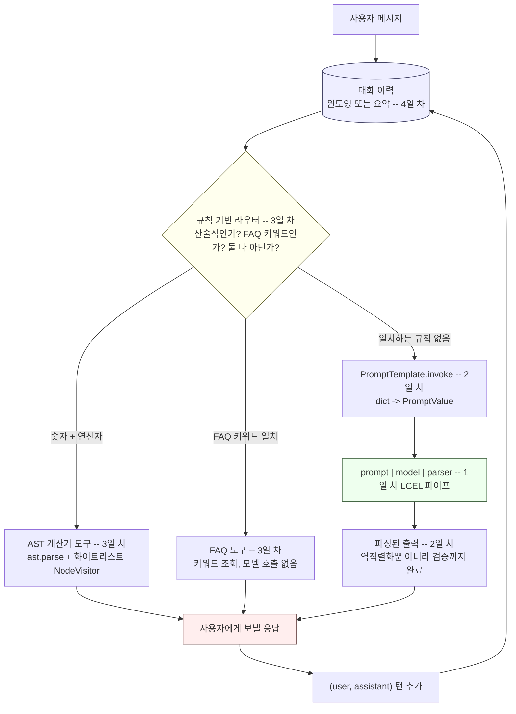

# Week 8: LangChain 프레임워크 기초

이번 주는 직접 만든 에이전트 코드에서 벗어나 같은 동작을 프레임워크로
구현하는 방법을 다룹니다. 여러 단계를 조합하는 LangChain의 LCEL 파이프,
모델을 교체할 수 있고 수동으로 출력을 파싱하는 재사용 가능한 프롬프트
템플릿, 규칙 기반 라우팅으로 연결한 안전한 AST 기반 계산기 도구와 FAQ
도구, 그리고 경계를 두고 영속화하는 대화 메모리까지 이어집니다.

| Day | 주제 | 링크 |
|-----|-------|------|
| 1 | LangChain과 LCEL 파이프(`prompt \| llm \| parser`) | [daily/Day1_lcel-pipe-chains.ko.md](daily/Day1_lcel-pipe-chains.ko.md) |
| 2 | 재사용 가능한 `PromptTemplate`, 교체 가능한 모델, 수동 출력 파싱 | [daily/Day2_prompts-models-output-parsing.ko.md](daily/Day2_prompts-models-output-parsing.ko.md) |
| 3 | 안전한 AST 기반 계산기 도구, FAQ 도구, 규칙 기반 라우팅 | [daily/Day3_safe-calc-and-faq-tools.ko.md](daily/Day3_safe-calc-and-faq-tools.ko.md) |
| 4 | 대화 메모리: 윈도잉, 요약, 영속성, PII 리스크 | [daily/Day4_conversation-memory-and-persistence.ko.md](daily/Day4_conversation-memory-and-persistence.ko.md) |

날짜별로 실행 가능한 코드는 [concepts/8th_week_Concepts.ko.ipynb](concepts/8th_week_Concepts.ko.ipynb)도 함께 참고하세요. 실제로 실행 가능한 부분은 실제 `langchain-core` 설치 환경에서 직접 실행해 검증했습니다.

## 4일치 내용이 어떻게 연결되는가

위 표만 보면 하루하루가 독립된 주제처럼 보이지만, 실제로는 하나의
시스템을 이루는 네 개의 층입니다. 1일 차의 파이프는 나머지 세 날의
구성 요소들을 이어 붙이는 연결 조직이고, 3일 차의 라우터는 어떤 턴이
1·2일 차의 모델 체인까지 도달할지, 아니면 도구가 대신 답할지를
결정하며, 4일 차의 메모리는 이 전체 루프를 감싸고 있습니다. 매 턴마다
이 판단이 다시 일어나고, 그때마다 점점 늘어나는 대화 이력이 다시
주입되기 때문입니다.

이 다이어그램은 한 번 실행되고 끝나는 파이프라인이 아니라 반복되는
루프로 읽어야 합니다. 매 응답은 다음 메시지가 도착하기 전에 다시 이력
저장소에 추가되며, 바로 이 때문에 4일 차의 경계 설정 전략(윈도잉 또는
요약)이 필요합니다 — 이 그림은 대화가 지속되는 턴 수만큼 매 턴마다
반복해서 실행됩니다.
