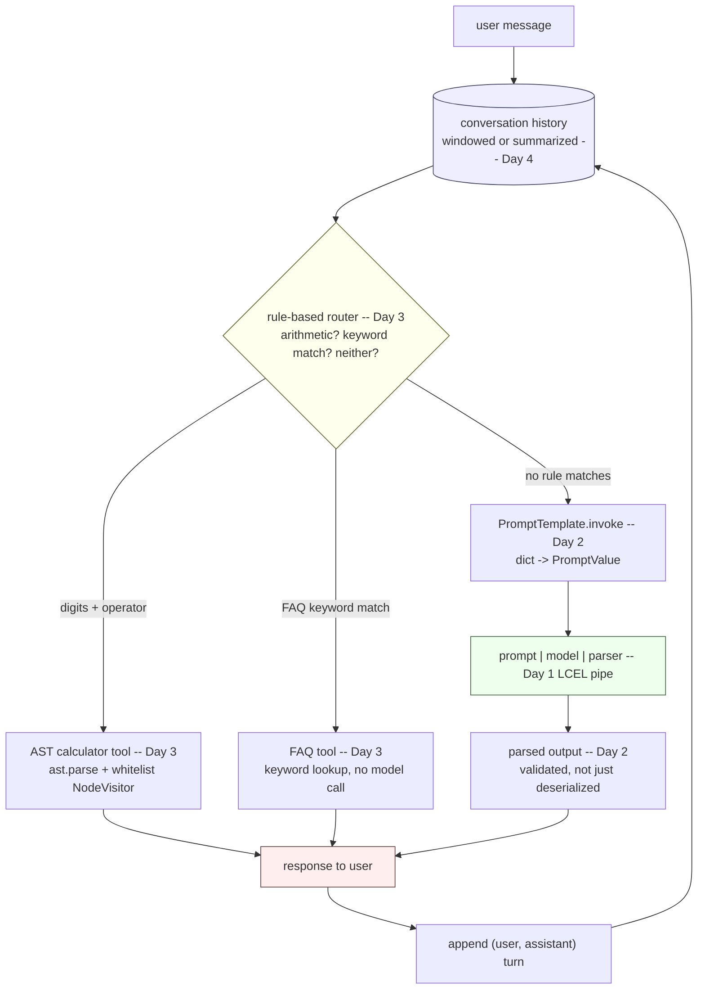

# Week 8: LangChain Framework Basics

This week moves from hand-rolled agent code to building the same behavior
with a framework: LangChain's LCEL pipe for composing steps, reusable
prompt templates with swappable models and manual output parsing, a
safe AST-based calculator tool alongside an FAQ tool wired by rule-based
routing, and conversational memory with bounding and persistence.

| Day | Topic | Link |
|-----|-------|------|
| 1 | LangChain and the LCEL pipe (`prompt \| llm \| parser`) | [daily/Day1_lcel-pipe-chains.md](daily/Day1_lcel-pipe-chains.md) |
| 2 | Reusable `PromptTemplate`s, swappable models, manual output parsing | [daily/Day2_prompts-models-output-parsing.md](daily/Day2_prompts-models-output-parsing.md) |
| 3 | A safe AST-based calculator tool, an FAQ tool, and rule-based routing | [daily/Day3_safe-calc-and-faq-tools.md](daily/Day3_safe-calc-and-faq-tools.md) |
| 4 | Conversational memory: windowing, summarizing, persistence, and PII risk | [daily/Day4_conversation-memory-and-persistence.md](daily/Day4_conversation-memory-and-persistence.md) |

See also: [concepts/8th_week_Concepts.ipynb](concepts/8th_week_Concepts.ipynb) for runnable code covering each day, executed against a real `langchain-core` install where practical.

## How the four days fit together

Each day looks like an isolated topic in the table above, but they're
actually four layers of one system. Day 1's pipe is the connective tissue
that the other three days' components get composed with; Day 3's router
decides whether a turn even reaches the Day 1/2 model chain or gets
answered by a tool instead; and Day 4's memory wraps the entire loop,
since every one of those decisions happens again on the next turn with
the growing history re-injected into it.

Read it as a loop, not a one-shot pipeline: every response gets appended
back into the history store before the next message arrives, which is
exactly why Day 4's bounding strategies (window or summary) exist — this
diagram runs once per turn, for as many turns as the conversation lasts.
