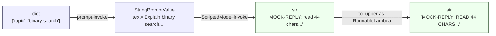

# Day 1: LangChain과 LCEL 파이프

지난주에는 프롬프트 문자열, 모델을 수동으로 호출하는 코드, 다음에 무엇을
할지 결정하는 if/else 로직으로 미니 에이전트 루프를 직접 만들어 봤습니다.
그 실습은 한 번은 꼭 해볼 만한 가치가 있었습니다 — 프레임워크를 걷어내면
에이전트 루프가 실제로 무엇인지 보여주기 때문입니다. 하지만 직접 만든
루프는 장난감 예제를 넘어서는 순간 확장성이 떨어지고, 오늘의 질문은
"LangChain 같은 프레임워크가 왜 존재하는가", 그리고 구체적으로 그 파이프
문법(`|`)이 독립적인 단계들을 어떻게 하나의 실행 가능한 체인으로
조합하는가입니다.

아래 코드는 모두 Python 3.9.6 위에서 `langchain-core` 0.3.86을 대상으로
실제로 실행한 결과이며, 문서를 그대로 옮긴 것이 아닙니다. 실제 API
키가 필요한 부분(OpenAI나 Anthropic에 실제로 요청을 보내는 부분)은
명시적으로 표시해 두었고, 그 주변 코드는 여전히 실제로 설치 가능한
`langchain_core`이며 네트워크 호출 부분만 스크립트로 대체했습니다.

## 문제: N개의 컴포넌트를 이어붙이기

LLM 앱에 세 종류의 구성 요소가 있다고 해봅시다: 프롬프트 템플릿, 모델,
출력 파서. 공통 인터페이스가 없다면 이 둘을 연결할 때마다 양쪽의 정확한
입출력 형태를 알아야 하는 맞춤형 접착 코드를 짜야 합니다 — 템플릿
객체에서 문자열을 *이런 식으로* 꺼내고, 모델에는 *저런 식으로* 넘기고,
모델이 반환한 *무언가*에서 결과를 *또 다른 방식으로* 읽어내야 합니다.
네 번째 컴포넌트(리트리버, 두 번째 파서, 검증 단계)를 추가하면 필요한
접착 코드의 양은 선형으로 늘지 않고, 서로 대화해야 하는 컴포넌트
*쌍*이 새로 생길 때마다 늘어납니다.

LangChain의 해법은 프롬프트 템플릿, 채팅 모델, 출력 파서, 심지어 평범한
함수까지 모든 조각에 동일한 인터페이스를 부여하는 것입니다: `.invoke(input)
-> output` 메서드를 가진 `Runnable`(여러 입력을 한 번에 처리하는
`.batch()`, 토큰 단위 출력을 위한 `.stream()`도 함께 제공됩니다). 모든
컴포넌트가 같은 인터페이스를 쓰게 되면 둘을 연결하는 일은 더 이상
맞춤형 작업이 아니라 "첫 번째 것의 출력을 두 번째 것의 입력으로
넘긴다"는 한 문장으로 끝나며, 이것이 바로 `|` 연산자가 자동화하는
내용입니다.

## Runnable과 `|` 연산자

`Runnable`은 Python의 `__or__`(`a | b`의 뒤에 있는 연산자)를 오버로드해서,
두 Runnable을 파이프로 연결하면 세 번째 Runnable — `RunnableSequence` —
가 반환되도록 합니다. 이 시퀀스의 `.invoke()`는 첫 번째 단계를 실행한
뒤 그 반환값을 그대로 두 번째 단계의 `.invoke()`에 넘깁니다. 세 개를
이어붙이면(`prompt | llm | parser`) 세 단계짜리 파이프라인이 만들어지고,
이 파이프라인 역시 구성 요소 하나하나와 똑같은 `.invoke()` 인터페이스를
그대로 노출합니다. 이 마지막 지점이 중요합니다 — `RunnableSequence`
자체도 하나의 `Runnable`이기 때문에, 여기에 계속 파이프를 이어붙이거나
더 큰 체인 안에 마치 단일 단계인 것처럼 끼워 넣을 수 있습니다.

아무것도 숨기지 않고 메커니즘을 그대로 보여주면 — 이것은 LangChain
내부에서 실제로 `Runnable.__or__`가 동작하는 방식에 상당히 가깝습니다.

```python
class MiniRunnable:
    """langchain_core.runnables.Runnable의 대역. 이번 레슨의 핵심인 하나의
    메커니즘만 남기고 나머지는 모두 뺐다: __or__가 두 단계를 시퀀스로
    묶고, 그 시퀀스는 여전히 .invoke()를 노출한다는 것."""

    def invoke(self, value):
        raise NotImplementedError

    def __or__(self, other):
        # a | b  ->  MiniSequence(a, b) ; 이 이상의 마법은 없다.
        return MiniSequence(self, other)


class MiniSequence(MiniRunnable):
    def __init__(self, first, second):
        self.first = first
        self.second = second

    def invoke(self, value):
        # `prompt | llm | parser`의 뒤에 숨어 있는 모든 트릭:
        # 첫 번째 단계의 반환값이 두 번째 단계의 인자가 된다.
        first_output = self.first.invoke(value)      # 1단계가 완전히 실행됨
        return self.second.invoke(first_output)       # 그 출력이 2단계로 흘러들어감
```

`MiniSequence.invoke`는 `first`가 프롬프트 템플릿인지, 모델인지, 아니면
세 단계 더 깊이 들어간 또 다른 `MiniSequence`인지 전혀 알지도, 신경
쓰지도 않습니다 — 오직 "`.invoke()`를 가지고 있다"는 사실에만
의존합니다. 이것이 계약의 전부이며, 그래서 임의로 긴 파이프라도 별도의
배관 작업 없이 조합될 수 있는 이유입니다.

## API 키 없이 실제 체인 실행하기

실제 `langchain_core` 패키지(`pip install langchain-core`만으로 설치되며
다른 의존성은 필요 없습니다)를 사용하되, *모델*만 흉내 냅니다 — 실제
비용이 들고 키가 필요한 유일한 구성 요소이기 때문입니다. 프롬프트
템플릿과 파이프 메커니즘은 진짜입니다.

```python
from langchain_core.prompts import PromptTemplate
from langchain_core.runnables import Runnable

class ScriptedModel(Runnable):
    """채팅 모델의 대역: 실제 모델과 동일한 .invoke() 형태를 갖지만
    네트워크 호출은 전혀 없고, 테스트를 위해 완전히 결정론적인 출력을 낸다."""
    def invoke(self, prompt_value, config=None, **kwargs):
        # prompt_value: StringPromptValue (PromptTemplate의 출력 타입)
        text = prompt_value.to_string()  # StringPromptValue -> str
        return f"MOCK-REPLY: read {len(text)} chars starting '{text[:24]}'"

def to_upper(text: str) -> str:
    return text.upper()

prompt = PromptTemplate.from_template("Explain {topic} in one short sentence.")
# prompt.invoke({...}) -> StringPromptValue(text='Explain binary search in one short sentence.')

chain = prompt | ScriptedModel() | to_upper
# chain은 RunnableSequence: dict -> StringPromptValue -> str -> str

result = chain.invoke({"topic": "binary search"})
print(result)
# MOCK-REPLY: READ 44 CHARS STARTING 'EXPLAIN BINARY SEARCH IN'
```

이 출력은 실제로 실행했을 때 나오는 값 그대로입니다 — `"Explain binary
search in one short sentence."`는 44자이고, `ScriptedModel`은 그 중 앞
24자만 잘라내며, 전체 응답은 이후 `to_upper`에 의해 대문자로
바뀝니다. `to_upper`는 직접 만든 `Runnable`이 아니라 평범한 Python
함수입니다 — LangChain은 파이프에 넣은 일반 호출 가능 객체를 자동으로
`RunnableLambda`로 감싸주기 때문에, `prompt | ScriptedModel() | to_upper`는
직접 `RunnableLambda(to_upper)`라고 쓰지 않아도 그대로 동작합니다.

### 파이프를 따라 흐르는 타입



다이어그램의 화살표 하나하나가 `.invoke()` 호출 한 번입니다. 아무것도
병렬로 실행되지 않고 지연 평가도 없습니다 — `RunnableSequence.invoke()`는
각 단계를 왼쪽에서 오른쪽으로 엄격하게 순서대로 실행하며, 체인 전체의
반환값은 마지막 단계가 반환한 값 그대로입니다.

## 실제 메시지 객체를 반환하는 체인

`PromptTemplate`은 평범한 문자열을 만듭니다. 실제로 채팅 모델과 함께
쓰는 `ChatPromptTemplate`은 좀 더 풍부한 것을 만듭니다 — 타입이 있는
메시지 객체(`SystemMessage`, `HumanMessage`, ...) 리스트를 감싼
`ChatPromptValue`입니다. 실제 채팅 모델은 이 리스트를 입력으로 받아
평범한 문자열이 아니라 `AIMessage`를 반환하는데, 그래서 뒤에 문자열
전용 파서를 순진하게 연결하면 깨지게 됩니다. `StrOutputParser`는 바로
이 간극을 메우기 위해 존재합니다.

```python
from langchain_core.prompts import ChatPromptTemplate
from langchain_core.runnables import Runnable
from langchain_core.output_parsers import StrOutputParser
from langchain_core.messages import AIMessage, HumanMessage

class FakeChatModel(Runnable):
    """실제 채팅 모델의 .invoke() 계약을 그대로 따른다: ChatPromptValue
    (또는 list[BaseMessage])를 받아 AIMessage를 반환한다."""
    def invoke(self, input_value, config=None, **kwargs):
        # ChatPromptValue -> list[BaseMessage], len=2 (system, human)
        messages = input_value.to_messages()
        last_human = next(
            (m.content for m in reversed(messages) if isinstance(m, HumanMessage)),
            "",
        )
        return AIMessage(content=f"[fake-llm] you said: {last_human}")

chat_prompt = ChatPromptTemplate.from_messages([
    ("system", "You are a terse assistant."),
    ("human", "{question}"),
])

chain = chat_prompt | FakeChatModel() | StrOutputParser()
# dict -> ChatPromptValue -> AIMessage -> str

result = chain.invoke({"question": "What is LCEL?"})
print(type(result), result)
# <class 'str'> [fake-llm] you said: What is LCEL?
```

각 단계에서 실제로 출력해서 확인한 중간 형태들입니다.

```python
pv = chat_prompt.invoke({"question": "What is LCEL?"})
pv.to_messages()
# -> [SystemMessage(content='You are a terse assistant.'),
#     HumanMessage(content='What is LCEL?')]

msg = FakeChatModel().invoke(pv)
# -> AIMessage(content='[fake-llm] you said: What is LCEL?')

StrOutputParser().invoke(msg)
# -> '[fake-llm] you said: What is LCEL?'   (AIMessage -> str, .content를 통해)
```

`StrOutputParser`가 하는 일은 정확히 딱 하나입니다: 메시지 객체에서
`.content`를 읽어내거나(혹은 이미 평범한 문자열이면 그대로 통과시키거나)
해서, 뒤따르는 코드가 지금 손에 쥔 것이 메시지 객체인지 문자열인지
전혀 몰라도 되게 만드는 것입니다. 이것이 다들 곳곳에서 직접 `.content`를
꺼내는 대신, 이 파서가 별도의 파이프라인 단계로 존재하는 이유의
전부입니다.

## `.batch()`는 그냥 for문에 겉옷만 입힌 게 아니다

모든 `Runnable`은 `.batch(list_of_inputs)`도 구현하고 있는데, 이것이
Python `for` 루프의 문법 설탕이 아니라는 점은 알아둘 만합니다 —
LangChain의 기본 `.batch()`는 스레드 풀을 통해 호출들을 동시에
실행합니다. 실제로 측정해 보면 이 점이 분명해집니다: 0.2초 동안
sleep하는 함수를 감싼 `RunnableLambda`를 네 개의 입력에 대해
`.batch()`로 호출했더니 **총 0.21초**만에 끝났습니다. 순차적으로 네 번
호출했다면 약 0.8초가 걸렸을 것입니다. 실제로 모델 API에 네 번 네트워크
요청을 보내는 체인이라면, 이 차이가 루프 대신 `.batch()`를 쓰는 이유
전부입니다.

## 분기: `RunnableParallel`과 `RunnablePassthrough`

모든 파이프라인이 하나의 직선인 것은 아닙니다. `RunnableParallel`은
여러 Runnable을 *같은* 입력에 대해 실행하고 그 결과들을 dict로
모으며, `RunnablePassthrough`는 입력을 그대로 반환하는 Runnable인데,
이것이 바로 변환된 값과 함께 원본 입력을 그대로 이어서 전달하는
방법입니다.

```python
from langchain_core.runnables import RunnableParallel, RunnablePassthrough, RunnableLambda

branch = RunnableParallel(
    upper=RunnableLambda(lambda x: x.upper()),
    length=RunnableLambda(lambda x: len(x)),
    original=RunnablePassthrough(),
)
branch.invoke("hello world")
# -> {'upper': 'HELLO WORLD', 'length': 11, 'original': 'hello world'}
```

이것은 실제 검색 증강(RAG) 체인 상당수에서 쓰는 패턴입니다: 리트리버와
`RunnablePassthrough()`를 병렬로 실행해서, 최종 프롬프트 템플릿이 검색된
컨텍스트*와* 원래 질문을 중간에 별도의 dict 조립 단계 없이 함께 받도록
만듭니다.

## 나중에 실제 모델로 교체하기

```python
# from langchain_openai import ChatOpenAI
# real_model = ChatOpenAI(model="gpt-4o-mini")  # 실제 API 키가 필요함
# chain = chat_prompt | real_model | StrOutputParser()
```

이것은 실제로 거의 한 줄짜리 교체입니다 — `ChatOpenAI`(그리고 다른 모든
채팅 모델 클래스)가 위의 `FakeChatModel`과 동일한 `Runnable` 계약을
구현하기 때문입니다: `ChatPromptValue`를 넘겨주면 `AIMessage`가
돌아옵니다. 이것이 공유 인터페이스가 주는 진짜 보상입니다 — 프롬프트
템플릿, 파이프, 파서는 모델이 바뀌어도 전혀 바뀌지 않습니다. 반대로
이 교체를 망가뜨렸을 상황은, `FakeChatModel`이 `AIMessage` 대신
평범한 문자열을 반환했다면(이 레슨의 초기 초안에서 실제로 있었던
실수입니다) 벌어졌을 일입니다 — `StrOutputParser`는 평범한 문자열도
그대로 통과시키기 때문에 우연히 동작은 했겠지만, 같은 체인을
`.content`를 기대하는 코드에 연결하는 순간 실패합니다. 컴포넌트를
교체 가능하게 만드는 것은 인터페이스가 실제로 일치하는지 여부이지,
양쪽 변수 이름을 똑같이 `model`이라고 지었는지가 아닙니다.

## 흔한 함정

- **형태 불일치는 발생한 지점이 아니라 그다음 단계에서 드러난다.**
  어떤 단계가 잘못된 타입을 반환하면, 오류는 잘못된 값이 만들어진
  곳이 아니라 그 값을 사용하려는 다음 단계에서 발생하며, 종종 여러
  겹의 LangChain 내부 코드를 거친 스택 트레이스로 나타납니다. 조합된
  체인을 신뢰하기 전에 각 조각을 `.invoke()`로 따로 테스트하세요.
- **`.batch()`의 동시성은 각 단계가 동시에 실행해도 안전하다는 전제를
  깔고 있다.** 스레드 풀 병렬성이 공짜인 것은 Runnable들이 가변 상태
  (카운터, 열린 파일 핸들, 스레드 안전하지 않은 클라이언트)를 공유하지
  않을 때뿐입니다. 공유 리스트를 변형하는 `RunnableLambda`는
  `.invoke()`에서는 멀쩡히 동작해도 `.batch()`에서는 오작동할 수
  있습니다.
- **모의 객체의 인터페이스는 실제 인터페이스와 *진짜로* 일치해야
  한다.** 메시지 객체 대신 평범한 문자열을 반환하는 모델 대역은,
  실제 모델로 바꾸고 뒤쪽 코드가 `.content`를 기대하는 순간까지는
  잘 동작합니다. 개발 중에 "에러 없이 돌아갔다"는 사실이 인터페이스가
  올바르다는 증거는 아닙니다.
- **함수를 파이프에 연결하는 것은 편리하지만 불투명하다.**
  `RunnableLambda` 자동 변환 덕분에 `prompt | llm | my_function`은
  `prompt | llm | my_runnable`과 겉보기에 똑같아 보이지만, 평범한
  함수는 `config` 전파도, 단계별 트레이싱 이름도, Python의 `map`이
  주는 것 이상의 `.batch()` 팬아웃 동작도 받지 못합니다 — 보통은
  문제없지만, 체인의 트레이싱 결과가 왜 허전한지 디버깅할 때는 알아둘
  가치가 있습니다.

**정리:** LCEL의 `|`는 Runnable들을 하나의 파이프라인으로 조합하며,
각 단계의 출력이 다음 단계의 입력이 됩니다. 이 조합이 프롬프트
템플릿, 모델, 파서, 평범한 함수로 이루어진 임의의 체인에 대해서도
작동하는 이유는 이들이 모두 같은 인터페이스를 공유하기 때문입니다.
비용이 들거나 키가 필요한 부분만 모의 객체로 대체하고, 조합된 체인을
실제 `langchain_core` 메커니즘으로 검증한 다음에야 실제 모델로
교체하세요.
