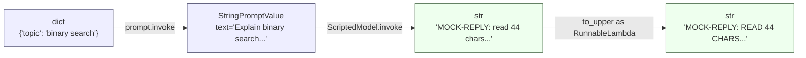

# Day 1: LangChain and the LCEL Pipe

In an earlier week we hand-built a mini agent loop from scratch: a prompt
string, a manual call to a model, and some if/else logic to decide what
happened next. That exercise was worth doing once — it shows what an agent
loop actually *is*, underneath any framework. But hand-rolled loops don't
scale past a toy example, and today's question is why a framework like
LangChain exists, and specifically how its pipe syntax (`|`) lets you
compose independent steps into one runnable chain.

All the code below was actually run against `langchain-core` 0.3.86 on
Python 3.9.6 — not paraphrased from documentation. Where a real API key
would be required (a live OpenAI or Anthropic call), that's called out
explicitly and the surrounding code is still real, installable
`langchain_core`, just with a scripted stand-in for the network call.

## The problem: gluing N components together

Say you have three kinds of building blocks in an LLM app: prompt
templates, models, and output parsers. Without a shared interface, wiring
any two of them together means writing bespoke glue code that knows the
exact input/output shape of both sides — pull the string out of the
template object *this* way, hand it to the model *that* way, read the
result out of *whatever* object the model returns. Add a fourth component
(a retriever, a second parser, a validation step) and the amount of glue
code doesn't grow linearly, it grows with every new *pair* of components
that need to talk to each other.

LangChain's fix is to give every piece — prompt templates, chat models,
output parsers, even plain functions — the same interface: a `Runnable`
with an `.invoke(input) -> output` method (plus `.batch()` for many inputs
at once, and `.stream()` for token-by-token output). Once every component
speaks the same interface, gluing two of them together stops being
custom work — it's just "feed the first one's output into the second
one's input," and that's exactly what the `|` operator automates.

## Runnables and the `|` operator

`Runnable` overloads Python's `__or__` (the operator behind `a | b`) so that
piping two Runnables together returns a third Runnable — a
`RunnableSequence` — whose `.invoke()` runs the first step, then feeds its
return value straight into the second step's `.invoke()`. Chain three
things together (`prompt | llm | parser`) and you get a three-step
pipeline that still exposes the exact same `.invoke()` interface as any
one of its parts. That last point matters: a `RunnableSequence` is itself
a `Runnable`, so you can keep piping into it, or drop it into a larger
chain as if it were a single step.

Here's the mechanism with nothing hidden — this is close to how
`Runnable.__or__` actually works inside LangChain:

```python
class MiniRunnable:
    """A stand-in for langchain_core.runnables.Runnable, minus everything
    except the one mechanism this lesson is about: __or__ composing two
    steps into a sequence that still exposes .invoke()."""

    def invoke(self, value):
        raise NotImplementedError

    def __or__(self, other):
        # a | b  ->  MiniSequence(a, b) ; nothing more magical than this.
        return MiniSequence(self, other)


class MiniSequence(MiniRunnable):
    def __init__(self, first, second):
        self.first = first
        self.second = second

    def invoke(self, value):
        # The entire trick behind `prompt | llm | parser`:
        # the first step's return value becomes the second step's argument.
        first_output = self.first.invoke(value)      # step 1 runs fully
        return self.second.invoke(first_output)       # its output feeds step 2
```

Nothing about `MiniSequence.invoke` knows or cares whether `first` is a
prompt template, a model, or another `MiniSequence` three levels deep —
it only relies on "has an `.invoke()`". That's the entire contract, and
it's why arbitrarily long pipes compose without extra plumbing.

## Running a real chain with no API key

Using the actual `langchain_core` package (installed via
`pip install langchain-core`, no other dependency needed), we mock only
the *model* — that's the one component that would otherwise cost money and
require a key. The prompt template and the pipe machinery are the real
thing:

```python
from langchain_core.prompts import PromptTemplate
from langchain_core.runnables import Runnable

class ScriptedModel(Runnable):
    """Stands in for a chat model: same .invoke() shape as a real model,
    zero network calls, fully deterministic output for testing the wiring."""
    def invoke(self, prompt_value, config=None, **kwargs):
        # prompt_value: StringPromptValue (PromptTemplate's output type)
        text = prompt_value.to_string()  # StringPromptValue -> str
        return f"MOCK-REPLY: read {len(text)} chars starting '{text[:24]}'"

def to_upper(text: str) -> str:
    return text.upper()

prompt = PromptTemplate.from_template("Explain {topic} in one short sentence.")
# prompt.invoke({...}) -> StringPromptValue(text='Explain binary search in one short sentence.')

chain = prompt | ScriptedModel() | to_upper
# chain is a RunnableSequence: dict -> StringPromptValue -> str -> str

result = chain.invoke({"topic": "binary search"})
print(result)
# MOCK-REPLY: READ 44 CHARS STARTING 'EXPLAIN BINARY SEARCH IN'
```

That output is exactly what running this produces — `"Explain binary
search in one short sentence."` is 44 characters, and `ScriptedModel`
truncates to the first 24 of them before the whole reply gets
upper-cased by `to_upper`. `to_upper` is an ordinary Python function, not
a hand-built `Runnable` — LangChain auto-wraps any plain callable you pipe
into as a `RunnableLambda`, so `prompt | ScriptedModel() | to_upper` works
without you writing `RunnableLambda(to_upper)` yourself.

### Type flow through the pipe



Each arrow in that diagram is one `.invoke()` call. Nothing runs in
parallel and nothing is lazy — `RunnableSequence.invoke()` executes the
steps strictly left to right, and the whole chain's return value is
whatever the last step returned.

## A chain that returns real message objects

A `PromptTemplate` produces a plain string. A `ChatPromptTemplate` — the
one you'd actually use with a chat model — produces something richer: a
`ChatPromptValue` wrapping a list of typed message objects
(`SystemMessage`, `HumanMessage`, ...). A real chat model consumes that
list and returns an `AIMessage`, not a plain string, which is why a
naive `str`-shaped parser downstream would break. `StrOutputParser` exists
specifically to bridge that gap:

```python
from langchain_core.prompts import ChatPromptTemplate
from langchain_core.runnables import Runnable
from langchain_core.output_parsers import StrOutputParser
from langchain_core.messages import AIMessage, HumanMessage

class FakeChatModel(Runnable):
    """Matches a real chat model's .invoke() contract: consumes a
    ChatPromptValue (or list[BaseMessage]) and returns an AIMessage."""
    def invoke(self, input_value, config=None, **kwargs):
        # ChatPromptValue -> list[BaseMessage], len=2 (system, human)
        messages = input_value.to_messages()
        last_human = next(
            (m.content for m in reversed(messages) if isinstance(m, HumanMessage)),
            "",
        )
        return AIMessage(content=f"[fake-llm] you said: {last_human}")

chat_prompt = ChatPromptTemplate.from_messages([
    ("system", "You are a terse assistant."),
    ("human", "{question}"),
])

chain = chat_prompt | FakeChatModel() | StrOutputParser()
# dict -> ChatPromptValue -> AIMessage -> str

result = chain.invoke({"question": "What is LCEL?"})
print(type(result), result)
# <class 'str'> [fake-llm] you said: What is LCEL?
```

Verified intermediate shapes, printed at each stage:

```python
pv = chat_prompt.invoke({"question": "What is LCEL?"})
pv.to_messages()
# -> [SystemMessage(content='You are a terse assistant.'),
#     HumanMessage(content='What is LCEL?')]

msg = FakeChatModel().invoke(pv)
# -> AIMessage(content='[fake-llm] you said: What is LCEL?')

StrOutputParser().invoke(msg)
# -> '[fake-llm] you said: What is LCEL?'   (AIMessage -> str via .content)
```

`StrOutputParser` is doing exactly one small job: read `.content` off a
message object (or pass a plain string through unchanged) so downstream
code never has to know whether it's holding a message object or a
string. That's the entire reason it exists as a separate pipeline step
instead of everyone just writing `.content` by hand everywhere.

## `.batch()` isn't a for-loop with extra steps

Every `Runnable` also implements `.batch(list_of_inputs)`, and it's worth
knowing this isn't sugar for a Python `for` loop — LangChain's default
`.batch()` runs the calls concurrently through a thread pool. A quick,
verified timing check makes this concrete: a `RunnableLambda` wrapping a
function that sleeps 0.2 seconds, called on four inputs via `.batch()`,
finished in **0.21 seconds total**, not the ~0.8 seconds four sequential
calls would take. For a real chain making four network calls to a model
API, that difference is the whole reason to reach for `.batch()` instead
of a loop.

## Branching: `RunnableParallel` and `RunnablePassthrough`

Not every pipeline is a single straight line. `RunnableParallel` runs
several Runnables against the *same* input and collects their outputs
into a dict; `RunnablePassthrough` is a Runnable that just returns its
input unchanged, which is how you carry the original input forward
alongside a transformed value:

```python
from langchain_core.runnables import RunnableParallel, RunnablePassthrough, RunnableLambda

branch = RunnableParallel(
    upper=RunnableLambda(lambda x: x.upper()),
    length=RunnableLambda(lambda x: len(x)),
    original=RunnablePassthrough(),
)
branch.invoke("hello world")
# -> {'upper': 'HELLO WORLD', 'length': 11, 'original': 'hello world'}
```

This is the pattern behind a lot of real retrieval-augmented chains:
run a retriever and `RunnablePassthrough()` in parallel so the final
prompt template gets both the retrieved context *and* the original
question, without a manual dict-building step in between.

## Swapping in a real model later

```python
# from langchain_openai import ChatOpenAI
# real_model = ChatOpenAI(model="gpt-4o-mini")  # needs a real API key
# chain = chat_prompt | real_model | StrOutputParser()
```

This really is close to a one-line swap — *because* `ChatOpenAI` (and
every other chat model class) implements the same `Runnable` contract as
`FakeChatModel` above: give it a `ChatPromptValue`, get back an
`AIMessage`. That's the payoff of the shared interface: the prompt
template, the pipe, and the parser don't change at all when the model
changes. What *would* have broken the swap is if `FakeChatModel` had
returned a plain string instead of an `AIMessage` (the mistake in an
earlier draft of this lesson) — `StrOutputParser` still would have worked
by accident (it passes plain strings through), but the moment you point
that same chain at code expecting `.content`, it fails. Matching
interfaces is what makes components swappable — not just naming the
variable `model` in both cases.

## Pitfalls

- **A shape mismatch surfaces downstream, not at the source.** If a step
  returns the wrong type, the error doesn't happen where the bad value
  was produced — it happens one step later, inside whatever tries to use
  it, often with a stack trace that runs through several layers of
  LangChain internals before it reaches your code. Test each piece with
  `.invoke()` in isolation before trusting the composed chain.
- **`.batch()` concurrency assumes the steps are safe to run concurrently.**
  Thread-pool parallelism is only free if your Runnables don't share
  mutable state (a counter, an open file handle, a non-thread-safe
  client). A `RunnableLambda` that mutates a shared list will misbehave
  under `.batch()` even though it works fine under `.invoke()`.
- **The mock's interface has to *actually* match the real one.** A model
  stand-in that returns a plain string instead of a message object will
  work right up until you swap in the real model and something downstream
  expects `.content`. "It ran without erroring" during development isn't
  proof the interface is right.
- **Piping into a function is convenient but opaque.** `RunnableLambda`
  coercion means `prompt | llm | my_function` looks identical to
  `prompt | llm | my_runnable`, but a plain function gets no `config`
  propagation, no per-step tracing name, and no `.batch()` fan-out
  behavior beyond what Python's `map` would give you — usually fine, but
  worth knowing when you're debugging why a chain's tracing looks sparse.

**Takeaway:** LCEL's `|` composes Runnables into a pipeline where each
step's output becomes the next step's input, and that composition works
for arbitrary chains of prompt templates, models, parsers, and plain
functions because they all share one interface. Mock only the piece that
costs money or needs a key, verify the composed chain against real
`langchain_core` machinery, and only then swap in the real model.
