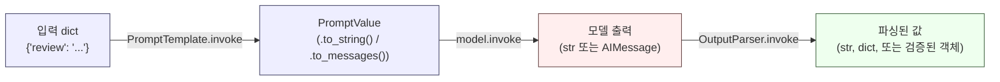

# Day 2: 재사용 가능한 프롬프트, 교체 가능한 모델, 원본 출력 파싱하기

프롬프트 템플릿은 같은 객체가 백 가지 다른 입력으로 재사용될 수 있어야
비로소 쓸모가 있습니다. 오늘은 서로 섞이기 쉬운 세 가지 별개의 주제를
다룹니다: 하나의 `PromptTemplate`을 여러 입력으로 채우는 방법, 모델
제공자를 교체하는 일이 왜 대부분 생성자 한 줄만 바꾸는 작업인지, 그리고
프레임워크의 출력 파서 지름길을 믿고 맡기기 전에 왜 LLM이 뱉어낸 원본
텍스트를 직접 파싱한다는 것이 무엇을 의미하는지 이해해야 하는지입니다.
Day 1과 마찬가지로 여기 실행 가능한 코드는 실제로 `langchain-core`
0.3.86을 대상으로 실행한 것입니다.

## 하나의 템플릿, 여러 입력

`PromptTemplate`은 작은 상태 덩어리입니다 — 템플릿 문자열과 그것이
기대하는 변수 이름 목록. 한 번 만들어두고 `.invoke()`를 반복해서
호출하는 것이 핵심입니다 — 입력마다 지시문 텍스트를 다시 조립할
이유가 없습니다.

```python
from langchain_core.prompts import PromptTemplate

review_prompt = PromptTemplate.from_template(
    "Rate the sentiment of this review from 1-5 and give one reason: {review}"
)

reviews = [
    {"review": "The battery died after two days."},
    {"review": "Fast shipping, exactly as described."},
]

# .batch()는 템플릿을(실제 체인이라면 그 뒤에 연결된 모든 것까지) 입력
# 목록 전체에 대해 실행한다 -- Python for문이 아니라 LCEL다운 방식이다.
# 각 호출은 독립적이다: 같은 템플릿 객체, 다른 {review} 값.
filled = review_prompt.batch(reviews)
for pv in filled:
    print(pv.to_string())
# Rate the sentiment of this review from 1-5 and give one reason: The battery died after two days.
# Rate the sentiment of this review from 1-5 and give one reason: Fast shipping, exactly as described.
```

같은 `review_prompt` 객체에서 서로 다른 두 개의 채워진 결과가
나왔습니다 — 지시문 텍스트를 다시 타이핑하거나 복사-붙여넣기한 부분은
전혀 없습니다.

### 부분 적용(Partial application)

템플릿의 일부는 세션 전체에서 고정되어 있고(페르소나, 시스템 역할,
로케일) 나머지는 호출마다 달라지는 경우, `.partial()`은 고정된 부분을
한 번만 채워 넣고 나머지 변수만 요구하는 새 템플릿을 반환합니다.

```python
base = PromptTemplate.from_template("You are a {persona}. Answer: {question}")
support_bot = base.partial(persona="support agent")

support_bot.invoke({"question": "how do I reset my password?"}).to_string()
# -> 'You are a support agent. Answer: how do I reset my password?'
```

`support_bot`은 진짜로 새로운 `PromptTemplate` 인스턴스입니다 — `base`
자체는 손대지 않은 채로 남아 있고, 여기서 또 다른 페르소나로 두 번째
`.partial()`을 만들어도 `support_bot`에는 아무 영향이 없습니다.

## 채우기부터 파싱까지 이어지는 파이프라인



이 페이지의 모든 내용은 저 세 화살표 중 하나에 들어갑니다: 템플릿
채우기(왼쪽 화살표), 모델 호출(가운데 화살표, Day 1에서 다룸), 원본
출력을 코드가 신뢰할 수 있는 무언가로 바꾸기(오른쪽 화살표, 아래에서
다룸).

## 모델 제공자 교체하기

여러 제공자의 채팅 모델 클래스는 Day 1에서 설명한 것과 같은 기본
`Runnable` 계약을 구현합니다 — `.invoke()`는 `ChatPromptValue`(또는
평범한 문자열/메시지 리스트)를 받아 `.content` 문자열을 가진
`AIMessage`를 반환합니다. 이 형태가 공유되기 때문에, 모델 *주변의*
코드 — 프롬프트를 만들고, `.invoke()`를 호출하고, `.content`를
읽는 것 — 는 제공자를 바꿔도 거의 그대로입니다.

```python
# 아래 두 줄 모두 실제로 실행하려면 실제 설치와 API 키가 필요하므로,
# 여기서는 실행하지 않고 스키마 형태로만 보여준다:
# from langchain_openai import ChatOpenAI
# from langchain_anthropic import ChatAnthropic
#
# model_a = ChatOpenAI(model="gpt-4o-mini")
# model_b = ChatAnthropic(model="claude-3-5-haiku-20241022")
#
# for model in (model_a, model_b):
#     response = model.invoke("Summarize LCEL in one sentence.")
#     print(response.content)   # 둘 다 AIMessage를 반환 -- .content를 읽는 방식도 동일
```

생성자 줄만 바뀝니다: 클래스 이름과 모델 문자열. 이것이 공유
인터페이스가 주는 보상의 전부입니다 — 제공자별 배관 작업(인증 헤더,
요청 형식, 스트리밍 프로토콜)은 모델을 사용하는 모든 호출 지점이 아니라
각 클래스 안에 갇혀 있습니다. 하지만 이것이 동작까지 동일하다는 보장은
*아닙니다* — 토큰 제한, 표현 습관, 지시를 얼마나 엄격히 따르는지는
여전히 제공자마다 다릅니다. 인터페이스가 같다는 것은 결과가 같다는
뜻이 아니라, 그것을 호출하는 코드가 상대가 누구인지 몰라도 된다는
뜻입니다.

## 원본 출력을 직접 파싱하기

프레임워크에 내장된 출력 파서를 쓰기 전에, 그것이 정확히 어떤 문제를
해결하는지 — 그리고 무엇을 해결하지 못하는지 — 직접 확인해볼 가치가
있습니다. 모델의 원본 출력은 그냥 문자열입니다. 구조화된 데이터처럼
*보이더라도*, 형식이 올바른지, 그 안의 값들이 여러분 애플리케이션
입장에서 말이 되는지는 여전히 직접 확인해야 합니다.

```python
import json

raw_output = '{"label": "positive", "confidence": 0.82, "tags": ["shipping", "praise"]}'

def parse_and_validate(raw: str) -> dict:
    data = json.loads(raw)  # 형식이 잘못된 JSON이면 json.JSONDecodeError 발생

    required = {"label", "confidence", "tags"}
    missing = required - data.keys()
    if missing:
        raise ValueError(f"missing keys: {missing}")

    if data["label"] not in {"positive", "neutral", "negative"}:
        raise ValueError(f"unexpected label: {data['label']}")

    conf = data["confidence"]
    if not isinstance(conf, (int, float)) or isinstance(conf, bool) or not (0.0 <= conf <= 1.0):
        raise ValueError(f"confidence out of range: {conf}")

    if not isinstance(data["tags"], list):
        raise ValueError("tags must be a list")

    return data  # -> dict, 네 가지 불변조건 모두 확인 완료, 이후 안전하게 사용 가능

print(parse_and_validate(raw_output))
# {'label': 'positive', 'confidence': 0.82, 'tags': ['shipping', 'praise']}
```

여기 있는 것 중 LangChain의 헬퍼는 하나도 없습니다 — `json.loads`에
직접 작성한 키·범위 검사가 더해졌을 뿐입니다. 이것은 의도적입니다:
모델은 JSON에 거의 가까운 무언가를, 키는 맞지만 타입이 틀린 값을,
또는 정상 범위를 벗어난 값을 출력할 수 있고, 이것을 명시적으로
검증하는 것이야말로 결과를 소비하는 코드가 망가지기 *전에* 문제를
잡아내는 방법입니다.

## 프레임워크 파서가 실제로 해주는 것 — 그리고 해주지 않는 것

`langchain_core.output_parsers.JsonOutputParser`는 언뜻 위의 수작업
함수를 대체할 수 있을 것처럼 보입니다. 같은 종류의 입력에 대해 둘을
실제로 돌려보면 그 차이가 이론이 아니라 눈에 보이는 사실이 됩니다.

첫째, 이 파서는 *문법* 측면에서는 `json.loads`보다 확실히 관대합니다
— 부분적으로 스트리밍되는 JSON을 위해 만들어졌기 때문에, 중간에 잘린
응답에서도 복구할 수 있습니다.

```python
from langchain_core.output_parsers import JsonOutputParser

parser = JsonOutputParser()

# 닫는 중괄호가 없이 잘린 객체 -- json.loads라면 그냥 거부했을 것이다:
parser.invoke('{"priority": "high", "category": "billing", "eta_minutes": 15')
# -> {'priority': 'high', 'category': 'billing', 'eta_minutes': 15}   (복구됨!)
```

하지만 바로 이 관대함 때문에 이 파서가 여러분의 검증 로직을 대신할 수는
없습니다. 문법적으로는 완벽하지만 의미적으로는 틀린 JSON을 넣으면,
아무 불평 없이 그 잘못된 데이터를 그대로 통과시킵니다.

```python
parser.invoke('{"priority": "urgent", "eta_minutes": "soon"}')
# -> {'priority': 'urgent', 'eta_minutes': 'soon'}
#
# 오류 없음 -- 하지만 "urgent"는 이 시스템에서 유효한 priority 값이 아니고,
# "eta_minutes"는 int가 와야 할 자리에 문자열이 들어가 있다. JsonOutputParser의
# 역할은 텍스트를 Python 객체로 바꾸는 것이지, 여러분의 비즈니스 규칙을
# 검사하는 것이 아니었다 -- 애초에 그렇게 하겠다고 말한 적도 없다.
```

반면 진짜로 JSON이 아닌 텍스트를 넣으면 예외가 발생합니다.

```python
parser.invoke('Sure! Here is the answer: not json at all')
# -> langchain_core.exceptions.OutputParserException 발생:
#    "Invalid json output: Sure! Here is the answer: not json at all"
```

정직하게 요약하면 이렇습니다: 이런 프레임워크 파서는 *문법*을
처리합니다 — 문자열을 관대하게 dict로 바꿔주는 것 — 그리고 여러분이
직접 작성한 `parse_and_validate` 같은 함수는 여전히 *의미*를 처리해야
합니다 — 이게 맞는 키인지, 맞는 타입인지, 값이 정상 범위 안에
있는지. 예외가 나지 않았다는 이유로 이 후자를 생략하면, "urgent"가
원래 `"low"`, `"medium"`, `"high"`만 들어와야 하는 필드에 그대로
들어가 버립니다.

## 흔한 함정

- **"예외가 안 났다"는 "값이 유효하다"와 같지 않다.**
  `JsonOutputParser`가 `{"priority": "urgent", "eta_minutes": "soon"}`에
  대해 예외를 던지지 않았다는 것은 파싱에 성공했다는 뜻이지, 그 데이터가
  쓸 만하다는 뜻이 아닙니다. 프레임워크 파서든 수작업 파서든, 항상 그
  위에 여러분만의 스키마·범위 검사를 한 겹 더 얹으세요.
- **스트리밍 친화적인 관대함이 잘린 응답을 완결된 것처럼 보이게 만들
  수 있다.** 닫는 중괄호가 없어도 복구하는 파서는 토큰 단위로 점진적으로
  화면에 표시하는 용도로는 장점이지만, 여러분의 파이프라인이 *완결된*
  객체를 기대하는 상황에서 조용히 일부만 있는 객체를 받아버리면, 뒤쪽
  코드는 오류 한 번 보지 못한 채 불완전한 데이터로 계속 진행할 수
  있습니다.
- **공유된 모델 인터페이스는 실제 동작 차이를 가려버린다.**
  `ChatOpenAI`와 `ChatAnthropic` 모두 `AIMessage`를 반환하지만, 같은
  단어를 쓰지도, 같은 시스템 프롬프트 관례를 따르지도, 같은 컨텍스트
  한계에 부딪히지도 않습니다. 생성자 줄을 바꾸는 것은 쉽지만, 출력
  품질이 동일할 것이라고 인터페이스만 보고 가정해서는 안 됩니다 —
  제공자를 바꾼 뒤에는 항상 출력을 직접 확인하세요.
- **`.partial()`은 새 객체를 반환할 뿐, 원본을 바꾸지 않는다.**
  반환값을 받지 않고 그냥 `base.partial(persona=...)`만 호출하고
  `support_bot = base.partial(persona=...)`처럼 대입하지 않으면, 여전히
  원래의 채워지지 않은 템플릿을 들고 있게 됩니다 — 아무 경고도 없이요.

**정리:** 템플릿은 구조상 재사용 가능하고, 모델 제공자는 공유된
`Runnable` 인터페이스 덕분에 교체 가능합니다(단, 출력이 동일하다는
뜻은 아닙니다). 그리고 손수 짠 파서든 프레임워크가 제공하는 파서든,
출력 파서는 자신이 설계된 만큼만 검사합니다. `json.loads`와
`JsonOutputParser`는 둘 다 문법을 검사할 뿐이며, 여러분이 직접 작성한
키·타입·범위 검사야말로 시스템의 나머지 부분을 실제로 보호하는
것입니다.
