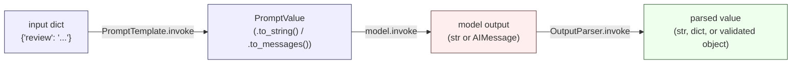

# Day 2: Reusable Prompts, Swappable Models, and Parsing Raw Output

A prompt template is only useful if the same object survives being reused
with a hundred different inputs. Today covers three separate things that
are easy to conflate: filling one `PromptTemplate` with many inputs,
why swapping model providers is mostly a construction-line change, and
why you should understand what it means to parse raw LLM text by hand
before trusting a framework's output-parser shortcut to do it for you.
As with Day 1, the runnable code here was actually executed against
`langchain-core` 0.3.86.

## One template, many inputs

A `PromptTemplate` is a small piece of state: a template string plus a
list of variable names it expects. Building it once and calling
`.invoke()` repeatedly is the entire point — there's no reason to
re-construct the instruction text for every input.

```python
from langchain_core.prompts import PromptTemplate

review_prompt = PromptTemplate.from_template(
    "Rate the sentiment of this review from 1-5 and give one reason: {review}"
)

reviews = [
    {"review": "The battery died after two days."},
    {"review": "Fast shipping, exactly as described."},
]

# .batch() runs the template (and, in a real chain, everything piped after
# it) over a list of inputs -- idiomatic LCEL, not a Python for-loop. Each
# call is independent: same template object, different {review} value.
filled = review_prompt.batch(reviews)
for pv in filled:
    print(pv.to_string())
# Rate the sentiment of this review from 1-5 and give one reason: The battery died after two days.
# Rate the sentiment of this review from 1-5 and give one reason: Fast shipping, exactly as described.
```

Same `review_prompt` object, two different filled results — nothing
about the instruction text was retyped or copy-pasted.

### Partial application

When part of a template is fixed for a whole session (a persona, a
system role, a locale) but the rest varies per call, `.partial()` bakes
in the fixed part once and returns a new template that only asks for the
remaining variables:

```python
base = PromptTemplate.from_template("You are a {persona}. Answer: {question}")
support_bot = base.partial(persona="support agent")

support_bot.invoke({"question": "how do I reset my password?"}).to_string()
# -> 'You are a support agent. Answer: how do I reset my password?'
```

`support_bot` is a genuinely new `PromptTemplate` instance — `base`
itself is untouched, and you could `.partial()` a second, different
persona from it without affecting `support_bot`.

## The fill-to-parse pipeline



Everything on this page lives in one of those three arrows: filling the
template (left arrow), calling the model (middle arrow, covered on
Day 1), and turning raw output into something your code can trust
(right arrow, covered below).

## Swapping the model provider

Chat model classes across providers implement the same base `Runnable`
contract described on Day 1 — `.invoke()` takes a `ChatPromptValue` (or a
plain string/list of messages) and returns an `AIMessage` with a
`.content` string. Because of that shared shape, the code *around* the
model — build a prompt, call `.invoke()`, read `.content` — barely
changes when you switch providers:

```python
# Both of these need real installs and API keys to actually run, so this
# is shown schematically rather than executed:
# from langchain_openai import ChatOpenAI
# from langchain_anthropic import ChatAnthropic
#
# model_a = ChatOpenAI(model="gpt-4o-mini")
# model_b = ChatAnthropic(model="claude-3-5-haiku-20241022")
#
# for model in (model_a, model_b):
#     response = model.invoke("Summarize LCEL in one sentence.")
#     print(response.content)   # both return an AIMessage -- same .content read
```

Only the construction line changes: the class name and the model string.
That's the entire payoff of a shared interface — provider-specific
plumbing (auth headers, request format, streaming protocol) lives inside
each class, not scattered through every call site that uses a model. It's
also *not* a guarantee that behavior is identical — token limits,
formatting habits, and how strictly a model follows instructions still
differ by provider. The interface being the same doesn't mean the outputs
are the same; it means the code that calls either one doesn't need to
know which it's talking to.

## Parsing raw output by hand

Before reaching for a framework's built-in output parser, it's worth
seeing exactly what problem it solves — and what it doesn't. Raw model
output is just a string. Even when it *looks* like structured data, you
still have to check it's well-formed and that the values inside it make
sense for your application:

```python
import json

raw_output = '{"label": "positive", "confidence": 0.82, "tags": ["shipping", "praise"]}'

def parse_and_validate(raw: str) -> dict:
    data = json.loads(raw)  # raises json.JSONDecodeError on malformed JSON

    required = {"label", "confidence", "tags"}
    missing = required - data.keys()
    if missing:
        raise ValueError(f"missing keys: {missing}")

    if data["label"] not in {"positive", "neutral", "negative"}:
        raise ValueError(f"unexpected label: {data['label']}")

    conf = data["confidence"]
    if not isinstance(conf, (int, float)) or isinstance(conf, bool) or not (0.0 <= conf <= 1.0):
        raise ValueError(f"confidence out of range: {conf}")

    if not isinstance(data["tags"], list):
        raise ValueError("tags must be a list")

    return data  # -> dict, all four invariants checked, safe to use downstream

print(parse_and_validate(raw_output))
# {'label': 'positive', 'confidence': 0.82, 'tags': ['shipping', 'praise']}
```

Nothing here is a LangChain helper — it's `json.loads` plus explicit key
and range checks you wrote yourself. That's deliberate: a model can
output almost-JSON, the right keys with wrong types, or a value outside
any sane range, and validating it explicitly is how you catch that
*before* it breaks whatever consumes the result.

## What a framework parser actually buys you — and doesn't

`langchain_core.output_parsers.JsonOutputParser` looks like it should
replace the hand-rolled function above. Run both against the same kind
of input and the difference becomes concrete rather than theoretical.

First, it's genuinely more forgiving of malformed *syntax* than
`json.loads` — it's built for streaming partial JSON, so it can recover
from a response that got cut off mid-object:

```python
from langchain_core.output_parsers import JsonOutputParser

parser = JsonOutputParser()

# A truncated object -- missing the closing brace -- that json.loads
# would reject outright:
parser.invoke('{"priority": "high", "category": "billing", "eta_minutes": 15')
# -> {'priority': 'high', 'category': 'billing', 'eta_minutes': 15}   (recovered!)
```

But that leniency is exactly why it can't replace your own validation.
Feed it JSON that is syntactically perfect but semantically wrong, and it
hands the bad data straight through without complaint:

```python
parser.invoke('{"priority": "urgent", "eta_minutes": "soon"}')
# -> {'priority': 'urgent', 'eta_minutes': 'soon'}
#
# No error -- but "urgent" isn't a valid priority in this system, and
# "eta_minutes" is a string where an int was expected. JsonOutputParser's
# job is turning text into a Python object; it was never checking your
# business rules, and nothing about it claims to.
```

Genuinely non-JSON text, on the other hand, does raise:

```python
parser.invoke('Sure! Here is the answer: not json at all')
# -> raises langchain_core.exceptions.OutputParserException:
#    "Invalid json output: Sure! Here is the answer: not json at all"
```

So the honest summary is: a framework parser like this one handles
*syntax* — turning a string into a dict, tolerantly — and your own
`parse_and_validate`-style function still has to handle *semantics*:
are these the right keys, the right types, values in the right range.
Skipping the second half because the first half didn't raise an
exception is how "urgent" ends up in a field that's supposed to only
ever contain `"low"`, `"medium"`, or `"high"`.

## Pitfalls

- **"It didn't raise" is not the same as "it's valid."** `JsonOutputParser`
  not raising on `{"priority": "urgent", "eta_minutes": "soon"}` proves it
  parsed successfully, not that the data is usable. Always layer your own
  schema/range checks on top of any parser, framework or hand-rolled.
- **Streaming-friendly leniency can mask a truncated response as complete.**
  A parser that recovers from a missing closing brace is a feature for
  incremental token-by-token display, but if your pipeline expects a
  *complete* object and silently gets a partial one, downstream code may
  proceed on incomplete data without ever seeing an error.
- **A shared model interface hides real behavioral differences.**
  `ChatOpenAI` and `ChatAnthropic` both return `AIMessage`, but they don't
  produce the same words, honor the same system-prompt conventions, or
  hit the same context limits. Swapping the construction line is easy;
  assuming identical output quality is not warranted by the interface
  alone — always spot-check output after a provider swap.
- **`.partial()` returns a new object; it doesn't mutate in place.**
  Forgetting to capture the return value (`base.partial(persona=...)`
  instead of `support_bot = base.partial(persona=...)`) silently leaves
  you with the original, unfilled template.

**Takeaway:** templates are reusable by construction, providers are
swappable because of a shared `Runnable` interface (not because their
output is identical), and any output parser — hand-rolled or
framework-provided — only ever checks what it's designed to check.
`json.loads` and `JsonOutputParser` both check syntax; your own key,
type, and range checks are what actually protect the rest of your system.
