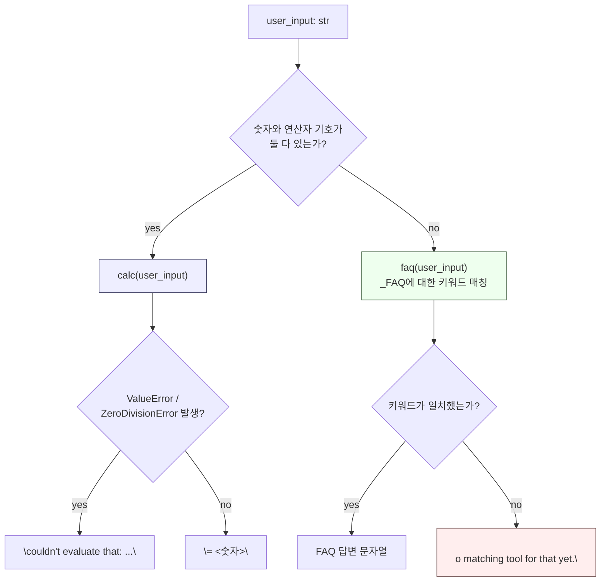

# Day 3: 규칙으로 연결한 계산기 도구와 FAQ 도구

모든 질문이 언어 모델의 몫은 아닙니다. 정확한 산술과 정확한 사실은
자유 형식 생성보다 작고 결정론적인 도구가 더 잘 처리합니다 — 모델은
`12 * 8 = 92`라고 아주 자신 있게 *말할 수* 있지만, 계산기는 그럴 수
없습니다. 오늘은 진짜로 안전한 계산기 도구, 키워드 매칭 FAQ 도구,
그 둘 사이의 규칙 기반 디스패처, 그리고 그 디스패처가 어디서
무너지는지를 솔직하게 살펴봅니다. 아래 스니펫은 전부 실제로 실행한
것이며, 나오는 출력값도 지어낸 것이 아니라 실제 결과입니다.

## 왜 그냥 `eval()`을 쓰면 안 되는가

`eval()`은 임의의 Python 코드를 실행합니다. 사용자 입력이 필터링 없이
그대로 도달하면, `eval("__import__('os').system('rm -rf ~')")`은 보이는
그대로 실행됩니다. 이것은 가상의 극단적 사례가 아닙니다 — 모델이나
사용자가 영향을 줄 수 있는 텍스트 필드는 모두 신뢰할 수 없는 입력이고,
신뢰할 수 없는 입력에 대한 `eval()`은 스타일 취향의 문제가 아니라
상시적인 원격 코드 실행 버그입니다.

## `ast.literal_eval`의 함정

`ast.literal_eval`은 표준적으로 제시되는 "안전한 eval" 대안이고,
실제로 *안전하기는* 합니다 — 하지만 계산기가 아니며, 이 둘을 혼동하는
것은 실제로 흔히 저지르는 실수입니다. `literal_eval`은 오직 **리터럴
상수와 컨테이너**만 파싱합니다: 숫자, 문자열, 튜플, 리스트, 딕셔너리,
집합, 불리언, `None`, 그리고 숫자 앞에 붙는 제한적인 `+`/`-`. 리터럴
사이의 **연산**은 애초에 이 제한된 문법에 포함되어 있지 않기 때문에
평가하지 않습니다.

```python
import ast

ast.literal_eval("12")          # -> 12            (리터럴: 문제없음)
ast.literal_eval("[1, 2, 3]")   # -> [1, 2, 3]      (리터럴 컨테이너: 문제없음)
ast.literal_eval("12 * 8")      # -> ValueError 발생: malformed node or string
```

마지막 줄은 가정이 아닙니다 — 실제로 실행하면 `ValueError: malformed
node or string: <ast.BinOp object at 0x...>`가 그대로 발생합니다.
`literal_eval`은 `BinOp` 노드(`12`와 `8` 사이의 `*`처럼 이항 연산을
나타내는 노드)를 보자마자 트리 전체를 거부합니다. `BinOp`가 리터럴
노드 타입의 화이트리스트에 없기 때문입니다. `literal_eval`만으로 만든
"안전한 계산기"는 숫자 두 개를 곱할 수조차 없습니다. 대신 필요한 것은
산술 연산자를 구체적으로 이해하는 무언가입니다 — 딱 그만큼만, 그 이상도
이하도 아닙니다.

## 화이트리스트 기반 AST 평가기

해법은 이렇습니다: `ast.parse(expr, mode="eval")`로 표현식을 구문
트리로 파싱한 다음, 여러분이 직접 만든 재귀 평가기로 그 트리를
순회하되, 숫자 상수·이항 연산자·단항 연산자라는 작고 명시적인
화이트리스트만 처리하고 그 외 모든 것 — 이름, 함수 호출, 속성 접근,
서브스크립트를 포함해서 — 은 예외를 던지게 만드는 것입니다.

```python
import ast
import operator

# 화이트리스트: 이 계산기가 지원하는 산술 연산, 그 이상은 없다.
_BIN_OPS = {
    ast.Add: operator.add,
    ast.Sub: operator.sub,
    ast.Mult: operator.mul,
    ast.Div: operator.truediv,
    ast.Pow: operator.pow,
    ast.Mod: operator.mod,
}
_UNARY_OPS = {ast.UAdd: operator.pos, ast.USub: operator.neg}

def _eval(node):
    # ast.parse(..., mode="eval")은 항상 실제 표현식을 Expression 노드로
    # 감싸므로, 맨 위에서 한 번 벗겨내고 .body를 재귀 호출한다.
    if isinstance(node, ast.Expression):
        return _eval(node.body)

    # int/float 상수만 허용한다 -- bool은 명시적으로 제외한다. Python의
    # bool은 int의 서브클래스라서(isinstance(True, int)는 True) 이걸
    # 빼먹으면 "True * 8"이 조용히 8로 평가되어 버린다.
    if isinstance(node, ast.Constant) and isinstance(node.value, (int, float)) \
            and not isinstance(node.value, bool):
        return node.value  # -> int | float

    if isinstance(node, ast.BinOp) and type(node.op) in _BIN_OPS:
        left = _eval(node.left)    # 재귀: 왼쪽도 그 자체로 BinOp일 수 있다
        right = _eval(node.right)  # 재귀: 오른쪽도 그 자체로 BinOp일 수 있다
        return _BIN_OPS[type(node.op)](left, right)

    if isinstance(node, ast.UnaryOp) and type(node.op) in _UNARY_OPS:
        return _UNARY_OPS[type(node.op)](_eval(node.operand))

    # 그 외 모든 것 -- Name, Call, Attribute, Subscript, List, Compare,
    # BoolOp, Lambda, ... -- 은 여기까지 흘러와서 거부된다.
    raise ValueError(f"disallowed expression: {type(node).__name__}")

def calc(expr: str):
    tree = ast.parse(expr, mode="eval")  # str -> ast.Expression
    return _eval(tree)                    # ast.Expression -> int | float
```

실제 입력으로 검증한 결과입니다.

```python
calc("12 * 8")             # -> 96
calc("(9 - 3) ** 2 / 4")   # -> 9.0
calc("-8 + 20 / 4")        # -> -3.0
calc("100 % 7")            # -> 2
calc("2 ** 10")            # -> 1024
```

그리고 실제 공격 시도로도 검증했습니다 — 아래 모든 줄이 어떤 노드
타입이 거부되었는지 정확히 알려주는 메시지와 함께 `ValueError`를
발생시킬 뿐, 아무것도 실행하지 않습니다.

```python
calc("__import__('os').system('echo pwned')")
# -> ValueError: disallowed expression: Call

calc("(1).__class__.__bases__")
# -> ValueError: disallowed expression: Attribute

calc("open('secrets.txt')")
# -> ValueError: disallowed expression: Call

calc("[1, 2, 3]")
# -> ValueError: disallowed expression: List

calc("a + 1")
# -> ValueError: disallowed expression: Name
```

`(1).__class__.__bases__`는 전형적인 샌드박스 탈출 패턴입니다 —
리터럴에서 그 타입으로, 다시 그 타입의 베이스 클래스로 걸어 들어가며,
결국 임의의 객체에 도달하기 위한 첫걸음입니다. 여기서는 아주 단순한
이유로 거부됩니다: `Attribute` 접근이 애초에 화이트리스트에 추가된
적이 없기 때문입니다. 이것이 실제 보안 모델입니다 — "공격을
탐지한다"가 아니라 "이 함수가 명시적으로 알고 있는 몇 가지 노드
타입만 실행한다"는 것이며, 그래서 새로운 공격 패턴이 나와도 별도의
방어 로직을 추가할 필요가 없습니다. 애초에 도달 가능하지 않았기
때문입니다.

이 버전이 처리하지 **못하는** 실제 허점이 하나 있습니다: `calc("1/0")`은
`ValueError`가 아니라 Python 자체의 `ZeroDivisionError`를 던집니다 —
평가기는 `Div` 노드를 정확히 평가했고, 문제는 나눗셈 그 자체가
런타임에 실패한 것입니다. 실제 프로덕션 버전이라면 호출부에서
`ValueError`와 함께 `ZeroDivisionError`(그리고 `10 ** 10 ** 10` 같은
경우를 위한 `OverflowError`도)를 함께 잡아야 합니다. 둘 다 완전히
"허용된" 산술을 통해서도 도달할 수 있기 때문입니다.

## 결정론적인 FAQ 도구

```python
_FAQ = [
    (("refund", "money back"), "Refunds post within 5-7 business days after we receive the return."),
    (("hours", "open"), "Support is staffed 9am-6pm, Monday through Friday."),
    (("shipping", "delivery"), "Standard shipping takes 3-5 business days."),
]

def faq(question: str):
    q = question.lower()  # 대소문자를 구분하지 않는 키워드 매칭
    for keywords, answer in _FAQ:
        if any(kw in q for kw in keywords):
            return answer  # -> str: 목록 순서상 처음 일치한 답변
    return None  # -> None: 어떤 키워드도 일치하지 않음
```

FAQ 도구는 모델을 전혀 호출하지 않습니다 — 키워드 조회일 뿐이므로,
같은 질문은 항상 같은 답변을 즉시, 호출당 비용 없이, 두 번의 실행
사이에 문구가 미묘하게 달라질 걱정 없이 반환합니다.

## 둘 사이를 라우팅하기

```python
def handle(user_input: str) -> str:
    has_digit = any(c.isdigit() for c in user_input)
    has_operator = any(op in user_input for op in "+-*/")
    if has_digit and has_operator:
        try:
            return f"= {calc(user_input)}"
        except (ValueError, ZeroDivisionError) as e:
            return f"couldn't evaluate that: {e}"
    answer = faq(user_input)
    return answer if answer else "no matching tool for that yet."
```



실제 입력으로 검증한 결과이며, 라우터의 사각지대를 드러내는 마지막
입력도 포함되어 있습니다.

```python
for text in ["9 * 6", "can I renew my loan?", "what are your hours",
             "what is nine times six"]:
    print(f"{text!r:30} -> {handle(text)}")

# '9 * 6'                        -> = 54
# 'can I renew my loan?'         -> no matching tool for that yet.   (이 FAQ 표에는 없는 항목)
# 'what are your hours'          -> Support is staffed 9am-6pm, Monday through Friday.
# 'what is nine times six'       -> no matching tool for that yet.
```

## 알려진 한계

위의 마지막 줄이 핵심입니다. "What is nine times six"에는 숫자 문자도
연산자 기호도 없어서 계산기 검사를 그대로 통과해버립니다. 이 FAQ
표의 키워드도 하나도 포함하고 있지 않아서 결국 일반 폴백으로
떨어지는데, 정작 이걸 읽는 사람이라면 곱셈 질문이라는 것을 곧바로
알아챌 것입니다. 규칙 기반 라우팅은 빠르고, 비용이 들지 않고, 완전히
예측 가능합니다 — 바로 그렇기 때문에 실제로 잡아내는 경우들에
대해서는 쓸 가치가 있지만, 규칙을 작성한 사람이 예상한 표현
방식만 잡아냅니다. 커버리지를 넓히려면 규칙 집합을 직접 손으로
키우거나(작은 숫자-단어 조회 테이블: `"nine"` -> `9`, `"times"` -> `*`)
애매한 입력을 최후의 수단으로 모델 분류기에 넘긴 뒤에야 "매칭되는
도구 없음"으로 떨어지게 해야 합니다. 두 방법 모두 실제 복잡도를
추가하며, 어느 쪽도 공짜가 아닙니다 — 그래서 조용히 땜질하는 대신
여기에 명시적인 한계로 적어두는 것입니다.

**정리:** 결정론적인 도구는 정확한 숫자와 정확한 사실에서 자유 형식
생성을 이깁니다 — 다만 "안전하다"는 말이 실제로 안전함을 의미할
때만입니다. `ast.literal_eval`은 계산기가 아니며, 진짜 화이트리스트
기반 `ast.NodeVisitor` 스타일 평가기가 계산기입니다. 그리고 규칙 기반
라우터는 작성자가 미리 생각해낸 패턴만큼만 똑똑합니다 — 폴백 경로를
잘 알아두세요. 규칙이 예상하지 못한 모든 것이 결국 거기로 떨어지기
때문입니다.
