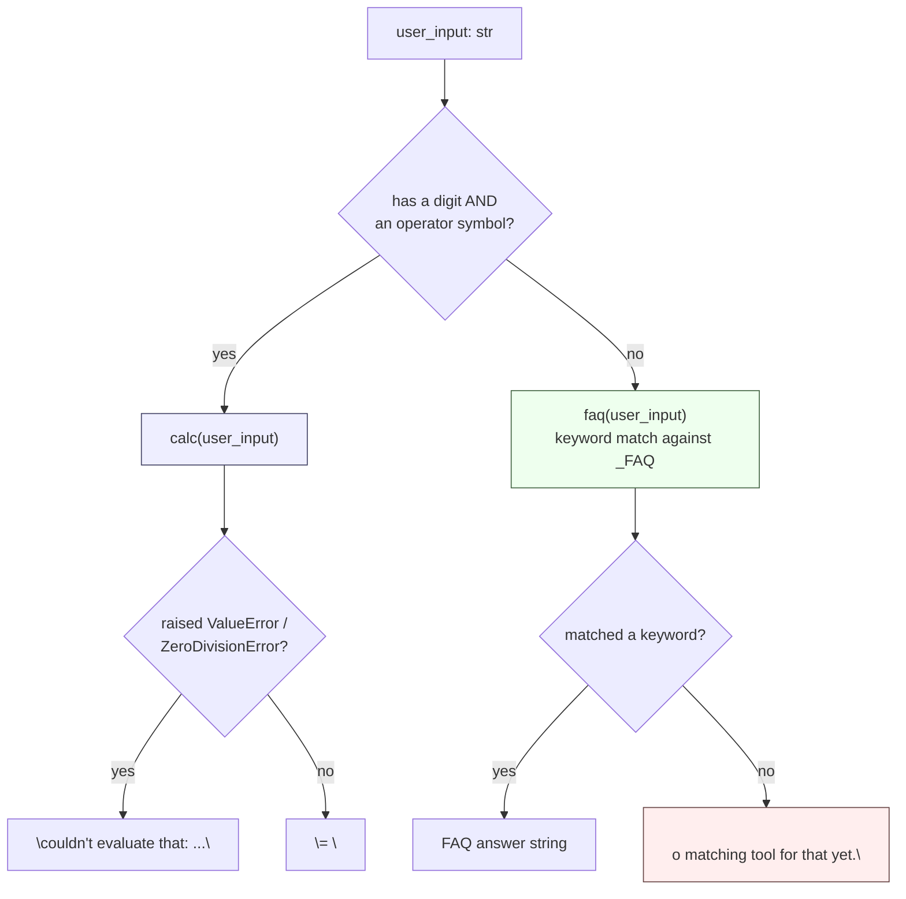

# Day 3: A Calculator Tool and an FAQ Tool, Wired by Rules

Not every question belongs to the language model. Exact arithmetic and
exact facts are both better served by small, deterministic tools than by
free-form generation — a model can *say* `12 * 8 = 92` with total
confidence, but a calculator can't. Today: a genuinely safe calculator
tool, a keyword-matched FAQ tool, a rule-based dispatcher between them,
and an honest look at where that dispatcher breaks. Every snippet below
was run for real; the outputs shown are actual results, not invented
ones.

## Why not just `eval()`?

`eval()` runs arbitrary Python. If user input ever reaches it unfiltered,
`eval("__import__('os').system('rm -rf ~')")` executes exactly what it
looks like it executes. This isn't a hypothetical edge case — any
text field a model or a user can influence is untrusted input, and
`eval()` on untrusted input is a standing remote-code-execution bug,
not a style preference.

## The `ast.literal_eval` trap

`ast.literal_eval` is the standard "safe eval" suggestion, and it *is*
safe — but it is not a calculator, and confusing the two is a real,
easy-to-make mistake. `literal_eval` only parses **literal constants and
containers**: numbers, strings, tuples, lists, dicts, sets, booleans,
`None`, and a limited leading `+`/`-` on a number. It does not evaluate
**operations** between literals, because operations aren't part of its
restricted grammar at all:

```python
import ast

ast.literal_eval("12")          # -> 12            (a literal: fine)
ast.literal_eval("[1, 2, 3]")   # -> [1, 2, 3]      (a literal container: fine)
ast.literal_eval("12 * 8")      # -> raises ValueError: malformed node or string
```

That last line is not a hypothetical — running it actually raises
`ValueError: malformed node or string: <ast.BinOp object at 0x...>`.
`literal_eval` sees the `BinOp` node (a binary operation — the `*`
between `12` and `8`) and rejects the whole tree, because `BinOp` isn't
on its whitelist of literal node types. A "safe calculator" built on
`literal_eval` alone can't multiply two numbers. What's needed instead is
something that understands arithmetic operators specifically — nothing
more, nothing less.

## A whitelist AST evaluator

The fix: parse the expression into a syntax tree with `ast.parse(expr,
mode="eval")`, then walk that tree with your own recursive evaluator that
only knows how to handle a small, explicit whitelist of node types —
numeric constants, binary operators, unary operators — and raises on
anything else, including names, function calls, attribute access, and
subscripting:

```python
import ast
import operator

# Whitelist: exactly the arithmetic this calculator supports, and nothing else.
_BIN_OPS = {
    ast.Add: operator.add,
    ast.Sub: operator.sub,
    ast.Mult: operator.mul,
    ast.Div: operator.truediv,
    ast.Pow: operator.pow,
    ast.Mod: operator.mod,
}
_UNARY_OPS = {ast.UAdd: operator.pos, ast.USub: operator.neg}

def _eval(node):
    # ast.parse(..., mode="eval") always wraps the real expression in an
    # Expression node -- unwrap it once at the top and recurse on .body.
    if isinstance(node, ast.Expression):
        return _eval(node.body)

    # Only plain int/float constants are allowed -- explicitly exclude
    # bool, since Python's bool is a subclass of int (isinstance(True, int)
    # is True) and "True * 8" should not silently evaluate to 8.
    if isinstance(node, ast.Constant) and isinstance(node.value, (int, float)) \
            and not isinstance(node.value, bool):
        return node.value  # -> int | float

    if isinstance(node, ast.BinOp) and type(node.op) in _BIN_OPS:
        left = _eval(node.left)    # recurse: left side may itself be a BinOp
        right = _eval(node.right)  # recurse: right side may itself be a BinOp
        return _BIN_OPS[type(node.op)](left, right)

    if isinstance(node, ast.UnaryOp) and type(node.op) in _UNARY_OPS:
        return _UNARY_OPS[type(node.op)](_eval(node.operand))

    # Anything else -- Name, Call, Attribute, Subscript, List, Compare,
    # BoolOp, Lambda, ... -- falls through to here and is rejected.
    raise ValueError(f"disallowed expression: {type(node).__name__}")

def calc(expr: str):
    tree = ast.parse(expr, mode="eval")  # str -> ast.Expression
    return _eval(tree)                    # ast.Expression -> int | float
```

Verified against real input:

```python
calc("12 * 8")             # -> 96
calc("(9 - 3) ** 2 / 4")   # -> 9.0
calc("-8 + 20 / 4")        # -> -3.0
calc("100 % 7")            # -> 2
calc("2 ** 10")            # -> 1024
```

And verified against real attack attempts — every one of these raises
`ValueError` with a message naming the exact rejected node type, instead
of running anything:

```python
calc("__import__('os').system('echo pwned')")
# -> ValueError: disallowed expression: Call

calc("(1).__class__.__bases__")
# -> ValueError: disallowed expression: Attribute

calc("open('secrets.txt')")
# -> ValueError: disallowed expression: Call

calc("[1, 2, 3]")
# -> ValueError: disallowed expression: List

calc("a + 1")
# -> ValueError: disallowed expression: Name
```

`(1).__class__.__bases__` is a classic sandbox-escape pattern — it walks
from a literal to its type to that type's base classes, a first step
toward reaching arbitrary objects. It's rejected here for a boring
reason: `Attribute` access was simply never added to the whitelist. That's
the actual security model — not "detect attacks," but "only run the
handful of node types this function explicitly knows about," which means
new attack patterns don't need new defenses, because they were never
reachable in the first place.

One real gap this version does **not** handle: `calc("1/0")` raises
Python's own `ZeroDivisionError`, not a `ValueError` — the walker
correctly evaluates a `Div` node, it's the division itself that fails at
runtime. A production version should catch `ZeroDivisionError` (and
`OverflowError`, for something like `10 ** 10 ** 10`) alongside
`ValueError` at the call site, since both are reachable through
perfectly "allowed" arithmetic.

## A deterministic FAQ tool

```python
_FAQ = [
    (("refund", "money back"), "Refunds post within 5-7 business days after we receive the return."),
    (("hours", "open"), "Support is staffed 9am-6pm, Monday through Friday."),
    (("shipping", "delivery"), "Standard shipping takes 3-5 business days."),
]

def faq(question: str):
    q = question.lower()  # case-insensitive keyword match
    for keywords, answer in _FAQ:
        if any(kw in q for kw in keywords):
            return answer  # -> str: first matching answer, in list order
    return None  # -> None: no keyword matched anything
```

The FAQ tool never calls a model — it's a keyword lookup, so the same
question always returns the same answer, instantly, with no per-call
cost and no chance of the wording drifting between two runs.

## Routing between them

```python
def handle(user_input: str) -> str:
    has_digit = any(c.isdigit() for c in user_input)
    has_operator = any(op in user_input for op in "+-*/")
    if has_digit and has_operator:
        try:
            return f"= {calc(user_input)}"
        except (ValueError, ZeroDivisionError) as e:
            return f"couldn't evaluate that: {e}"
    answer = faq(user_input)
    return answer if answer else "no matching tool for that yet."
```



Verified against real inputs, including the one that exposes the router's
blind spot:

```python
for text in ["9 * 6", "can I renew my loan?", "what are your hours",
             "what is nine times six"]:
    print(f"{text!r:30} -> {handle(text)}")

# '9 * 6'                        -> = 54
# 'can I renew my loan?'         -> no matching tool for that yet.   (not in this FAQ table)
# 'what are your hours'          -> Support is staffed 9am-6pm, Monday through Friday.
# 'what is nine times six'       -> no matching tool for that yet.
```

## A known limitation

The last line above is the important one. "What is nine times six" has
neither a digit character nor an operator symbol, so it slides straight
past the calculator check. It also doesn't contain any of this FAQ
table's keywords, so it falls through to the generic fallback — even
though a human reading it instantly knows it's an arithmetic question.
Rule-based routing is fast, free, and fully predictable, which is exactly
why it's worth using for the cases it *does* catch — but it only catches
the phrasings someone anticipated when writing the rules. Extending
coverage means either growing the rule set by hand (a small number-word
lookup: `"nine"` -> `9`, `"times"` -> `*`) or handing ambiguous input to
the model as a last-resort classifier before falling back to "no matching
tool." Either fix adds real complexity; neither is free, which is why it's
listed here as a limitation rather than silently patched over.

**Takeaway:** deterministic tools beat free-form generation for exact
numbers and exact facts, but only if "safe" actually means safe —
`ast.literal_eval` is not a calculator, a real whitelist `ast.NodeVisitor`-
style walker is. And a rule-based router is only as good as the patterns
its author thought to write; know your fallback path, because it's where
everything the rules didn't anticipate ends up.
