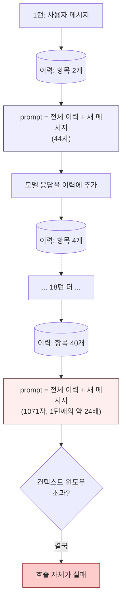
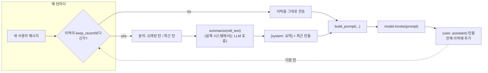

# Day 4: 메모리란 결국 대화를 다시 보내는 것

언어 모델 호출은 상태가 없습니다: `.invoke()` 한 번과 다음 번 사이에
기억되는 것은 아무것도 없습니다. 모델은 세션을 열어두지도 않고,
재방문한 사용자를 알아보지도 않으며, "이 대화의 앞부분"이라는 개념이
동작 방식에 내장되어 있지도 않습니다. 챗봇이 세 메시지 전에 여러분이
말한 것을 "기억"하는 것처럼 보인다면, 그것은 주변 애플리케이션 코드가
그 이전 턴들을 매 새로운 프롬프트의 일부로 다시 보내고 있기 때문입니다.
"메모리"는 모델이 스스로 가진 능력이 아니라 엔지니어링 패턴 — 재주입
전략입니다. 아래 내용은 모두 실제로 실행해서 얻은, 실제로 측정된
숫자입니다.

## 경계 없는 이력은 비용이 든다, 그것도 눈에 띄게

```python
def build_prompt(history, new_message):
    convo = "\n".join(f"{role}: {text}" for role, text in history)
    return f"{convo}\nuser: {new_message}\nassistant:"

history = []
for turn in range(1, 21):
    user_msg = f"question {turn} about the order"
    prompt = build_prompt(history, user_msg)   # 지금까지의 *모든 것*을 매번 다시 직렬화
    history.append(("user", user_msg))
    history.append(("assistant", f"answer {turn}"))
```

이 루프를 그대로 측정한 결과: 1턴째 프롬프트는 **44자**이고, 20턴째에는
**1,071자**입니다 — 20턴 동안 약 **24배** 증가한 것이며, 이것도 모든
메시지가 짧고 고정된 길이의 자리표시자인 장난감 대화 기준입니다. 실제
대화는 메시지가 더 길고 다양하기 때문에 오히려 더 빨리 커집니다,
느려지지 않습니다. 이것은 턴 수에 대해서는 선형 증가지만, 과소평가하기
쉬운 방식으로 누적됩니다: 대화가 남은 시간 동안 이뤄질 모든 API
호출이 이제 전체 이력을 함께 실어 나르기 때문에, 비용과 지연 시간
모두가 응답할 때마다 함께 올라가고, 충분히 오래 이어진 대화는 결국
모델의 하드 컨텍스트 윈도우 한계와 부딪힙니다 — 그리고 그 시점에서
*다음* 호출은 느려지는 게 아니라 아예 실패합니다.



여기서의 해법은 "가끔 텍스트를 좀 덜 보낸다"가 아니라, 무엇을 다시
보낼지 처음부터 엄격하게 경계 짓는 두 가지 전략 중 하나를 선택하는
것입니다.

## 완화책 1: 윈도우 메모리

가장 최근 N턴만 유지하고, 그보다 오래된 것은 조건 없이 버립니다.

```python
def windowed_history(history, max_turns=6):
    return history[-max_turns:]  # -> list[tuple[str, str]], len <= max_turns
```

위에서 만든 40개 항목짜리 이력(사용자 20턴 + 어시스턴트 20턴)에 대해
실행하면, `windowed_history(history)`는 정확히 **6개 항목** — 가장
최근 사용자/어시스턴트 쌍 세 개 — 를 반환합니다. 대화가 40개 항목이든
4,000개 항목이든 상관없이 그렇습니다. 이것이 바로 이 방식의 매력입니다:
이제 프롬프트 크기는 대화 길이가 아니라 상수로 경계 지어집니다. 대가도
그만큼 단순합니다: 윈도우 밖의 것은 요약되는 것도, 검색 가능한 것도
아니고, 그냥 사라집니다. 한 번에 하나의 질문에 답하고 각 질문이 그
자체로 완결되는 상담 봇에는 괜찮지만, 한참 전에 말한 것을 다시
언급하는 대화에서는 눈에 띄게 나빠집니다("아까 주문번호가 —"라고
말했는데, 그 턴이 이미 세 번의 교환 전에 윈도우 밖으로 떨어져 나갔다면
소용없습니다).

## 완화책 2: 요약된 메모리

오래된 턴을 그냥 버리는 대신, 하나의 누적 요약으로 압축하고 요약 +
좀 더 작은 최근 윈도우만 유지합니다.

```python
def compact_history(history, keep_recent=6, summarize=None):
    if len(history) <= keep_recent:
        return history  # 아직 압축할 게 없음
    old, recent = history[:-keep_recent], history[-keep_recent:]
    old_text = "\n".join(f"{r}: {t}" for r, t in old)
    # 실제 시스템에서 `summarize`는 보통 또 다른 모델 호출이다 -- 여기서는
    # 외부 의존성 없이 이 함수를 그대로 실행할 수 있도록 기본값으로
    # 거친 절삭(truncation)을 사용한다.
    summary = summarize(old_text) if summarize else old_text[:200] + "..."
    return [("system", f"earlier conversation summary: {summary}")] + list(recent)
```

같은 40개 항목짜리 이력에 대해 `keep_recent=6`으로 실행하면:
`compact_history(history)`는 **7개 항목**을 반환합니다 — 오래된 34개
턴 전체를 대신하는 합성된 `("system", "earlier conversation summary:
...")` 항목 하나에, 그대로 보존된 가장 최근 6턴을 더한 것입니다.
`windowed_history`의 6개 항목과 비교하면: 요약 방식은 조금 더
유지하면서도(6개가 아니라 7개) 잘린 꼬리 부분만이 아니라 모든 것에
대한 압축된 흔적을 남깁니다.

실제 버전의 `summarize`는 그 자체로 LLM 호출입니다 — 이후 *모든*
프롬프트를 더 작게 유지하기 위해 하나의 작은 추가 호출을 소비하는
것인데, 대화가 충분히 길어지면 좋은 거래입니다: 한 번의 요약 호출에
비용을 지불하는 것이 끝없이 늘어나는 전체 이력을 매 턴 다시 보내는
것보다 저렴합니다. 다만 공짜는 아닙니다 — 요약은 나중에 중요해질
디테일을 누락시킬 수 있고, 아주 긴 세션에서 요약의 요약을 또 요약하듯
반복하면 손실이 누적됩니다.



## 재시작 후에도 이력을 유지하기

위의 두 완화책 모두 다른 문제 하나는 해결하지 못합니다: 프로세스가
재시작되는 순간 메모리 상의 Python 리스트는 사라집니다. 이력을
디스크(또는 데이터베이스)에 영속화한다는 것은 배포, 크래시, 또는
사용자가 며칠 뒤 앱을 다시 여는 것과 같은 상황에서도 대화가 살아남게
한다는 뜻입니다.

```python
import json
from pathlib import Path

def save_history(history, path="chat_history.json"):
    Path(path).write_text(json.dumps(history, indent=2))

def load_history(path="chat_history.json"):
    p = Path(path)
    return json.loads(p.read_text()) if p.exists() else []
```

실제로 확인한 왕복 테스트: `history`의 앞 4개 항목을 JSON 파일에
저장했다가 다시 읽어오면, 원본과 동일한 리스트가 나옵니다(JSON이
튜플을 리스트로 바꾼다는 점만 감안하면). 이 형태의 데이터에 대해서는
왕복 과정에서 손실이 없습니다.

단일 JSON 파일은 단일 사용자 프로토타입에는 충분합니다. id로 조회해야
하는 동시 대화가 여러 개 생기면, `conversation_id` 컬럼이 있는 가벼운
테이블(단일 프로세스 앱이라면 SQLite로 충분하고, 여러 프로세스가
동시에 쓰기를 해야 한다면 Postgres)이 대화마다 파일 하나를 두는
것보다 더 잘 확장됩니다.

```python
import sqlite3

def save_history_sqlite(history, db_path="conversations.db", conversation_id="demo"):
    conn = sqlite3.connect(db_path)
    conn.execute(
        "CREATE TABLE IF NOT EXISTS turns "
        "(conversation_id TEXT, turn_index INTEGER, speaker TEXT, text TEXT)"
    )
    conn.execute("DELETE FROM turns WHERE conversation_id = ?", (conversation_id,))
    conn.executemany(
        "INSERT INTO turns VALUES (?, ?, ?, ?)",
        [(conversation_id, i, speaker, text) for i, (speaker, text) in enumerate(history)],
    )
    conn.commit()
    conn.close()
```

어느 저장 방식을 택하든 앱 프로세스 자체는 언제든 버려도 되는 존재가
됩니다 — 재시작하면, `conversation_id="demo"`에 대한 다음 요청이
멈췄던 바로 그 지점부터 대화를 이어받습니다.

## 실질적인 보안 이슈: 영속화된 이력 속의 PII

사용자가 채팅에 이메일 주소, 전화번호, 주문/ID 번호를 붙여넣으면,
그 텍스트는 이력을 담고 있는 파일이나 테이블에 그대로 저장됩니다 —
"메모리"라는 개념 자체는 그것을 자동으로 걸러내 주지 않으며, JSON이나
SQLite 역시 PII를 인식하지 못합니다. 이것은 실제 데이터 보존 및
컴플라이언스 문제와 직결됩니다: 영속화된 채팅 로그는 아무도 그래야
한다고 결정한 적 없는 개인정보가 조용히 쌓이는 대표적인 장소입니다.

정규식 기반 마스킹은 흔히 쓰이는 1차 완화책이며, 이것이 무엇을
잡아내고 — 그만큼 중요하게 — 무엇을 놓치는지 둘 다 직접 보는 것이
가치 있습니다.

```python
import re

_EMAIL_RE = re.compile(r"[\w.+-]+@[\w-]+\.[\w.-]+")
_PHONE_RE = re.compile(r"(?<!\w)\+?\d[\d\-\s]{7,}\d(?!\w)")

def redact_pii(text: str) -> str:
    text = _EMAIL_RE.sub("[redacted-email]", text)
    text = _PHONE_RE.sub("[redacted-phone]", text)
    return text
```

실제 샘플 문자열로 검증한 결과입니다.

```python
redact_pii("my email is a.kim@example.com, call me at 555-123-4567 too")
# -> "my email is [redacted-email], call me at [redacted-phone] too"

redact_pii("reach me at +1 415 555 0199 or backup jane.doe+work@corp.co.kr")
# -> "reach me at [redacted-phone] or backup [redacted-email]"

redact_pii("my number is five five five, one two three, four five six seven")
# -> "my number is five five five, one two three, four five six seven"   (그대로 통과됨)
```

마지막 줄이 각주가 아니라 핵심입니다: 말로 풀어쓴 전화번호는 완전히
아무 처리 없이 통과합니다. 정규식이 오직 숫자 문자만 찾기 때문입니다.
정규식 기반 PII 마스킹은 패턴을 미리 생각해서 작성해둔 형식만 잡아내고
나머지는 조용히 놓칩니다 — 다른 로케일의 전화번호 형식, 주민등록번호
같은 국가 ID 번호, 이름, 산문으로 풀어쓴 집 주소 같은 것들입니다.
정규식 마스킹 계층은 항상 부분적인 완화책으로만 취급하고 결코 보장으로
여기지 마세요. 요구사항이 실제로 엄격한 경우(건강 정보, 금융 계좌
번호, 정부 ID 형식)라면 위험한 패턴을 일일이 손으로 나열하려 하기보다
전용 PII 탐지 라이브러리를 쓰거나, 저장해도 안전한 필드가 정확히
무엇인지 명시적인 허용 목록을 두는 편이 낫습니다.

## 흔한 함정

- **윈도잉은 아무 신호도 없이 조용히 잊어버린다.** 오류도, 경고도
  없습니다 — 마치 열한 턴 전의 사실이 언급된 적조차 없었다는 듯 앱이
  응답할 뿐입니다. 사용자가 이전 맥락을 다시 언급하는 사용 사례라면,
  요약 방식을 우선하거나 "이전 맥락 일부를 잃었을 수 있습니다"라고
  명시적으로 알려주는 편이, 윈도우가 보이지 않는 척하는 것보다
  낫습니다.
- **손실이 있는 요약은 반복 요약될수록 누적된다.** 아주 긴 세션에서
  요약의 요약을 또 요약하면, 원본 턴을 한 번만 요약하는 것보다 더
  빠르게 품질이 떨어집니다 — 매 단계가 다음 단계로서는 더 이상 입력에
  존재하지 않아 복구할 방법이 없는 세부 정보를 흘릴 수 있기
  때문입니다.
- **영속화된 이력은 실제 책임이 따르는 진짜 데이터 자산이다.**
  대화 테이블을 다른 사용자 데이터 저장소와 똑같이 취급하세요 — 누가
  읽을 수 있는지, 얼마나 오래 보관되는지, 요청 시 삭제 가능한지는
  무기한 미뤄도 되는 구현 세부사항이 아니라 제품·법률 차원의
  질문입니다.
- **정규식 마스킹은 잘못된 안도감을 준다.** `redact_pii` 함수를
  배포하고 PII 문제를 "처리했다"고 여기는 것은, 그 때문에 실제로
  무엇이 저장되고 있는지에 대해 아무도 더 이상 생각하지 않게 만든다면
  아예 시도하지 않은 것보다 나쁠 수 있습니다 — 모두가 전적으로
  신뢰하는 부분적인 필터가, 인정된 빈틈보다 더 큰 위험입니다.

**정리:** 메모리는 재주입된 이력이지, 모델의 마법이 아닙니다 — 걷잡을
수 없이 커지기 전에 윈도우나 요약으로 경계를 두고, 앱이 재시작되어도
대화를 잃지 않도록 의도적으로 영속화하며, 저장하는 모든 것을 여러분이
보호 없이 방치하고 싶지 않을 다른 어떤 기록과 똑같은 취급 의무를 지닌
데이터로 다루세요.
