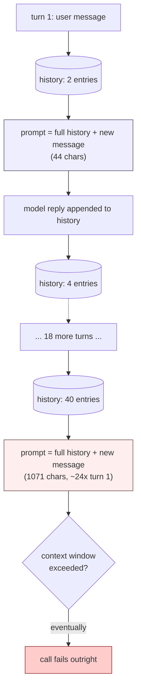
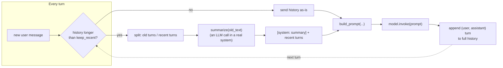

# Day 4: Memory Is Just Re-Sending the Conversation

A language model call is stateless: nothing is remembered between one
`.invoke()` and the next. The model doesn't hold a session open, doesn't
recognize a returning user, and has no notion of "earlier in this
conversation" baked into how it runs. When a chatbot "remembers" what you
said three messages ago, that's because the surrounding application code
re-sends those earlier turns as part of every new prompt. "Memory" is an
engineering pattern — a re-injection strategy — not a capability the
model has on its own. Everything below was run for real, with actual
measured numbers.

## Unbounded history gets expensive, and it's not subtle

```python
def build_prompt(history, new_message):
    convo = "\n".join(f"{role}: {text}" for role, text in history)
    return f"{convo}\nuser: {new_message}\nassistant:"

history = []
for turn in range(1, 21):
    user_msg = f"question {turn} about the order"
    prompt = build_prompt(history, user_msg)   # re-serializes *everything* so far
    history.append(("user", user_msg))
    history.append(("assistant", f"answer {turn}"))
```

Measured on this exact loop: the prompt at turn 1 is **44 characters**;
by turn 20 it's **1,071 characters** — roughly a **24x** increase over 20
turns, for a toy conversation where every message is a short, fixed-length
placeholder. A real conversation with longer, more varied messages grows
faster in practice, not slower. This is linear growth in the number of
turns, but it compounds in a way that's easy to underestimate: every
single API call for the rest of the conversation now carries the entire
history, so cost and latency both climb with every reply, and a chat that
runs long enough eventually collides with the model's hard context-window
limit — at which point the *next* call doesn't get slower, it fails
outright.



The fix isn't "send less text sometimes" — it's picking, up front, one of
two disciplined strategies for bounding what gets re-sent.

## Mitigation 1: windowed memory

Keep only the last N turns; drop everything older, unconditionally.

```python
def windowed_history(history, max_turns=6):
    return history[-max_turns:]  # -> list[tuple[str, str]], len <= max_turns
```

Run against the 40-entry history built above (20 user + 20 assistant
turns), `windowed_history(history)` returns exactly **6 entries** — the
last three user/assistant pairs — regardless of whether the conversation
has 40 entries or 4,000. That's the entire appeal: the prompt size is now
bounded by a constant, not by conversation length. The cost is equally
blunt: anything outside the window is gone, not summarized, not
searchable, just absent. Fine for a support bot answering one question at
a time where each question stands alone; noticeably worse for a
conversation that circles back ("earlier you said the order number was
—", except that turn fell out of the window three exchanges ago).

## Mitigation 2: summarized memory

Instead of discarding old turns outright, collapse them into a running
summary and keep only the summary plus a smaller recent window:

```python
def compact_history(history, keep_recent=6, summarize=None):
    if len(history) <= keep_recent:
        return history  # nothing to compact yet
    old, recent = history[:-keep_recent], history[-keep_recent:]
    old_text = "\n".join(f"{r}: {t}" for r, t in old)
    # `summarize` would typically be another model call in a real system --
    # here it defaults to a crude truncation so the function is runnable
    # with no external dependency.
    summary = summarize(old_text) if summarize else old_text[:200] + "..."
    return [("system", f"earlier conversation summary: {summary}")] + list(recent)
```

Run against the same 40-entry history with `keep_recent=6`:
`compact_history(history)` returns **7 entries** — one synthetic
`("system", "earlier conversation summary: ...")` entry standing in for
all 34 older turns, plus the 6 most recent turns kept verbatim. Compare
that to `windowed_history`'s 6 entries: summarizing keeps a little more
(7 vs. 6) but retains a compressed trace of everything, not just a
truncated tail.

The real version of `summarize` is itself an LLM call — you spend one
extra, smaller call to keep every *later* prompt smaller, which is a good
trade once a conversation runs long enough: paying for one summarization
call is cheaper than re-sending the full, ever-growing history on every
subsequent turn. It is not free, though — summarization can drop details
that turn out to matter later, and a lossy summary compounds if you
re-summarize a summary of a summary across a very long-running session.



## Persisting history across restarts

Neither mitigation above addresses a different problem: an in-memory
Python list disappears the moment the process restarts. Persisting
history to disk (or a database) is what lets a conversation survive a
deploy, a crash, or the user simply closing and reopening the app days
later.

```python
import json
from pathlib import Path

def save_history(history, path="chat_history.json"):
    Path(path).write_text(json.dumps(history, indent=2))

def load_history(path="chat_history.json"):
    p = Path(path)
    return json.loads(p.read_text()) if p.exists() else []
```

Verified round-trip: writing the first 4 entries of `history` to a JSON
file and reading them back produces a list equal to the original (once
you account for JSON turning tuples into lists) — the round trip is
lossless for this shape of data.

A single JSON file is enough for a single-user prototype. Once you have
many concurrent conversations that need to be looked up by an id, a
lightweight table (SQLite is enough for a single-process app; Postgres
once multiple processes need to write concurrently) with a
`conversation_id` column scales better than one file per conversation:

```python
import sqlite3

def save_history_sqlite(history, db_path="conversations.db", conversation_id="demo"):
    conn = sqlite3.connect(db_path)
    conn.execute(
        "CREATE TABLE IF NOT EXISTS turns "
        "(conversation_id TEXT, turn_index INTEGER, speaker TEXT, text TEXT)"
    )
    conn.execute("DELETE FROM turns WHERE conversation_id = ?", (conversation_id,))
    conn.executemany(
        "INSERT INTO turns VALUES (?, ?, ?, ?)",
        [(conversation_id, i, speaker, text) for i, (speaker, text) in enumerate(history)],
    )
    conn.commit()
    conn.close()
```

Either storage choice makes the app process itself disposable — restart
it, and the next request for `conversation_id="demo"` picks the
conversation back up exactly where it left off.

## A real security note: PII in persisted history

If a user pastes an email address, a phone number, or an order/ID number
into the chat, that exact text is stored verbatim in whatever file or
table holds the history — nothing about "memory" strips it out
automatically, and nothing about JSON or SQLite is PII-aware. This
matters for real data-retention and compliance reasons: persisted chat
logs are precisely the kind of place personal data quietly accumulates
without anyone deciding it should.

A regex-based redaction pass is a common first mitigation, and it's worth
seeing both what it catches and — just as importantly — what it misses:

```python
import re

_EMAIL_RE = re.compile(r"[\w.+-]+@[\w-]+\.[\w.-]+")
_PHONE_RE = re.compile(r"(?<!\w)\+?\d[\d\-\s]{7,}\d(?!\w)")

def redact_pii(text: str) -> str:
    text = _EMAIL_RE.sub("[redacted-email]", text)
    text = _PHONE_RE.sub("[redacted-phone]", text)
    return text
```

Verified against real sample strings:

```python
redact_pii("my email is a.kim@example.com, call me at 555-123-4567 too")
# -> "my email is [redacted-email], call me at [redacted-phone] too"

redact_pii("reach me at +1 415 555 0199 or backup jane.doe+work@corp.co.kr")
# -> "reach me at [redacted-phone] or backup [redacted-email]"

redact_pii("my number is five five five, one two three, four five six seven")
# -> "my number is five five five, one two three, four five six seven"   (UNCHANGED)
```

That last line is the actual point, not a footnote: a phone number
spelled out in words sails through completely untouched, because the
regex only looks for digit characters. Regex-based PII scrubbing catches
the formats you thought to write a pattern for and silently misses
everything else — a different locale's phone format, a national ID
number, a name, a home address written as prose. Treat any regex
redaction layer as a partial mitigation, never a guarantee, and where the
requirement is real (health data, financial account numbers, government
ID formats) use a dedicated PII-detection library or an explicit
allowlist of exactly which fields are safe to persist at all, rather than
trying to enumerate every dangerous pattern by hand.

## Pitfalls

- **Windowing silently forgets, without any signal that it happened.**
  There's no error, no warning — the app just responds as if a fact from
  eleven turns ago was never mentioned. If your use case involves users
  referring back to earlier context, prefer summarization or explicitly
  surface "we may have lost earlier context" rather than pretending the
  window is invisible.
- **A lossy summary compounds under repeated summarization.** Summarizing
  a summary of a summary across a very long session degrades
  faster than summarizing the raw turns once — each pass can drop
  specifics the next pass has no way to recover, since they're no longer
  in the input.
- **Persisted history is a real data asset with real obligations.**
  Treat a conversations table exactly like any other store of user data:
  who can read it, how long it's retained, and whether it needs to be
  deletable on request are product and legal questions, not
  implementation details to defer indefinitely.
- **Regex redaction gives false confidence.** Shipping a `redact_pii`
  function and considering PII "handled" is worse than not attempting it
  at all if it causes anyone to stop thinking about what's actually being
  stored — a partial filter that everyone trusts fully is a bigger risk
  than an acknowledged gap.

**Takeaway:** memory is re-injected history, not model magic — bound it
with a window or a summary before it grows unchecked, persist it
deliberately so the app can restart without losing a conversation, and
treat everything you persist as data that carries the same handling
obligations as any other record you'd be uncomfortable leaving
unprotected.
